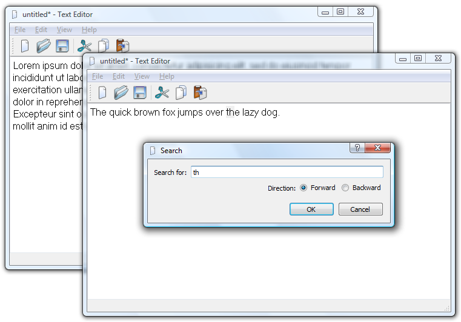
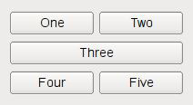
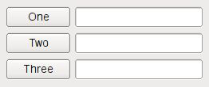

# Лабораторная работа №1 #

## Использование библиотеки элементов графического интерфейса Qt ##

## Цель лабораторной работы ##

Научиться использовать библиотеку элементов графического интерфейса Qt.

## Введение ##

### План ###

+ простейшее графическое приложение на Qt
+ работа с компоновщиками
+ создание приложения ColorViewer
+ использование QFileDialog - создание простейшего обозревателя текста

## Инструкция по выполнению лабораторной работы ##

### Простейшее GUI-приложение на Qt ###

Рассмотрим следующий фрагмент кода, представляющий простейшее GUI-приложение, созданное с использованием элементов Qt.

```C++
#include <QApplication>
#include <QWidget>
int main (int argc, char **argv)
{
    QApplication app(argc, argv);
    QWidget widget(0);
    widget.show();
    return app.exec();
}
```

В этом примере используются два фундаментальных Qt-класса:

+ QApplication $-$ это движок Qt-приложения и должен создаваться в единственном экземпляре в каждом графическом Qt-приложении. В консольных приложениях используется QCoreApplication. В QApplication запускается диспетчер сигналов и устанавливаются некоторые общие настройки приложения.
+ QWidget $-$ базовый класс для всех элементов графического интерфейса (виджетов) в Qt, начиная с кнопок и кончая сложными диалогами. Конструктор QWidget может принимать в качестве аргумента указатель на родительский QWidget. В случае, если передаётся «0», как в настоящем примере, виджет создаётся как самостоятельное окно в системе.

Итак, собрав и запустив пример в каталоге lab08/01, мы обнаружим, что было отображено пустое окно.

### Компоновщики (Layout managers) ###

*Мотивация использования.* Следующий пример наглядно демонстрирует потребность в компоновщиках.

+ Попробуйте добавить в корневой виджет в предыдущем примере несколько элементов типов `QPushButton, QLabel, QTextEdit`

    + включите соответствующие заголовочные файлы, например, `#include <QPushButton>`
    + создайте объекты, передав в конструкторе указатель на родительский widget ```QPushButton but1(&widget)```
+ Соберите и запустите приложение.

Обратите внимание, что все элементы были помещены в левый верхний угол.

Разумеется, все созданные нами дочерние виджеты, могут быть размещены в необходимых местах явно, при помощи задания координат и размеров, но такой метод в крайней степени неудобен и вынудит нас постоянно отслеживать изменения в размере родительского виджета, дабы перекомпоновать дочерние. Компоновщик, представленный общим классом QLayout, позволяет избежать этих проблем.

*Работа с компоновщиками.* Компоновщик отвечает за размещение виджетов в области компоновки в соответствии с некоторыми правилами компоновки. Изменение размеров области компоновки приводит обычно к перекомпоновке.

Рассмотрим виды простейших  компоновщиков.

+ **QHBoxLayout, QVBoxLayout** $-$ размещает элементы в один ряд (вертикальный либо горизонтальный)



**Рис. 1**

+ **QGridLayout** $-$ размещает элементы в ячейки таблицы



**Рис. 2**

+ **QFormLayout** $-$ размещает элементы сверху вниз в две колонки. Такая организация интерфейса часто используется при заполнении различных форм, где одна колонка $-$ описание, а другая $-$ поле ввода.



**Рис. 3**

### Пример работы с компоновщиком ###


**Рис. 4**

### Задание ###

+ пользуясь примером в каталоге lab08/02, создайте приложение с графическим интерфейсом, аналогичным представленному сверху
+ используйте классы `QLabel, QSpinBox, QSlider, QPlainTextEdit.`

### Знакомство с элементами интерфейса: добавим функциональность ###

+ Добавим функциональность созданному на предыдущем этапе приложению:
     + спин-боксы и слайдеры будут перемещаться синхронизировано в диапазоне значений от 0 до 255.
     + Цвет фона `QPlainTextEdit` будет меняться соответственно
+ Выполнение:
     + Выставляем диапазон допустимых значений для `QSpinBox` и `QSlider` при помощи методов `setMinimum()` и `setMaximum()`
     + запрещаем ввод в текстовое поле: `setEnabled(false)`
     + Реализуем метод `setColor()` и слоты `setRed(int), setGreen(int), setBlue(int)` к слотам подключаем сигналы ```QSlider::sliderMoved()``` и `QSpinBox::valueChanged()`
     + в реализации слотов синхронизируем значения слайдера и спин-бокса и вызываем setColor()
+ Для изменения цвета фона текстового поля воспользуемся таблицами стилей для описания стиля элементов.
    + таблицы стилей используют синтаксис CSS
	+ будем задавать цвет в виде строки типа `#rrggbb`
	+ таким образом, надо задать `QPlainTextEdit` следующий стиль:
	+ `QPlainTextEdit { background: #rrggbb; }`
	+ задаём стиль при помощи метода setStyleSheet() (таблица стиля передаётся в виде строки).

### Диалоги ###

Библиотека графических элементов Qt предлагает набор из нескольких полнофункциональных диалоговых окон, позволяющих выполнять некоторые стандартные операции. Среди них такие, как выбор файла в файловой системе, выбор шрифта, выбор цвета, диалог печати и некоторые другие. Мы рассмотрим в настоящей работе пример использования диалога выбора файла $-$ `QFileDialog`.

#### Создаём простейший обозреватель текстовых файлов ####

+ Создайте новый виджет и поместите на него элемент `QTextEdit`.
+ Добавьте кнопку `QPushButton` и подключите её сигнал `clicked()` к слоту `openFile()`
+ Реализуйте в слоте выбор имени файла пользователем: `QFileDialog::getOpenFileName()`
+ Откройте `QFile` в соответствии с выбранным названием
+ Прочитайте его содержимое и поместите в виде текста в элемент `QTextEdit`
