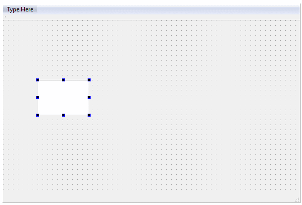
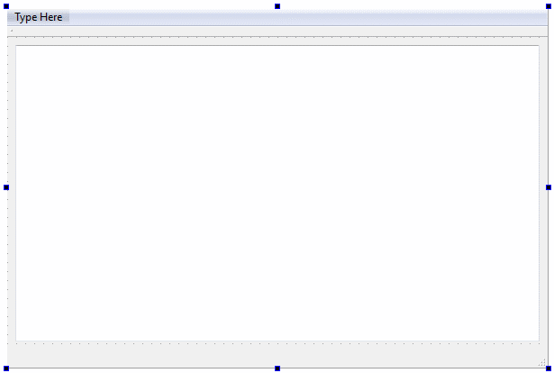
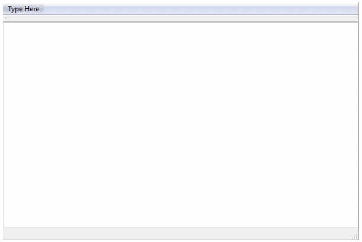
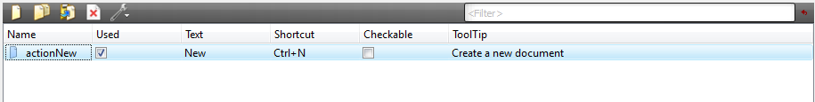
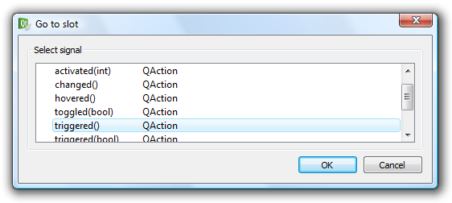
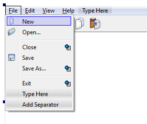

# Лабораторная работа №2 #

## Основы Qt ##

## Цель ##

Эта лабораторная работа проведёт вас через все этапы построения законченного приложения на Qt. Целью является понимание структуры приложения на Qt и получение опыта использования стандартной документации Qt.

## Длительность ##

3 часа.

## Введение и задачи лабораторной работы ##

Целью этой лабораторной работы является применение полученных на предыдущих лекциях знаний и повторение их на практических примерах. Задачей будет разработка законченного оконного приложения — текстового редактора, работающего с несколькими документами с возможностями открытия и сохранения, отмены действий, работы с буфером обмена и другими.


По мере выполнения работы новые возможности будут добавляться постепенно. На это есть две причины. Во-первых, настоящее программное обеспечение так и разрабатывается: функционал расширяется со временем. Во-вторых, на каждом шаге вы будете иметь работающее приложение, которое можно запустить, проверить и начать отлаживать. Не откладывайте исправление ошибок на следующие шаги, убеждайтесь в работоспособности приложения на каждом шаге. В более сложном приложении будет труднее найти и исправить проблемы.
В лабораторной работе описание ваших действий менее подробное, чем в упражнениях. Это означает, что вам нужно будет смотреть описания классов в документации Qt и самостоятельно подключать необходимые заголовочные файлы и писать тривиальные части исходного кода.

## Начальное приложение ##

Для создание заготовки приложения используйте шаблон Qt Application. Создайте такой проект и выберите только модули QtCore и QtGui. В качестве базового класса для класса главного окна выберите QTextEditor. Далее будем называть этот проект «TextEditor».


Созданный проект будет состоять из следующих файлов:

+ texteditor.ui $-$ пользовательский интерфейс для класса TextEditor.
+ texteditor.qrc $-$ файл ресурсов.
+ texteditor.cpp/h $-$ реализация и объявление класса TextEditor.
+ main.cpp $-$ содержит функцию main, которая инициализирует и запускает приложение.
Просмотрите эти файлы и проверьте, что проект успешно собирается и запускается.

## Добавление элементов пользовательского интерфейса ##

Следующим шаг $-$ добавление виджета QTextEdit и основных пользовательских        действий *Создать*, *Закрыть* и *Выход* в главное окно.

Для начала, нужно добавить в проект значки, которые будут использоваться в пользовательском интерфейсе.

Скопируйте файлы `*.png`, прилагаемые к этой лабораторной работе в каталог Resources проекта. Откройте файл `texteditor.qrc`, добавьте префикс `icons` и добавьте файлы `*.png`.

Теперь можно начать работу над пользовательским интерфейсом. Для этого откройте файл `texteditor.ui` в режиме дизайна.

Добавьте виджет `QTextEdit` и расположите его в главном окне. Выберите само окно и уменьшите поля компоновки (layout) до нуля, чтобы новый виджет полностью занял центральную область окна.

<table>
    <tbody>
       <tr>
            <td></td>
            <td ></td>
            <td ></td>
        </tr>
    </tbody>
</table>

Когда виджет правильно расположен, вы можете проверить внешний вид окна, используя пункт меню *Инструменты $-$ Редактор форм $-$ Предпросмотр*... (Ctrl+Alt+R).

Пользовательские действия описываются объектами класса QAction. Их можно настроить в Редакторе действий:



Создайте следующие действия:

|Текст |Имя | Значок|Горячая клавиша | Подсказка|
|---|---|---|---|---|
|Создать |*actionNew* | |Ctrl+N |Создать новый документ |
| Закрыть| *actionClose*| |Ctrl+W |Закрыть текущее окно |
|Выход | *actionExit*| | |Закрыть приложение|

Действия добавляются в пользовательский интерфейс перетаскиванием. Перетащите действие actionNew на панель инструментов.

Добавьте пункт Файл в строку меню, для этого нажмите на тексте «Пишите здесь» и введите Файл. Теперь перетащите действия *actionNew*, *actionClose* и *actionExit* в меню. Добавьте разделители между всеми пунктами меню. Чтобы добавить разделитель, щёлкните *«Добавить разделитель»* в редактируемом меню и перетащите разделитель в нужно место.

```
Если ввести «&Файл» в качестве названия меню, то автоматически появится клавиатурный ускоритель:
«Файл». Чтобы получить знак амперсанда в тексте меню, введите «&&».
```

## Реализация функциональности ##

Каждое добавленное действие необходимо реализовать. Чтобы сделать это, нажмите правой кнопкой мыши на действии из списка, щёлкните в контекстном меню *Перейти к слоту* и выберите сигнал *triggered()*  в появившемся окне.



Начните с реализации действия *actionNew*, автоматически появится следующий участок кода:

```C++
void TextEditor::on_actionNew_triggered()
{

}
```

В этом слоте создайте новый объект класса *TextEditor*, динамически выделив память для него, и покажите его.
Для двух других действий, *actionClose* и *actionExit*, уже есть необходимые слоты, реализованные в Qt. Выполните следующие соединения сигналов со слотами в конструкторе класса *TextEditor* после вызова *setupUi*:

|Отправитель | Сигнал|Получатель | Слот|
|---|---|---|---|
|*actionClose* |*triggered()* |*this* (текущее окно) | *close()*|
|*actionExit*| *triggered()*| *qApp* (текущее приложение)| *closeAllWindows()*|

Также не забудьте вызвать setAttribute и установить атрибут *Qt::WA_DeleteOnClose* в конструкторе класса *TextEditor*.

## Проверь себя ##

+ Проверьте, что вы можете открывать новые окна в приложении.
+ Проверьте, что Файл $-$ Закрыть закрывает текущее окно.
+ Проверьте, что Файл $-$ Выход закрывает все окна и, таким образом, завершает работу приложения.
+ Объясните, зачем нужно устанавливать атрибут Qt::WA_DeleteOnClose. На что он влияет, и почему он важен?

## Редактирование и закрытие ##

На данном этапе пользователь может по ошибке закрыть окно с несохранёнными изменениями. Это не то, чего ожидают от редактора. Обычно в редакторах пользователь должен подтвердить свои действия при риске потери несохранённого документа. Будем решать задачу в два шага. Во-первых, если документ изменён, должна быть показана соответствующая пометка. Во-вторых, при закрытии окна с изменённым документом пользователь должен подтверждать выход без сохранения.

Изменения документа можно отслеживать с помощью сигнала *textChanged* класса *QTextEdit*. Создайте приватный слот *documentEdited210643* в вашем классе *TextEditor*. В конструкторе соедините сигнал редактора с вашим слотом. В слоте устанавливайте свойство *windowModified* в *true*.


```
При чтении документации вы не найдёте свойства windowModified в классе QTextEditor.
Оно определено в классе QWidget, от которого наследуется QTextEditor. Его можно
увидеть, пройдя по ссылке «...properties inherited from QWidget» («свойства,
наследованные от QWidget») под списком свойств класса QTextEditor.
```

Свойство *windowModified* влияет на свойство *windowTitle* (заголовок окна). В Mac OS X изменённый документ отмечается жирной точкой в красной (самой левой) кнопке окна. На большинстве других платформ в заголовке окна добавляется звёздочка. Звёздочка может быть добавлена к заголовку окна *(windowTitle)* в виде **«[*]»**. Qt автоматически обновляет свойство *windowTitle* в соответствии со свойством *windowModified* и наоборот.


Например, если установить windowTitle в **«TextEditor[*]»** в конструкторе *TextEditor*, то при изменении документа в заголовке окна будет появляться звёздочка.

Второй шаг решения задачи состоит в использовании подтверждения закрытия документа при наличии несохранённых изменений. Это делается переопределением функции *closeEvent* в классе *TextEditor*. Начните с добавления функции в определение класса:

```C++
protected:
    void closeEvent(QCloseEvent *e)
```

Затем добавьте пустое тело функции в реализацию класса:

```C++
void TextEditor::closeEvent(QCloseEvent *e)
{

}
```

Событие, *e*, может быть либо принято, либо проигнорировано вызовом *e->accept()* или *e->ignore()* соответственно. Напишите такую реализацию функции, чтобы событие принималось для всех неизменённых документов. А если документ изменён, используйте функцию *QMessageBox::warning*, чтобы запросить подтверждение пользователя, и либо «примите» событие, либо проигнорируйте его в соотвествии с ответом пользователя.

Функция *warning* принимает следующие аргументы (чтобы узнать типы данных аргументов, обратитесь к документации):

```C++
QMessageBox::warning( родительский виджет,
                      заголовок диалогового окна, текст диалогового окна,
                      показываемые кнопки, кнопка по умолчанию )
```

Диалоговое окно должно показывать кнопки *QMessageBox::Yes* («Да») и *QMessageBox::No* («Нет»), причём по умочанию должна быть выделена кнопка *Нет*:


Возвращаемое значение функции равно кнопке, нажатой пользователем. Поскольку пользователь может закрыть диалоговое окно в том числе нажатием кнопки с крестиком в заголовке окна или нажатием кнопки Нет, проверяйте, нажал ли пользователь кнопку Да.

Реализовав функцию *closeEvent*, команды меню *Файл $-$ Закрыть и Файл $-$ Выход* должны начать работать изложенным ранее образом.

## Проверь себя ##

+ Проверьте, что при изменении документа появляется индикатор изменения (звёздочка или точка в красной кнопке).
+ Откройте документ, отредактируйте его, попытайтесь закрыть окно следующими способами: через диспетчер окон (например, в Windows нажмите кнопку «X», и так далее), *Файл $-$ Закрыть, Файл – Выход*. Убедитесь в том, что во всех случаях открывается диалоговое окно подтверждения.
+ Проверьте, что если в диалоге подтверждения закрытия окна нажать *Нет* или закрыть диалог нажатием крестика в заголовке, то документ не будет закрыт.
+ Откройте документ, не изменяйте его и попытайтесь закрыть его перечисленными выше способами. Убедитесь в том, что диалог подтверждения не появляется.
+ Откройте несколько документов, измените некоторые из них и нажмите *Файл $-$ Выход*. Убедитесь в то   м, что при этом закроются только окна, в которых не было изменений. Если диалоге подтверждения нажать *Нет*, процедура выхода из приложения должна прерваться.

## Параметры и настройка приложения ##

Практически все современные приложения имеют параметры, задаваемые пользователем. Сюда входит выбор единиц измерения, расположения панелей инструментов и более детальные параметры. На этом шаге мы разрешим пользователю выбрать шрифт для вывод текста документа


Этот параметр будет сохраняться стандартным для используемой платформы способом, то есть реестр в Windows или скрытые файлы в Linux, и так далее.

## The Ground Work ##

В Qt можно явно задать место и формат для сохранения параметров, но удобнее установить значения нескольких свойств объекта *Qapplication*, а затем использовать стандартное поведение класса *QSettings*.

Необходимыми параметрами являются название и версия приложения, название организации-производителя и домен. Просто добавьте следующие строки в вашу функцию main, где a $-$ экземпляр *QApplication*.

```C++
a.setApplicationName("Text Editor");
a.setApplicationVersion("0.1");

a.setOrganizationName("ExampleSoft");
a.setOrganizationDomain("example.com");
```
Также установите свойство windowIcon объекта *QApplication*, чтобы использовался значок *":/icons/new.png"*.

## Добавление действий ##

Добавьте следующее действие в главное окно:

|Текст |Имя |Значок |Горячая клавиша |Подсказка |
|---|---|---|---|---|
| Select Font...| *actionSelectFont*| | | Select the display font|

Добавьте действие в меню *Вид* (сначала нужно создать это меню в строке меню).
Нажмите правой кнопкой на действии и перейдите к слоту сигнала *triggered*. Тело слота будет выглядеть так:

```C++
void TextEditor::on_actionSelectFont_triggered()
{

}
```
В этом слоте используйте функцию *QFontDialog::getFont( *ok, initial, parent )*, чтобы получить новый объект *QFont*. Используйте ui->textEdit->font() в качестве исходного шрифта. Если пользователь подтвердит выбор шрифта в диалоговом окне, то есть если ok равен *truev, обновите свойство *font* объекта *ui->textEditv. Используйте экземпляр *QSettings*, чтобы записать текущий шрифт в параметр *«viewFont»*.

```
Можно создать экземпляр QSettings в стеке, поскольку создание и удаление экземпляра этого класса
происходит очень быстро, а все параметры берутся из объекта QApplication
```

Осталось установить в виджете *ui->textEdit* шрифт, который был ранее сохранён при помощи экземпляра класса *QSettings*. Делайте это в конструкторе *TextEditor*, в качестве значения по умолчанию используйте *QApplication::font()*.

```
Значение, полученное из экземпляра QSettings — объект QVariant. Чтобы из этого объекта получить
объект QFont, используйте функцию QVariant::value<T>(), где T=QFont.
```

## Проверь себя ##

+ Проверьте, что все окна в своём заголовке имеют значок нового документа.
+ Проверьте, что можно изменить шрифт в окне.
+ Проверьте, что в диалоговом окне выбора шрифта можно отказаться от смены шрифта.
+ Измените шрифт и откройте новое окно. Убедитесь в том, что новое окно открывается с новым шрифтом.
+ Проверьте, что выбор шрифта запоминается, если перезапустить приложение.

## Буфер обмена и история изменений ##

Добавить операции с буфером обмена *Вырезать, Копировать и Вставить*, а также действия *Отменить и Повторить* очень просто. Это настолько просто, что оставшееся время мы потратим на добавление диалогового окна О *программе* и другие мелочи.

Большинство виджетов Qt готовы к использованию в ситуациях, возникающих при создании настоящих программ, и обеспечивают простой в использовании интерфейс. Виджет *QTextEdit* $-$ не исключение. У него есть слоты для копирования, вырезки, вставки, отмены и повтора действий, а также сигналы для реализации различных действий. Но, по-прежнему, нужно создать действия для всех этих операций и подсоединить их.

## Добавление действий ##

Начнём с добавления следующих действий к главному окну:

| Текст| Имя| Значок| Горячая клавиша| Подсказка|
|---|---|---|---|---|
|About |*actionAbout* | | | |
|About Qt | *actionAboutQt*| | | |
|Cut | *actionCut*| |Ctrl+X | Cut|
|Copy | *actionCopy*| |Ctrl+C |Copy |
| Paste|*actionPaste* | |Ctrl+V | Paste|
|Undo | *actionUndo*| Ctrl+Z| | Undo the last action|
|Redo |*actionRedo* | | Ctrl+Y| Redo the last action|

Поместите действия «О программе» и «О Qt» в меню *Справка* (это меню нужно сначала создать). Остальные действия расположите в меню *Правка* (это меню нужно сначала создать). Перетащите меню в строке меню таким образом, чтобы они были расположены в следующем порядке: *Файл, Правка, Вид, Справка*.

Добавьте действия, работающие с буфером обмена, на панель инструментов. Чтобы добавить разделитель между действием *actionNew* и действиям с буфером обмена, щёлкните правой кнопкой мыши на панели инструментов.

## Реализация функциональности ##

Для работы всех действий кроме О программе достаточно лишь выполнить соединения. Это означает, что соответствующая функциональность уже реализована в Qt.

О конструкторе класса TextEditor выполните следующие соединения:

|Отправитель |Сигнал |Получатель | Слот|
|---|---|---|---|
|*actionAboutQt* |*triggered()* |*qApp* |*aboutQt()* |
| *actionCut*| *triggered()*|*textEdit* | *cut()*|
|*actionCopy* | *triggered()*|*textEdit* |*copy()* |
| *actionPaste*| *triggered()*|*textEdit* |*paste()* |
| *actionUndo*|*triggered()* | *textEdit*| *undo()*|
|*actionRedo* |*triggered()* | *textEdit*|*redo()* |
|*textEdit* |*copyAvailable(bool)* | *actionCopy*|*setEnabled(bool)* |
|*textEdit* |*copyAvailable(bool)* | *actionCut*| *setEnabled(bool)*|
| *textEdit*| *undoAvailable(bool)*| *actionUndo*| *setEnabled(bool)*|
| *textEdit*| *redoAvailable(bool)*|*actionRedo* |*setEnabled(bool)* |

Свойства *enabled* действий *actionCopy*, *actionCut*, *actionUndo* и *actionRedo* обновляются соответствующими сигналами *QTextEdit*. Однако их исходное состояние не задаётся. Добавьте в конструктор код, который установит исходные состояния их свойств enabled в *false*.

Осталось отдельно обработать действие *actionAbout*. Щёлкните правой кнопкой на действии и перейдите к слоту для сигнала *triggered*. Слот будет выглядеть так:

```C++
void TextEditor::on_actionAbout_triggered()
{

}
```
В слоте используйте *QMessageBox::about*, чтобы показать диалоговое окно «О программе» для вашего приложения.

## Проверь себя ##

+ Проверьте, что Справка $-$ *О программе* открывает соответствующее диалоговое окно.
+ Проверьте, что Справка $-$ *О Qt* показывает диалоговое окно об используемой версии Qt.
+ Проверьте, что действия *Отменить* и *Повторить* работают как и ожидалось.
+ Проверьте, что действия *Отменить* и *Повторить* становятся активными или неактивными ожидаемым образом, даже сразу после запуска приложения.
+ Проверьте, что действия *Вырезать, Копировать и Вставить* работают как и ожидалось.
+ Проверьте, что действия *Вырезать и Копировать* становятся активными или неактивными ожидаемым образом, даже сразу после запуска приложения.

## Операции с файлами ##

Основным недостатком текстового редактора в его текущем состоянии является отсутствие возможности открытия и сохранения файлов. Теперь мы займёмся этой проблемой.



Добавление возможности открытия и сохранения файлов повлияет на различные части приложения. Каждому окну теперь должно быть присвоено имя файла, а в обработчике события *closeEvent* нужно добавить возможность сохранения документа.

## Открытие документов ##

Начните с добавления приватного объекта *QString m_fileName* в объявление класса *TextEditor*.
Измените конструктор *TextEditor*, чтобы он имел следующие аргументы:

```C++
TextEditor(const QString &fileName=QString(), QWidget *parent=0);
```

В конце конструктора добавьте следующую строку:

```C++
loadFile(fileName);
```

Вы наверное уже поняли, что главной задачей теперь остаётся написание функции *loadFile*. Добавьте её как приватную функцию класса *TextEditor*. Тело функции должно выглядеть вот так:

```C++
void TextEditor::loadFile(const QString &fileName)
{

}
```

В этой функции выполните следующие действия:
1. Если *fileName* пустое, вызовите *setFileName(QString())* (функция *setFileName* ещё не определена) и выйдите из функции.
2. Создайте экземпляр *QFile* для файла *fileName*.
3. Попытайтесь открыть файл объекта *QFile* для чтения текстового файла, то есть с флагами *QIODevice::ReadOnly* и *QIODevice::Text*.
4. Если файл не получилось открыть, покажите сообщение об ошибке с помощью *QMessageBox::warning*(), вызовите *setFileName(QString())* и выйдите из функции.
5. Если файл открылся, создайте экземпляр *QTextStream для работы с объектом QFile*.
6. Запишите в свойство text виджета textEdit результат выполнения функции readAll над объектом *QTextStream*.
7. Закройте объект *QFile*.
8. Вызовите *setFileName(fileName)*.
9. Установите свойство *windowModified* в false.
Теперь добавьте недостающую функцию setFileName(const QString &) как приватную функцию класса TextEditor. В этой функции запишите в *m_fileName* имя файла, переданное в аргументе функции, а в свойство *windowTitle* $-$ следующую строку:

```C++
QString("%1[*] - %2")
    .arg(m_fileName.isNull()?"untitled":QFileInfo(m_fileName).fileName())
    .arg(QApplication::applicationName())
```

Создайте следующее действие в пользовательском интерфейсе *TextEditor*. Добавьте это действие на панель инструментов и в меню *Файл*.

|Текст |Имя |Значок |Горячая клавиша |Подсказка |
|---|---|---|---|---|
|Open...| *actionOpen*| | Ctrl+O| Open a document|

Перейдите в автоматически сгенерированному слоту для сигнала triggered. Тело функции показано ниже.

```C++
void TextEditor::on_actionOpen_triggered()
{

}
```

В этой функции выполните следующие действия:
1.	Используйте следующую функцию, чтобы получить имя открываемого файла:

```C++
QString fileName = QFileDialog::getOpenFileName(this,
    "Open document", QDir::currentPath(), "Text documents (*.txt)");
```
2. Если имя файла не было выбрано пользователем (*isNull*), выйдите из функции.
3. Если *m_fileName* для текущего окна выбрано (*isNull*) и текущий документ не был изменён, вызовите *loadFile(fileName)*, чтобы загрузить документ в текущее окно.
4. Иначе, создайте новое окно *(new QTextEditor(fileName))* и покажите его, тем самым загрузив документ в новое окно.

Поэкспериментируйте с новой функциональностью. Открывайте документы, создавайте новые документы и так далее. Ещё раз проверьте, что при закрытии документа окно подтверждения открывается только при наличии несохранённых изменений.

## Сохранение документов ##

Сохранение документов немного сложнее, чем их загрузка из файлов. Во-первых должны быть команды Сохранить и Сохранить как, во-вторых пользователь должен быть уведомлен об ошибках сохранения.

Начните реализацию функциональности сохранения файлов с создания приватных слотов в объявление класса TextEditor. Также создайте пустые тела этих функций.

```C++
private slots:
    bool saveFile();
    bool saveFileAs();
```

Обе функции возвращают логическое значение. Значение *true* будет возвращаться при успешном сохранении файла, а *false* $-$ если файл не удалось сохранить. Это возвращаемое значение мы будем использовать позже при написании нового обработчика события закрытия несохранённого документа.
Функция *saveFile* занимается сохранением файла, а *saveFileAs* запрашивает у пользователя новое имя файла и вызывает *saveFile*, чтобы сохранить в него документ.

Начните с реализации функции *saveFileAs* в соответствии со следующим планом:
1.	Используйте следующий вызов для получения имени файла от пользователя:

```C++
QString fileName = QFileDialog::getSaveFileName(this, "Save document",
   m_fileName.isNull()?QDir::currentPath():m_fileName, "Text documents (*.txt)");
```
2. Если имя файла не получено *(isNull)*, верните false, потому что файл не был сохранён.
3. Если имя файла допустимо, вызовите *setFileName*, чтобы установить новое имя файла, а затем вызовите *saveFile*. Верните значение, полученное из функции *saveFile*.
Следующим шагом является написание слота *saveFile*. Реализуйте функцию следующим образом:
1. Если *m_fileName* не установлено *(isNull)*, вызовите saveFileAs и верните полученное из этого вызова значение.
2. Если значение *m_fileName* допустимо (не isNull) создайте экземпляр *QFile* для текущего имени файла.
3. Попытайтесь открыть объект QFile для чтения текстового файла, то есть с флагами  *QIODevice::WriteOnly* и *QIODevice::Text*.
4. Если объект QFile не открылся, используйте *QmessageBox::warning*, чтобы сообщить пользователю об ошибке, вызовите *setFileName(QString())* и верните из функции *false*.
5. Если объект *QFile* успешно открылся, создайте объект QTextStream для файла.
6. Запишите *textEdit->toPlainText()* в объект QTextStream.
7. Закройте *QFile*.
8. Установите свойство windowModified в *false*.
9. Верните из функции *true*.

Функции *saveFile* и *saveFileAs* вызывают друг друга. Объясните, почему они не зациклятся, вызывая друг друга.

Теперь создайте следующие действия в пользовательский интерфейс *TextEditor*. Добавьте оба действия в меню Файл, а на панель инструментов $-$ только *actionSave*.

|Текст |Имя |Значок |Горячая клавиша |Подсказка |
|---|---|---|---|---|
|Save| *actionSave*| | Ctrl+S| Save document|
|Save As...| *actionSaveAs*| | Ctrl+Shift+S| Save document as|

В конструкторе *TextEditor* соедините эти действия со слотами *saveFile* и *saveFileAs*.
Проверьте, что приложение успешно собирается и запускается. Поэкспериментируйте с новыми функциями. Проверьте, что документы можно открывать из файлов, сохранять в тот же файл и сохранять в новый файл. Также проверьте правильность работы индикатора несохранённых изменений и окна подтверждения закрытия документа.

## Закрытие окон ##

На данный момент у пользователя запрашивается подтверждение закрытия документа при наличии несохранённых изменений. Но обычно в текстовых редакторах при закрытии окна пользователю предлагается «отклонить изменения и закрыть», «сохранить изменения и закрыть» или «не закрывать». Чтобы побиться таких вариантов, нужно добавить возможность сохранения файлов в функцию *closeEvent*.


Начните со следующего тела функции:

```C++
void TextEditor::closeEvent(QCloseEvent *e)
{
    if(m_modified)
    {
        switch(QMessageBox::warning(this, "Document Modified",
           "The document has been modified. "
           "Do you want to save your changes?\n"
           "You will lose and unsaved changes.",
           QMessageBox::Yes | QMessageBox::No | QMessageBox::Cancel,
           QMessageBox::Cancel))
        {
        case QMessageBox::Yes:
            // [1]
            break;
        case QMessageBox::No:
            // [2]
            break;
        case QMessageBox::Cancel:
            // [3]
            break;
        }
    }
    else
    {
        // [4]
    }
}

```

В местах, отмеченных комментариями [1], [2], [3] и [4], проигнорируйте или примите событие закрытия в соответствии с выбором пользователя. В одном из случаев нужно вызвать saveFile и либо проигнорировать, либо принять событие в зависимости от успешности выполнения сохранения.

## Проверь себя ##

+ Проверьте, что вы можете открывать документы.
+ Проверьте, что вы можете сохранять документы (и правильно открывать их заново).
+ Проверьте, что при использовании команд *Открыть, Сохранить и Сохранить как* заголовок окна правильно обновляется.
+ Проверьте, что при открытии, сохранении и изменении документов состояние windowModified меняется ожидаемым образом.
+ Попробуйте закрыть окно изменённого безымянного документа. Убедитесь в том, что программа предлагает выбрать имя файла для сохранения, если перед этим согласиться сохранить документ.
+ Попробуйте закрыть окно изменённого, но безымянного документа. Ответьте, что вы хотите сохранить документ, но нажмите кнопку *Отмена* в диалоговом окне выбора имени файла. Убедитесь в том, что после этого окно документа не закрывается.
