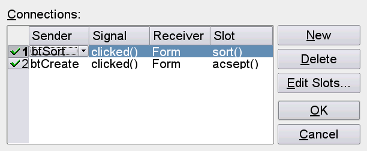
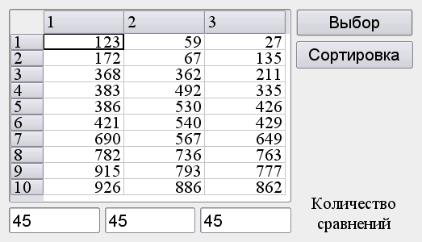
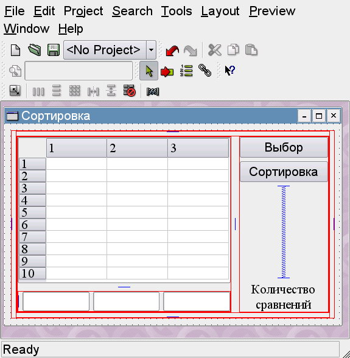

# Лабораторная работа №4 #

## Создание интерфейса простых приложений ##

## Цель лабораторной работы ##

Отработка умений и навыков описания событий в приложениях.

## Теория ##

### Класс QTable ###

Класс `QTable` представляет собой таблицу, количество строк и столбцов которой и их заголовки определяются окном свойств, вызываемое двойным щелчком мыши на таблице. Поместить текст в ячейку можно с помощью метода `setText`:

```C++ 
setText(int, int, QString).
```

Первый параметр указывает на номер строки, второй – на номер столбца. Для записи числа `k` в `(i,j)` ячейку таблицы `table` его необходимо преобразовать к типу `QString`:

```C++ 
table->setText(i,j,QString("%1").arg(k));
```

Считать запись с преобразованием в число позволяет команда:

```C++ 
int s=(table->text(i,j)).toInt();
```
Сортировку в столбце `"0"` выполняет команда:

```C++ 
table->sortColumn(0);
```

## Задание ##

1. Создать интерфейс приложения задачи предложенного варианта. Используя лейауты, удобно расположить элементы приложения. Представить решение задачи и готовый исполняемый файл приложения.
2. Добавить созданному приложению новую функциональность на основе событий. Создать события обработки «горячих клавиш» дублирующих функции кнопок, а при наведении курсора мыши на ячейку таблицы в компоненте `ToolTip` должно отображаться ее текущее значение.

|Вариант|Задание|
| --- | --- |
| 1 | Напишите программу, способную высчитывать тригонометрические функции `sin`, `cos`, `tg` заданных углов от 0 до 90º. Создайте интерфейс программы: в таблице 3 поля – «угол в градусах», «угол в радианах» и «результат», три кнопки – «sin», «cos», «tg» - выполняют действия и выводят результат в третье поле таблицы. Данные углов выбрать с шагом 5º. В таблице использовать выравнивание элементов справа. |
| 2 | Напишите программу, выполняющую сортировку случайным образом полученного массива 3х10 методами `пузырька` и `вставок`. Создайте интерфейс программы: в таблице 3х10 числа получить случайным образом по сигналу от предусмотренной кнопки; обеспечить выбор метода сортировки; сортировку чисел в столбце начинать по клику `ЛКМ` в этом столбце; предусмотреть вывод количества сравнений. |
| 3 | Напишите программу, способную определять следующие параметры массива 7х7: максимальное и минимальное значение, их местоположение, сумму значений элементов массива и среднее арифметическое значение. Создайте интерфейс программы: в таблице 7х7 числа получить случайным образом по сигналу от предусмотренной кнопки; кнопки «Max» и «Min» должны выполнять поиск соответствующих значений и их местоположение, которое должно быть подсвечено цветом в таблице; кнопки «Сумма» и «СА» должны высчитывать указанные значения и выводить результат в поля надписи. |
| 4 | Напишите программу, выполняющую операции сложения, вычитания и умножения матриц 3х3. Создайте интерфейс программы: в 2-х таблицах 3х3 числа получить случайным образом по сигналу от предусмотренной кнопки; кнопки «Сумма», «Разность» и «Произведение» должны выполнять соответствующие действия над массивами, результат должен быть выведен в третий массив, в котором подсветить цветом максимальное и минимальное значение. |
| 5 | Напишите программу, анимирующую операцию нахождения определителя матрицы 3х3. Создайте интерфейс программы: в таблице 3х3 числа получить случайным образом по сигналу от предусмотренной кнопки; кнопки «Шаг 1», «Шаг 2», «Шаг 3» и «Шаг 4» должны выполнять соответствующие действия по определению определителя матрицы, при этом на каждом шаге в таблице цветом должны быть подсвечены элементы, с которыми производятся действия; результат должен быть выведен в поле надписи.|
| 6 | Напишите программу, которая преобразует температуру в целых числах по `Фаренгейту` от 0 до 212 градусов к значениям с плавающей запятой температуры по `Цельсию` с точностью до 3 знаков и к значениям `абсолютной` температуры с точностью до 1 знака. Используйте для вычислений формулы: $Т_С = 5.0/9.0 * (Т_F - 32)$ и $Т_К = Т_С + 273$. Создайте интерфейс программы: выходные данные должны быть отпечатаны в таблице с выравниванием по правой границе поля, причем значения температуры по `Цельсию` должны содержать знак и перед положительными, и перед отрицательными температурами. Отрицательные значения $Т_С$ в таблице указать <span style="color:blue">синим</span> шрифтом, а положительные – <span style="color:red">красным</span>. |
| 7 | Напишите программу, которая при клике `ЛКМ` в ячейке таблицы 10х10, в зависимости от положения указателя в поле надписи выводит: координаты элемента таблицы; порядковый номер элемента, квадрат и куб его значения. Создайте интерфейс программы: в таблице 10х10 числа получить случайным образом; создать компонент выбора и кнопки выполняемых действий; результат действий выводить в поле надписи. |
| 8 | Напишите программу, которая находит в массиве 10х10 числа делимые на 2, 3, 4, 5 и 6. Создайте интерфейс программы: в таблице 10х10 числа получить случайным образом; создать кнопки выполняемых действий; результат действий `подсвечивать` цветом; в поле надписи выводить количество найденных чисел. |
| 9 | Напишите программу, которая находит в массиве 15х15 числа являющиеся степенью 2 и 3. Создайте интерфейс программы: в таблице 15х15 числа получить случайным образом; создать кнопки выполняемых действий; результат действий `подсвечивать` цветом; в поле надписи выводить количество найденных чисел. |
| 10 | Напишите программу, которая рассчитывает 15 значений сопротивления по `закону Ома` и количество выделенного тепла по `закону Джоуля-Ленца` за время 10 сек. Создайте интерфейс программы: в таблице 4х15 в первых двух полях числа получить случайным образом (от 10 до 100); создать кнопки расчета сопротивления и выделенной энергии; результат выводить во третье и четвертое поля таблицы; в результате `подсвечивать` цветом значения сопротивления в интервале от 100 `Ом` до 1 `кОм` и энергии от 10 до 100 `Дж`; в поле надписи выводить количество таких значений. |
| 11 | Напишите программу, которая выводит в таблицу с 5 полями числа в десятичной, двоичной, восьмеричной, шестнадцатеричной и двоично-десятичной системах счисления соответственно в указанном диапазоне. Создайте интерфейс программы: два поля ввода должны принимать целые числа от 0 до 100; по клику на кнопке «Показать», в таблице 5хN вывести числа в указанных системах счисления в указанном диапазоне; `подсветить` цветом значения содержащие ноль в младшем разряде; в поле надписи выводить количество таких значений. |
| 12 | Напишите программу, выполняющую сортировку случайным образом полученного массива 3х10 методом `пузырька`. Создайте интерфейс программы: в таблице 3х10 числа получить случайным образом по сигналу от предусмотренной кнопки; обеспечить независимый выбор направления сортировки в столбцах (по возрастанию и по убыванию) по клику `ЛКМ` в данном столбце; предусмотреть сортировку по `ASCII` коду. |

 

 

 

## Контрольные вопросы ##

1.	Какие возможности предоставляет среда быстрой разработки приложений `Qt designer`. Чем она отличается от других аналогичных программ?
2.	В средах ОС `Windows` и `Unix` `qmake` создает разные файлы исходного кода. Обоснуйте их различие.
3.	Какова последовательность команд получения исполняемого файла приложения, использующего библиотеку `Qt`?
4.	Определите значение каждого файла проекта.
5.	Что называют событием в приложениях разработанных с помощью библиотеки `Qt`?
6.	Какие события представлены в библиотеке `Qt`?
7.	Каков принцип описания событий с помощью библиотеки `Qt`?
8.	Для чего предназначены фильтры событий?
