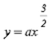
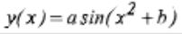
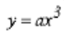
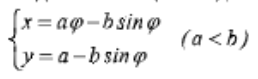
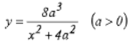
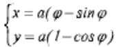
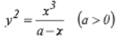
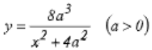

# Лабораторная работа № 8 #

## Графические примитивы в библиотеке QT ##

## Цель работы ##

Изучить графические примитивы библиотеки QT. 

## Теоретические сведения ##

Итак, начнём с главного правила - рисовать на виджете можно переопределив его метод paintEvent(QPaintEvent *).

Причина переопределения метода перерисовки в том, что код, выполняющийся в этой функции, будет запущен каждый раз, когда надо перерисовать внешний вид виджета. Перерисовка, на самом
деле, требуется на так уж часто $-$ когда изменяется геометрия виджета (например мы растянули окно, и вместе с ним растянулся наш виджет), когда виджет перекрывается/перестаёт_перекрываться/изменилось_перекрывание другими виджетами $-$ вот основные причины для автоматического вызова перерисовки.
Кстати говоря, автоматического вызова перерисовки не всегда достаточно, но мы можем сами
вызвать перерисовку, вызвав метод update() для виджета.
Подводя итог, можно сказать следующее: если мы хотим нарисовать что-то на виджете - нам надо
создать свой собственный виджет, и переопределить его метод paintEvent(QPaintEvent *). После
этого, мы создадим объект нашего класса.

## Пояснения ##

QPainter p(this); $-$ создаём новый объект рисовальщика. Рисовать мы можем, по идее, на любом
QPaintDevice, указав указатель на объект унаследованный от QPaintDevice в качестве параметра
для создающегося QPainter объекта. (Подробнее о классах, на которых можно рисовать -
QtAssitant::QPaintDevice;) В нашем случае мы передаём указатель на наш виджет - this. После
этого наш объект QPainter класса может совершенно спокойно рисовать.

p.setPen(QPen(Qt::red,1,Qt::SolidLine)); - настраиваем рисование. а точнее говорим, что рисовать
надо красным цветом, сплошными линиями толщиной 1 пиксель.

p.drawLine(0,0,width(),height()); - рисуем линию из точки с координатами (0,0) (по умолчанию это
верхний левый угол виджета, однако это можно изменить) в точку с координатами (width,height).
В результате, мы добьемся того, что у нас на виджете всегда будет рисоваться диагональная
красная линия.
### Небольшое пояснение о системах координат: ###
По умолчанию виджет имеет систему координат с началом в верхнем левом углу (точка (0,0) ).
Ось X направлена вправо, ось Y направлена вниз. Однако это всегда можно изменить функцией
setWindow() - подробности в QtAssistant в лекционном материале.
## Задания для выполнения ##
1. Вывести заданным шрифтом вертикально на экран наименование лабораторной работы –
   2 балла.
2. Нарисовать цветную фигуру (2 балла) и организовать движение её по заданной
   траектории (6 баллов).
### Варианты заданий ###
| № варианта | Шрифт             | Фигура                                                 | Траектория движения                                                        |
|------------|-------------------|--------------------------------------------------------|----------------------------------------------------------------------------|
| 1          | Готический        | Снежинка, имеющая сердцевину в виде окружности         | Раскручивающаяся спираль                                                   |
| 2          | Рубленный         | Три связанных разноцветных окружности                  | Кубическая парабола  $y = ax^3$                        |
| 3          | Матричный         | Два частично перекрывающихся прямоугольника            | Полукубическая парабола                      |
| 4          | Полужирный        | Прямоугольник, поставленный на пьедестал               | Закручивающаяся спираль                                                    |
| 5          | Книжная гарнитура | Окружность на поставленном прямоугольнике              | Синусоида y=asin(x+b)                                                  |
| 6          | Готический        | Два прямоугольника, имеющих один общий угол            | Отрезок прямой, проведённой из левого верхнего в правый нижний угол экрана |
| 7          | Матричный         | Три окружности, образующих снеговика                   | Косинусоида y=acos(x+b)                                                |
| 8          | Светлый           | Три окружности по горизонтали                          | Синусоида                                    |
| 9          | Полужирный        | Поставленный прямоугольник и окружность у его подножия | Кубическая парабола                          |
| 10         | Книжная гарнитура | Гирлянда из трёх окружностей                           | Удлинённая циклоида                          |
| 11         |Готический| Три окружности, расположенных в виде треугольника      | Верзьера Аньези                              |
| 12         |Матричный|Прямоугольник на окружности| Обыкновенная циклоида                        |
| 13         |Светлый|Окружность на треугольнике| Циссоида Диокла                              |
| 14         |Готический|Ёлка из двух треугольников| Верзьера Аньези                              |