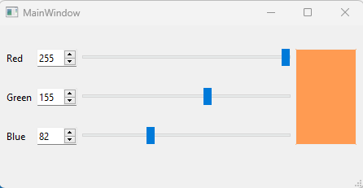
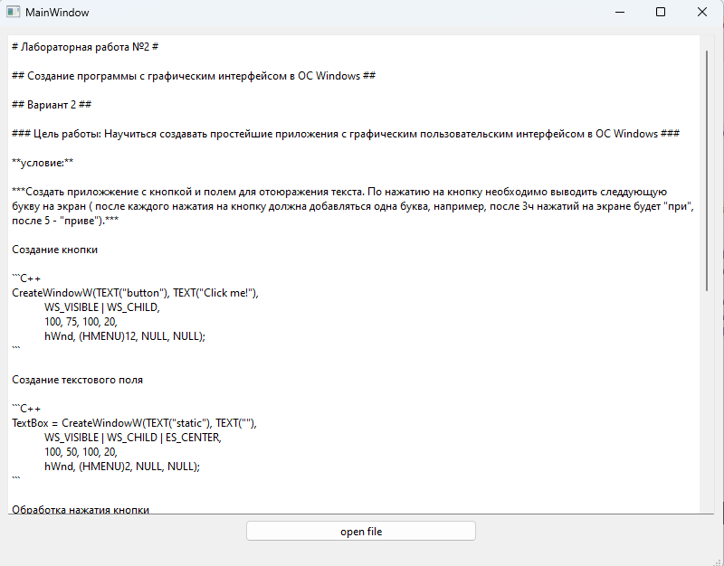

# Лабораторная работа №1 #

## Использование библиотеки элементов графического интерфейса Qt ##

## Цель работы ##

Научиться использовать библиотеку элементов графического интерфейса Qt.

### План ###

+ простейшее графическое приложение на Qt
+ работа с компоновщиками
+ создание приложения ColorViewer
+ использование QFileDialog - создание простейшего обозревателя текста

#### Реализация приложения color viewer ####

```c++
#include "mainwindow.h"
#include <QApplication>

int main(int argc, char *argv[])
{
    QApplication a(argc, argv);
    MainWindow w;

    QLabel *l1;
    QLabel *l2;
    QLabel *l3;
    QSpinBox *sb1;
    QSpinBox *sb2;
    QSpinBox *sb3;
    QSlider *sl1;
    QSlider *sl2;
    QSlider *sl3;
    QPlainTextEdit *pte;
    QGridLayout *layout;

    l1 = new QLabel("Red");
    l2 = new QLabel("Green");
    l3 = new QLabel("Blue");

    sb1 = new QSpinBox(this);
    sb2 = new QSpinBox(this);
    sb3 = new QSpinBox(this);

    sb1->setMinimum(0);
    sb1->setMaximum(255);
    sb1->setValue(0);
    sb1->setFixedWidth(50);

    sb2->setMinimum(0);
    sb2->setMaximum(255);
    sb2->setValue(0);
    sb2->setFixedWidth(50);

    sb3->setMinimum(0);
    sb3->setMaximum(255);
    sb3->setValue(0);
    sb3->setFixedWidth(50);

    sl1 = new QSlider(Qt::Horizontal, this);
    sl2 = new QSlider(Qt::Horizontal, this);
    sl3 = new QSlider(Qt::Horizontal, this);

    sl1->setMinimum(0);
    sl1->setMaximum(255);
    sl1->setValue(0);
    sl1->setFixedWidth(256);

    sl2->setMinimum(0);
    sl2->setMaximum(255);
    sl2->setValue(0);
    sl2->setFixedWidth(256);

    sl3->setMinimum(0);
    sl3->setMaximum(255);
    sl3->setValue(0);
    sl3->setFixedWidth(256);

    pte = new QPlainTextEdit(this);

    pte->setFixedWidth(75);
    pte->setEnabled(false);

    layout = new QGridLayout;
    layout->addWidget(l1, 0, 0);
    layout->addWidget(sb1, 0, 1);
    layout->addWidget(sl1, 0, 2);
    layout->addWidget(l2, 1, 0);
    layout->addWidget(sb2, 1, 1);
    layout->addWidget(sl2, 1, 2);
    layout->addWidget(l3, 2, 0);
    layout->addWidget(sb3, 2, 1);
    layout->addWidget(sl3, 2, 2);
    layout->addWidget(pte, 0, 3, 3, 1);

    QObject::connect(w.sl1, &QSlider::sliderMoved, &w, w.setRed);
    QObject::connect(w.sl2, &QSlider::sliderMoved, &w, w.setGreen);
    QObject::connect(w.sl3, &QSlider::sliderMoved, &w, w.setBlue);

    QObject::connect(w.sb1, &QSpinBox::valueChanged, &w, w.setRed);
    QObject::connect(w.sb2, &QSpinBox::valueChanged, &w, w.setGreen);
    QObject::connect(w.sb3, &QSpinBox::valueChanged, &w, w.setBlue);

    w.resize(200, 200);
    w.show();
    return a.exec();
}

void MainWindow::setRed(int red){
    sb1->setValue(red);
    sl1->setValue(red);
    setColor();
}

void MainWindow::setGreen(int green){
    sb2->setValue(green);
    sl2->setValue(green);
    setColor();
}

void MainWindow::setBlue(int blue){
    sb3->setValue(blue);
    sl3->setValue(blue);
    setColor();
}

void MainWindow::setColor(){
    QString style="QPlainTextEdit { background: #";
    QString temp;
    temp = QString::number(sb1->value(), 16);
    style += temp;
    temp = QString::number(sb2->value(), 16);
    style += temp;
    temp = QString::number(sb3->value(), 16);
        style += temp;
    style += "; }";
    pte->setStyleSheet(style);
}
```

#### Результат программы color viewer ####



#### Реализация простейшего обозревателя файлов ####

```C++
#include "textbox.h"
#include <QApplication>

int main(int argc, char *argv[])
{
    QApplication a(argc, argv);
    TextBox t;

    QTextEdit *te;
    QPushButton *but;
    QGridLayout *layout;

    te = new QTextEdit("file text", this);
    but = new QPushButton("open file", this);
    layout = new QGridLayout;

    layout->addWidget(te, 0, 0, 3, 3);
    layout->addWidget(but, 3, 1);

    QObject::connect(t.but, &QPushButton::clicked, &t, t.openFile);
    t.show();
    return a.exec();
}

void TextBox::openFile(){
    QString fileName;
    fileName=QFileDialog::getOpenFileName();
    QFile file(fileName);
    QByteArray text;
    if (!file.open(QIODevice::ReadOnly))
        return;
    text = file.readAll();
    te->setText(QString(text));
}
```

#### Результат программы ####



#### Вывод ####

Научились использовать библиотеку элементов графического интерфейса Qt.
