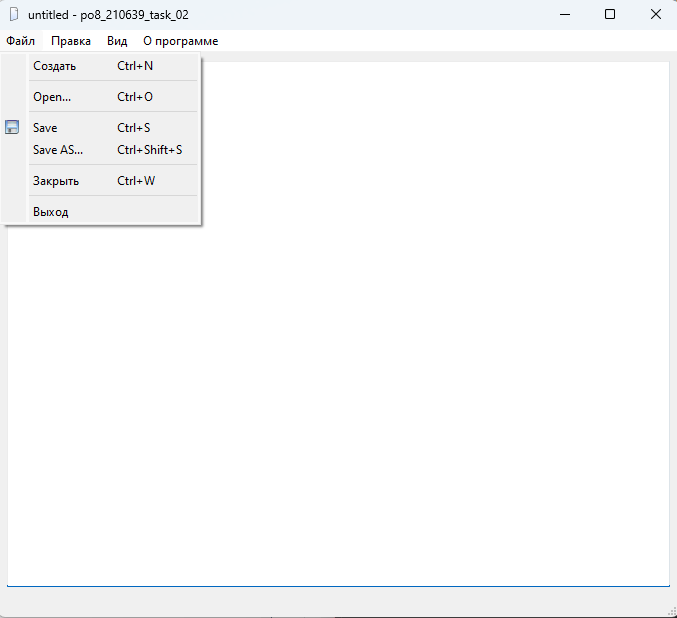
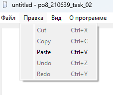
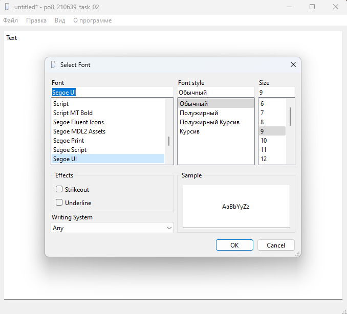
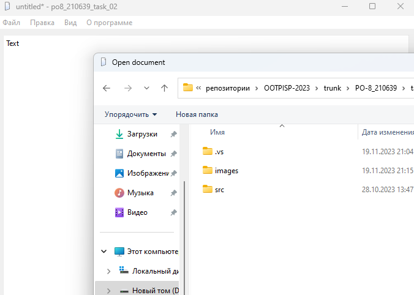
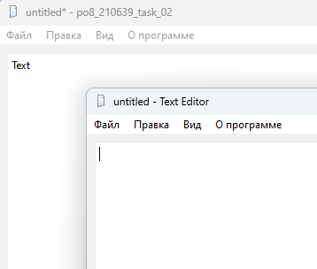
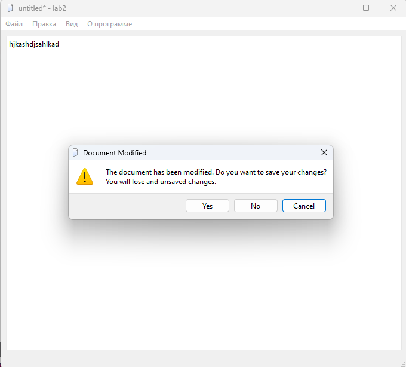

# Лабораторная работа №2 #

## Реализация ##

## Цель работы ##

Целью этой лабораторной работы является применение полученных на предыдущих лекциях знаний и повторение их на практических примерах. Задачей будет разработка законченного оконного приложения — текстового редактора, работающего с несколькими документами с возможностями открытия и сохранения, отмены действий, работы с буфером обмена и другими.

**main.cpp** содержит функцию main, которая инициализирует и запускает приложение.

```c++
#include "texteditor.h"

#include <QApplication>

int main(int argc, char *argv[])
{
    QApplication a(argc, argv);
    textEditor w;
    a.setApplicationName("Text Editor");
    a.setApplicationVersion("0.1");
    a.setOrganizationName("ExampleSoft");
    a.setOrganizationDomain("example.com");
    a.setWindowIcon(QIcon(":/icons/new.png"));
    w.show();
    return a.exec();
}
```

**texteditor.cpp** содержит реализацию класса TextEditor.

Реализации действия **actionNew**:

```c++
void textEditor::on_actionNew210639_triggered()
{
    textEditor *texteditor= new textEditor();
    texteditor->show();
}
```

Для двух других действий, **actionClose** и **actionExit** выполнили соединение сигналов со слотами в конструкторе класса TextEditor:

```c++
connect(ui->actionClose210639, SIGNAL(triggered()), this, SLOT(close()));
connect(ui->actionExit210639, SIGNAL(triggered()), qApp, SLOT(closeAllWindows()));
```

Подтверждение при закрытии измененного окна:

```c++
void textEditor::closeEvent210639(QCloseEvent *e)
{
    if(isWindowModified())
    {
        switch(QMessageBox::warning(this, "Document Modified",
        "The document has been modified. "
        "Do you want to save your changes?\n"
        "You will lose and unsaved changes.",
        QMessageBox::Yes | QMessageBox::No | QMessageBox::Cancel,
        QMessageBox::Cancel))
        {
        case QMessageBox::Yes:
            if(!saveFile210639()){
               e->accept();
            }
            e->ignore();
            break;
        case QMessageBox::No:
            e->accept();
            break;
        case QMessageBox::Cancel:
            e->ignore();
        break;
        }
    }
    else
    {
        e->accept();
    }
}
```

Реализации действия **actionSelectFont**:

```c++
void textEditor::on_actionSelectFont210639_triggered()
{
    bool ok;
    QFont font;
    QFont initial = ui->textEdit->font();
    font = QFontDialog::getFont(&ok, initial, this);
    if(ok){
        ui->textEdit->setFont(font);
        QSettings settings;
        settings.setValue("viewFont", QVariant::fromValue(font));
    }
}
```

Для действий с работой буфера обмена (Вырезать, Копировать, Вставить, Отменить, Повторить, О программе, О Qt) выполнили соединение сигналов со слотами:

```c++  
    connect(ui->actionAbout_Qt210639, SIGNAL(triggered()), qApp, SLOT(aboutQt()));
    connect(ui->actionCut210639, SIGNAL(triggered()), ui->textEdit, SLOT(cut()));
    connect(ui->actionCopy210639, SIGNAL(triggered()), ui->textEdit, SLOT(copy()));
    connect(ui->actionPaste210639, SIGNAL(triggered()), ui->textEdit, SLOT(paste()));
    connect(ui->actionUndo210639, SIGNAL(triggered()), ui->textEdit, SLOT(undo()));
    connect(ui->actionRedo210639, SIGNAL(triggered()), ui->textEdit, SLOT(redo()));
    connect(ui->textEdit, SIGNAL(copyAvailable(bool)), ui->actionCopy210639, SLOT(setEnabled(bool)));
    connect(ui->textEdit, SIGNAL(copyAvailable(bool)), ui->actionCut210639, SLOT(setEnabled(bool)));
    connect(ui->textEdit, SIGNAL(undoAvailable(bool)), ui->actionUndo210639, SLOT(setEnabled(bool)));
    connect(ui->textEdit, SIGNAL(redoAvailable(bool)), ui->actionRedo210639, SLOT(setEnabled(bool)));

    ui->actionCopy210639->setEnabled(false);
    ui->actionCut210639->setEnabled(false);
    ui->actionUndo210639->setEnabled(false);
    ui->actionRedo210639->setEnabled(false);
```

Реализации действия **actionAbout**:

```c++
void textEditor::on_actionAbout210639_triggered()
{
    QMessageBox::about(this, "About", "Text editor.");
}
```

Реализации действия **actionOpen**:

```c++
void textEditor::on_actionOpen210639_triggered()
{
    QString fileName = QFileDialog::getOpenFileName(this, "Open document", QDir::currentPath(), "Text documents (*.txt)");
    if(fileName.isNull()){
        return;
    }
    if(m_fileName.isNull() && !isWindowModified()){
        loadFile210639(fileName);
    }
    else{
        textEditor *texteditor = new textEditor(fileName);
        texteditor->show();
    }
}
```

Создание приватных слотов для реализации функциональности сохранения файлов:

```c++
private slots:
    bool saveFile210639();
    bool saveFileAs210639();
```

Реализации функции **saveFileAs**:

```c++
bool textEditor::saveFileAs210639(){
    QString fileName = QFileDialog::getSaveFileName(this, "Save document", m_fileName.isNull()?QDir::currentPath():m_fileName, "Text documents (*.txt)");
    if(fileName.isNull()){
        return false;
    }
    else{
        setFileName210639(fileName);
        return saveFile210639();
    }
}
```

Реализации функции **saveFile**:

```c++
bool textEditor::saveFile210639(){
    if(m_fileName.isNull()){
        return saveFileAs210639();
    }
    QFile file(m_fileName);
    if (!file.open(QIODevice::WriteOnly | QIODevice::Text)){
        QMessageBox::warning(this, "Warning", "Can't open this file");
        setFileName210639(QString());
        return false;
    }
    else{
        QTextStream out_stream(&file);
        out_stream << ui->textEdit->toPlainText();
        file.close();
        setWindowModified(false);
        return true;
    }
}
```

### Результат работы программы ###





Возможность изменения шрифтов:



Возможность открытия файлов:


Поддержка работы нескольких окон:



Уведомление о том, что файл не сохранен при выходе из приложения:



#### Вывод ####

Разработали законченное оконное приложение — текстовый редактор, работающий с несколькими документами с возможностями открытия и сохранения, отмены действий, работы с буфером обмена и другими.
