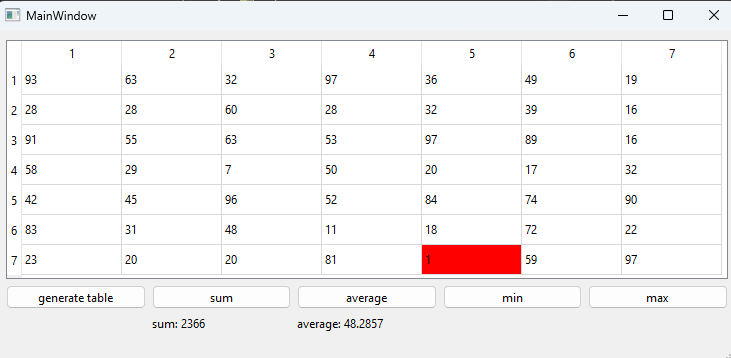

# Лабораторная работа №4 #

## Создание интерфейса простых приложений ##

## Вариант 3 ##

## Цель лабораторной работы ##

Отработка умений и навыков описания событий в приложениях.

## Реализация ##

Файлы проекта:

- [main.cpp](./src/main.cpp)
- [mainwindow.h](./src/mainwindow.h)
- [mainwindow.cpp](./src/mainwindow.cpp)

## Результат работы программы ##

Генерация таблицы 7х7:

Подсчет суммы элементов таблицы:

Подсчет среднего арифметического элементов таблицы:

Поиск минимального элемента:

Поиск максимального элемента:

## Вывод ##

Отработали умения и навыки описания событий в приложениях.
