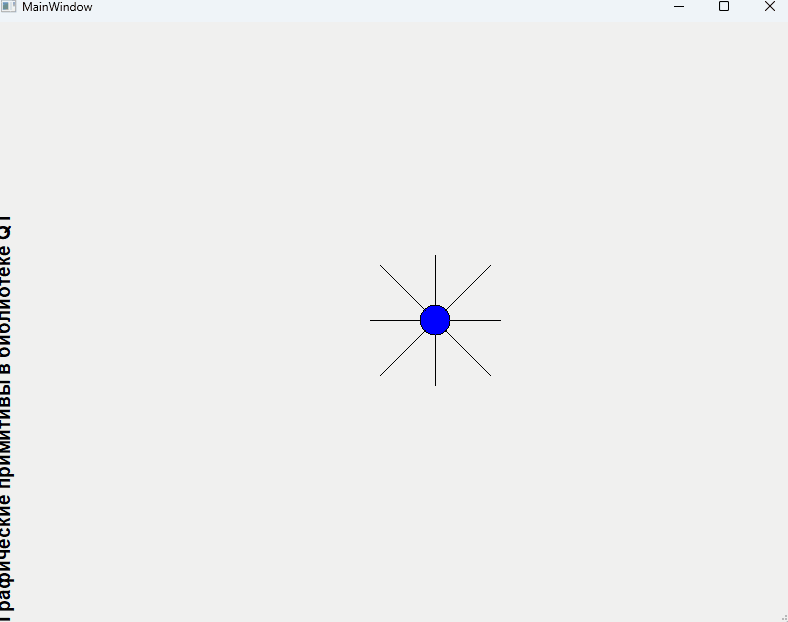

# Отчет по лабораторной работе №8 #

## Вариант №1 ##

|№ варианта|Шрифт|Фигура|Траектория движения|
|---|---|---|---|
|1|Готический|Снежинка, имеющая сердцевину в виде окружности|Раскручивающаяся спираль|

## Код программы ##

[mainwindow.h](./src/mainwindow.h)
[mainwindow.cpp](./src/mainwindow.cpp)

## Результат работы программы ##

