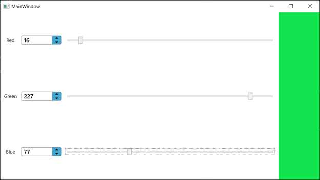
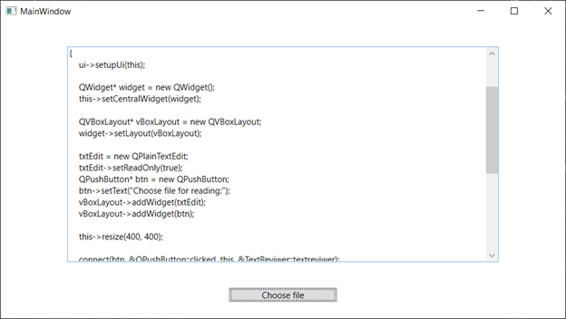

# Цель работы 

Научиться использовать библиотеку элементов графического интерфейса.

### План 

+ простейшее графическое приложение на Qt
+ работа с компоновщиками
+ создание приложения ColorViewer
+ использование QFileDialog - создание простейшего обозревателя текста

#### Создание приложения ColorViewer 

`MainWindow.xaml`
```XAML
<Grid Name="MainGrid">

    <Grid.RowDefinitions>
        <RowDefinition Height="*"/>
        <RowDefinition Height="*"/>
        <RowDefinition Height="*"/>
    </Grid.RowDefinitions>

    <Grid.ColumnDefinitions>
        <ColumnDefinition Width="50"/>
        <ColumnDefinition Width="100"/>
        <ColumnDefinition Width="*"/>
        <ColumnDefinition Width="100"/>
    </Grid.ColumnDefinitions>


    <TextBlock Text="Red" Grid.Row="0" Grid.Column="0" HorizontalAlignment="Center" VerticalAlignment="Center"/>
    <lib:NumericSpinner x:Name="SpinnerR" Step="1" MinValue="0" MaxValue="255" Grid.Row="0" Grid.Column="1" VerticalAlignment="Center" ValueChanged="Red_ValueChanged"/>
    <Slider Name="SliderR" Minimum="0" Maximum="255" Grid.Row="0" Grid.Column="2" VerticalAlignment="Center" ValueChanged="Red_ValueChanged" Margin="10,0,10,0"/>

    <TextBlock Text="Green" Grid.Row="1" Grid.Column="0" HorizontalAlignment="Center" VerticalAlignment="Center"/>
    <lib:NumericSpinner x:Name="SpinnerG" Step="1" MinValue="0" MaxValue="255" Grid.Row="1" Grid.Column="1" VerticalAlignment="Center" ValueChanged="Green_ValueChanged"/>
    <Slider Name="SliderG" Minimum="0" Maximum="255" Grid.Row="1" Grid.Column="2" VerticalAlignment="Center" ValueChanged="Green_ValueChanged" Margin="10,0,10,0"/>

    <TextBlock Text="Blue" Grid.Row="2" Grid.Column="0" HorizontalAlignment="Center" VerticalAlignment="Center"/>
    <lib:NumericSpinner x:Name="SpinnerB" Step="1" MinValue="0" MaxValue="255" Grid.Row="2" Grid.Column="1" VerticalAlignment="Center" ValueChanged="Blue_ValueChanged"/>
    <Slider Name="SliderB" Minimum="0" Maximum="255" Grid.Row="2" Grid.Column="2" VerticalAlignment="Center" ValueChanged="Blue_ValueChanged" Margin="10,0,10,0"/>


    <Canvas Name="RGBCanvas" Grid.Row="0" Grid.Column="3" Grid.RowSpan="3"/>
    
</Grid>
```
`MainWindow.xaml.cs`
``` C#
public partial class MainWindow : Window
{
    public MainWindow()
    {
        InitializeComponent();

        RGBCanvas.Background = new SolidColorBrush(Color.FromRgb(0, 0, 0));
    }

    private void Red_ValueChanged(object sender, EventArgs e)
    {
        if (sender is Slider slider)
        {
            var value = Convert.ToByte(slider.Value);
            SpinnerR.Value = value;

            if (RGBCanvas.Background is SolidColorBrush brush)
            {
                var color = brush.Color;
                color.R = value;
                brush.Color = color;
            }
        }

        if (sender is NumericSpinner spinner)
        {
            var value = Convert.ToByte(spinner.Value);
            SliderR.Value = value;

            if (RGBCanvas.Background is SolidColorBrush brush)
            {
                var color = brush.Color;
                color.R = value;
                brush.Color = color;
            }
        }
    }

    private void Green_ValueChanged(object sender, EventArgs e)
    {
        if (sender is Slider slider)
        {
            var value = Convert.ToByte(slider.Value);
            SpinnerG.Value = value;

            if (RGBCanvas.Background is SolidColorBrush brush)
            {
                var color = brush.Color;
                color.G = value;
                brush.Color = color;
            }
        }

        if (sender is NumericSpinner spinner)
        {
            var value = Convert.ToByte(spinner.Value);
            SliderG.Value = value;

            if (RGBCanvas.Background is SolidColorBrush brush)
            {
                var color = brush.Color;
                color.G = value;
                brush.Color = color;
            }
        }
    }

    private void Blue_ValueChanged(object sender, EventArgs e)
    {
        if (sender is Slider slider)
        {
            var value = Convert.ToByte(slider.Value);
            SpinnerB.Value = value;

            if (RGBCanvas.Background is SolidColorBrush brush)
            {
                var color = brush.Color;
                color.B = value;
                brush.Color = color;
            }
        }

        if (sender is NumericSpinner spinner)
        {
            var value = Convert.ToByte(spinner.Value);
            SliderB.Value = value;

            if (RGBCanvas.Background is SolidColorBrush brush)
            {
                var color = brush.Color;
                color.B = value;
                brush.Color = color;
            }
        }
    }
}
```

#### Результат работы программы 1



#### Cоздание простейшего обозревателя текста 

`MainWindow.xaml`
```XAML
<Grid>
    <TextBox 
        x:Name="TextDisplay" 
        IsReadOnly="True" 
        HorizontalAlignment="Center" 
        Margin="0,34,0,0" 
        TextWrapping="Wrap" 
        VerticalAlignment="Top" 
        Height="300" Width="600" 
        VerticalScrollBarVisibility="Auto"/>
    
    <Button 
        x:Name="FileButton" 
        Content="Choose file" 
        HorizontalAlignment="Center" 
        Margin="0,370,0,0" 
        VerticalAlignment="Top" 
        Width="150" 
        Click="FileButton_Click"/>

</Grid>
```
`MainWindow.xaml.cs`
``` C#
public partial class MainWindow : Window
{
    public MainWindow()
    {
        InitializeComponent();
    }

    private void FileButton_Click(object sender, RoutedEventArgs e)
    {
        var dialog = new OpenFileDialog
        {
            CheckFileExists = true,
            CheckPathExists = true,
            ShowReadOnly = true,
            Title = "Choosing file...",

            Filter = "Текстовые файлы(*.txt)|*.txt",
        };

        var result = dialog.ShowDialog();
        if (result == true)
        {
            var text = File.ReadAllText(dialog.FileName);
            TextDisplay.Text = text;
        }
    }
}
```

#### Результат работы программы 2



#### Вывод 

Научился использовать библиотеку элементов графического интерфейса.
