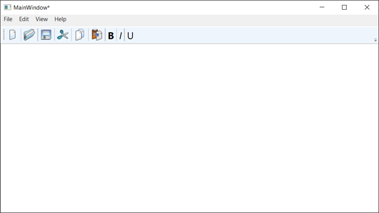
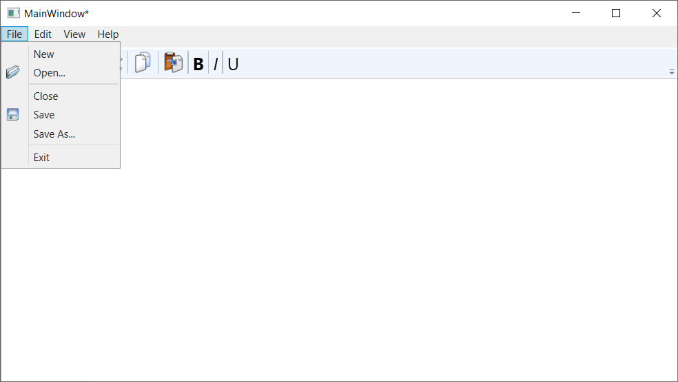
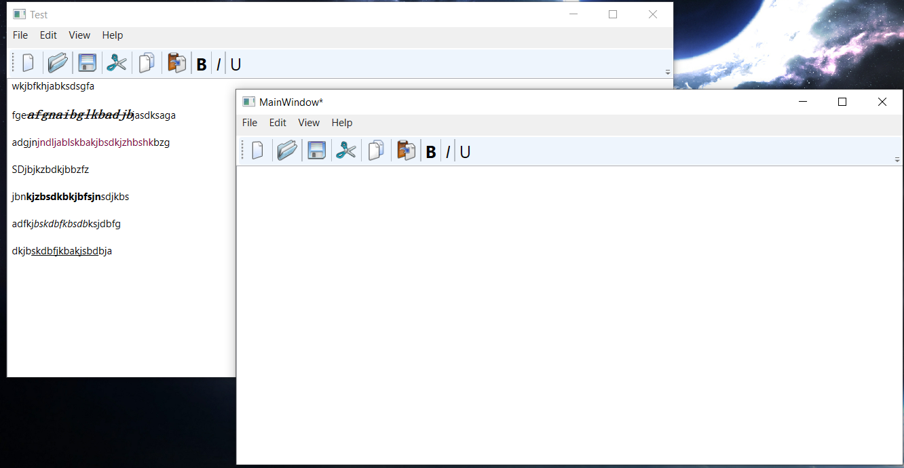

# Цель работы 
Целью является понимание структуры приложения на WPF и получение опыта использования стандартной документации WPF.
#### Создание меню 
```XAML
<Menu Height="25" VerticalAlignment="Top">
    <MenuItem Header="File">
        <MenuItem Header="New" Click="New_MenuItem_Click" ToolTip="Create new document"/>
        <MenuItem Header="Open..." Click="Open_Button_Click" ToolTip="Open existing document">
            <MenuItem.Icon>
                <Image Source="/Resources/Icons/open.png"/>
            </MenuItem.Icon>
        </MenuItem>
        <Separator/>
        <MenuItem Header="Close" Click="Close_MenuItem_Click"/>
        <MenuItem Header="Save" Click="Save_Button_Click">
            <MenuItem.Icon>
                <Image Source="/Resources/Icons/save.png"/>
            </MenuItem.Icon>
        </MenuItem>
        <MenuItem Header="Save As..." Click="SaveAs_Button_Click"/>
        <Separator/>
        <MenuItem Header="Exit" Click="Exit_MenuItem_Click"/>
    </MenuItem>
    
    <MenuItem Header="Edit">
        <MenuItem Header="Cut" Command="ApplicationCommands.Cut">
            <MenuItem.Icon>
                <Image Source="/Resources/Icons/cut.png"/>
            </MenuItem.Icon>
        </MenuItem>
        <MenuItem Header="Copy" Command="ApplicationCommands.Copy">
            <MenuItem.Icon>
                <Image Source="/Resources/Icons/copy.png"/>
            </MenuItem.Icon>
        </MenuItem>
        <MenuItem Header="Paste" Command="ApplicationCommands.Paste">
            <MenuItem.Icon>
                <Image Source="/Resources/Icons/paste.png"/>
            </MenuItem.Icon>
        </MenuItem>
        <MenuItem Header="Undo" Command="ApplicationCommands.Undo"/>
        <MenuItem Header="Redo" Command="ApplicationCommands.Redo"/>
    </MenuItem>
    
    <MenuItem Header="View">
        <MenuItem Header="Font" Click="Font_MenuItem_Click"/>
        <MenuItem Header="Color" Click="Color_MenuItem_Click"/>
    </MenuItem>
    
    <MenuItem Header="Help">
        <MenuItem Header="About" Click="About_MenuItem_Click"/>
        <MenuItem Header="About WPF" Click="WPF_MenuItem_Click" />
    </MenuItem>
</Menu>
```
#### Создание панели инструментов 
```XAML
<ToolBar Height="35" VerticalAlignment="Top">
    <Button Click="New_MenuItem_Click">
        <Image Source="/Resources/Icons/new.png" />
    </Button>
    <Separator />
    <Button Click="Open_Button_Click">
        <Image Source="/Resources/Icons/open.png" />
    </Button>
    <Separator />
    <Button Click="Save_Button_Click">
        <Image Source="/Resources/Icons/save.png" />
    </Button>
    <Separator />
    <Button Command="ApplicationCommands.Cut">
        <Image Source="/Resources/Icons/cut.png" />
    </Button>
    <Separator />
    <Button Command="ApplicationCommands.Copy">
        <Image Source="/Resources/Icons/copy.png" />
    </Button>
    <Separator />
    <Button Command="ApplicationCommands.Paste">
        <Image Source="/Resources/Icons/paste.png" />
    </Button>
    
    <Separator />
    <Button FontWeight="Bold" Foreground="Black" FontSize="20" Command="EditingCommands.ToggleBold">B</Button>
    <Separator />
    <Button FontStyle="Italic" Foreground="Black" FontSize="20" Command="EditingCommands.ToggleItalic">I</Button>
    <Separator />
    <Button Foreground="Black" FontSize="20" Command="EditingCommands.ToggleUnderline">U</Button>
</ToolBar>
```
#### Создание собственно редактора 
```XAML
<RichTextBox 
    Name="RichText"
    Height="375" 
    Width="800" 
    ScrollViewer.CanContentScroll="True" 
    ScrollViewer.VerticalScrollBarVisibility="Auto"
    TextChanged="RichTextBox_TextChanged">
    
    <FlowDocument>
        <Paragraph>
            <Run Text=""/>
        </Paragraph>
    </FlowDocument>
</RichTextBox>
```
#### Реализация открытия документа 
``` C#
private void Open_Button_Click(object sender, RoutedEventArgs e)
{
    var fileDialog = new OpenFileDialog();
    fileDialog.Filter = "RichText files (*.rtf)|*.rtf|All files (*.*)|*.*";

    var result = fileDialog.ShowDialog();
    if (result == System.Windows.Forms.DialogResult.OK)
    {
        TextRange tr = new TextRange(
            RichText.Document.ContentStart, RichText.Document.ContentEnd);

        using (FileStream fs = File.Open(fileDialog.FileName, FileMode.Open))
        {
            tr.Load(fs, DataFormats.Rtf);
        }

        var path = fileDialog.FileName;
        CurrentPath = path;
        this.Title = Path.GetFileNameWithoutExtension(path);
        _saveCanExecute = false;
    }
}
```
#### Результаты работы



#### Вывод 
Понял структуру приложения и получил опыт использования стандартной документации WPF.
