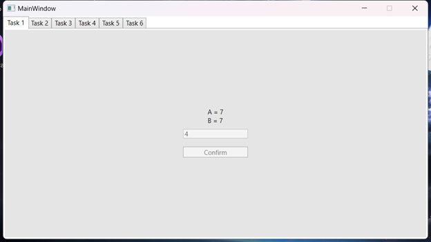
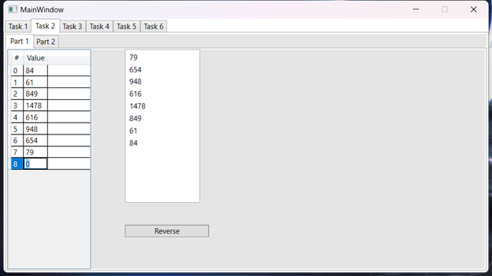
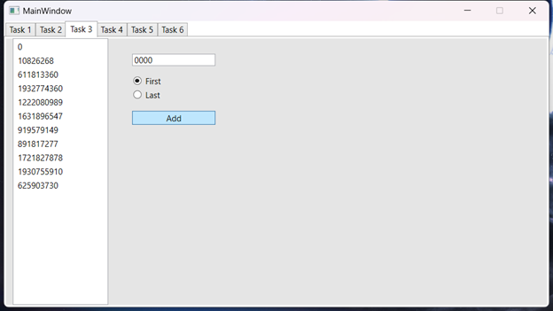
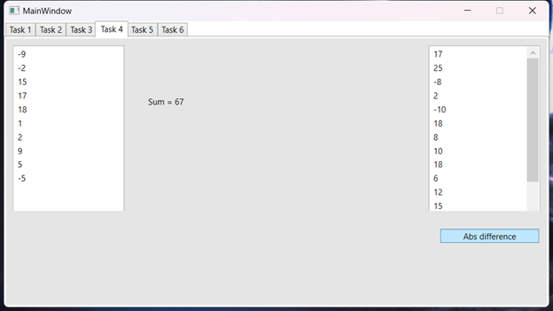
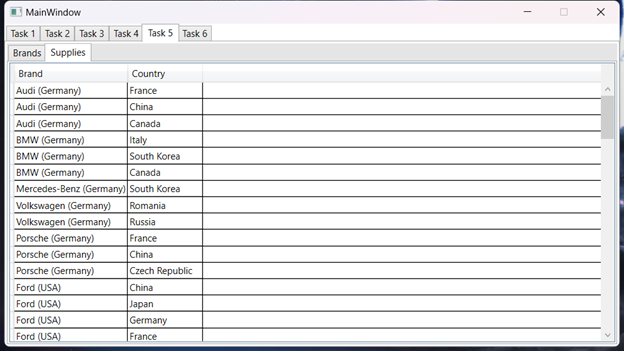
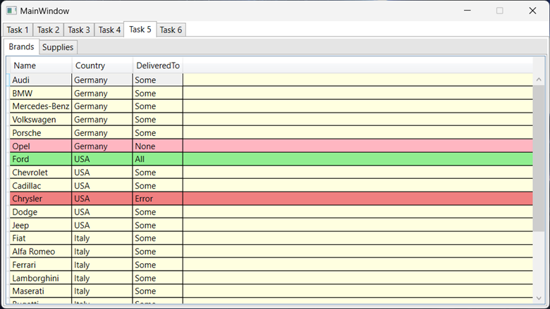
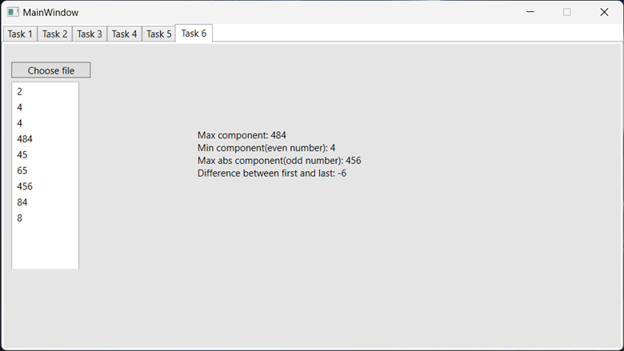

## Задание 1
### Вариант 16(6)
Даны две переменные целого типа: A и B (переменные вводятся в `lineedit`). Если их значения не равны, то присвоить каждой переменной максимальное из этих значений, а если равны, то присвоить переменным нулевые значения.
#### Разметка  
```XAML
<Grid Background="#FFE5E5E5">
    <TextBox 
        Name="Task1TextBox" 
        HorizontalAlignment="Center" 
        TextWrapping="Wrap" 
        VerticalAlignment="Center" 
        Width="120" 
        TextChanged="Task1TextBox_TextChanged"/>
    
    <Label 
        Name="Task1Label" 
        Content="Enter A" 
        HorizontalAlignment="Center" 
        Margin="0,132,0,0" 
        VerticalAlignment="Top" 
        Width="120" Height="56" 
        VerticalContentAlignment="Center" 
        HorizontalContentAlignment="Center"/>
    
    <Button 
        Name="Task1Button" 
        Content="Confirm" 
        HorizontalAlignment="Center" 
        Margin="0,217,0,0" 
        VerticalAlignment="Top" 
        Width="120" 
        Click="Task1Button_Button_Click"/>
</Grid>
```
#### Код 
```CSharp
private int? A { get; set; } = null;
private int B { get; set; }
private void Task1TextBox_TextChanged(object sender, TextChangedEventArgs e)
{
    Task1Button.IsEnabled = int.TryParse(Task1TextBox.Text, out int _);
}

private void Task1Button_Button_Click(object sender, RoutedEventArgs e)
{
    if (A is null)
    {
        A = int.Parse(Task1TextBox.Text);
        Task1Label.Content = "Enter B";
        Task1TextBox.Text = "";
    }
    else
    {
        B = int.Parse(Task1TextBox.Text);
        int a = A.Value;
        if (a == B)
        {
            A = B = 0;
        }
        else
        {
            A = B = Math.Max(a, B);
        }

        Task1TextBox.IsEnabled = false;
        Task1Button.IsEnabled = false;

        Task1Label.Content = $"A = {A}\nB = {B}";
    }
}
```
## Задание 2
### Вариант 16(1)
1. Дан массив размера N. Вывести его элементы в обратном порядке.
2. Дано число k (0 < k < 11) и матрица размера m x n. Найти сумму и произведение элементов k-го столбца данной матрицы (нахождение суммы или произведения определяется пользователем в виджете `comboBox`).
#### Разметка 
```XAML
<TabControl>
    <TabItem Header="Part 1">
        <Grid Background="#FFE5E5E5">
            <DataGrid 
                Name="Task2Part1Datagrid" 
                Initialized="Task2Part1Datagrid_Initialized" 
                CanUserAddRows="True" 
                CanUserDeleteRows="True" 
                AutoGenerateColumns="False"
                SelectionUnit="FullRow" Margin="0,0,638,0">

                <DataGrid.Columns>
                    <DataGridTextColumn Header="#" 
                    IsReadOnly="True" 
                    CanUserResize="False" 
                    Width="auto" 
                    Binding="{Binding Id}"/>

                    <DataGridTextColumn Header="Value" 
                    CanUserResize="False" 
                    Width="auto"  
                    Binding="{Binding Value}"/>
                </DataGrid.Columns>
            </DataGrid>
            <Button 
                Content="Reverse" 
                HorizontalAlignment="Left" 
                Margin="191,285,0,0" 
                VerticalAlignment="Top" 
                Width="136" 
                Click="Task2Part1Reverse_Button_Click"/>
            
            <ListBox x:Name="Task2Part1ListBox" Margin="191,0,461,108"/>
        </Grid>
    </TabItem>
    <TabItem Header="Part 2">
        <Grid Background="#FFE5E5E5">
            <UniformGrid 
                Name="Task2Part2UniformGrid" 
                Columns="11" 
                Rows="11" 
                ScrollViewer.HorizontalScrollBarVisibility="Auto" 
                ScrollViewer.VerticalScrollBarVisibility="Auto" 
                Margin="145,10,10,10"
                Initialized="Task2Part2UniformGrid_Initialized">

            </UniformGrid>
            <Label 
                Name="Task2Part2Label" 
                Content="0" 
                HorizontalContentAlignment="Center" 
                HorizontalAlignment="Left" 
                Margin="10,86,0,0" 
                VerticalAlignment="Top" 
                Width="120"/>
            
            <ComboBox 
                Name="Task2Part2KComboBox" 
                HorizontalAlignment="Left" 
                Margin="10,18,0,0" 
                VerticalAlignment="Top" 
                Width="120" 
                Initialized="Task2Part2KComboBox_Initialized"/>
            
            <ComboBox 
                Name="Task2Part2TypeComboBox" 
                HorizontalAlignment="Left" 
                Margin="10,45,0,0" 
                VerticalAlignment="Top" 
                Width="120" 
                SelectedIndex="0"  
                Initialized="Task2Part2TypeComboBox_Initialized"/>
        </Grid>
    </TabItem>
</TabControl>
```
#### Код 
```CSharp
private void Task2Part1Datagrid_Initialized(object sender, EventArgs e)
{
    var array = new ObservableCollection<MyInt>();
    Task2Part1Datagrid.ItemsSource = array;
}

private void Task2Part1Reverse_Button_Click(object sender, RoutedEventArgs e)
{
    var list = Task2Part1Datagrid.ItemsSource.Cast<MyInt>().Select(x => x.Value).ToList();
    list.Reverse();

    Task2Part1ListBox.ItemsSource = list;
}

// Part 2

private void Task2Part2UniformGrid_Initialized(object sender, EventArgs e)
{
    for (int i = 0; i < 11; i++)
    {
        for (int j = 0; j < 11; j++)
        {
            if (i == 0 && j == 0)
            {
                Task2Part2UniformGrid.Children.Add(new TextBlock()
                {
                    Text = "X",
                    Margin = new Thickness(5),
                    Visibility = Visibility.Hidden
                });
                continue;
            }

            if (i == 0)
            {
                Task2Part2UniformGrid.Children.Add(new TextBlock()
                {
                    Text = j.ToString(),
                    TextAlignment = TextAlignment.Center,
                    Margin = new Thickness(5)
                });
                continue;
            }

            if (j == 0)
            {
                Task2Part2UniformGrid.Children.Add(new TextBlock()
                {
                    Text = i.ToString(),
                    TextAlignment = TextAlignment.Right,
                    Margin = new Thickness(5)
                });
                continue;
            }

            var textBox = new TextBox()
            {
                Text = "0",
                Margin = new Thickness(5),
            };
            textBox.TextChanged += Task2Part2SomethingChanged;

            Task2Part2UniformGrid.Children.Add(textBox);
        }
    }
}

private void Task2Part2KComboBox_Initialized(object sender, EventArgs e)
{
    Task2Part2KComboBox.ItemsSource = Enumerable.Range(1, 10).Select(x => $"Column {x}").ToList();
    Task2Part2KComboBox.SelectionChanged += Task2Part2KComboBox_SelectionChanged;

    Task2Part2KComboBox.SelectedIndex = 0;

    Task2Part2KComboBox.SelectionChanged += Task2Part2SomethingChanged;
}

private void Task2Part2TypeComboBox_Initialized(object sender, EventArgs e)
{
    var types = new List<string>()
    {
        "Sum",
        "Product",
    };

    Task2Part2TypeComboBox.ItemsSource = types;
    Task2Part2TypeComboBox.SelectionChanged += Task2Part2SomethingChanged;
}

private List<TextBox> Task2Part2SelectedColumn { get; set; } = new List<TextBox>();

private void Task2Part2KComboBox_SelectionChanged(object sender, SelectionChangedEventArgs e)
{
    int k = Task2Part2KComboBox.SelectedIndex + 1;
    int j = 0;

    Task2Part2SelectedColumn.Clear();

    foreach (var item in Task2Part2UniformGrid.Children)
    {
        if (j == k)
        {
            if (item is TextBox textBox)
            {
                textBox.BorderBrush = Brushes.Green;
                textBox.BorderThickness = new Thickness(2);
                Task2Part2SelectedColumn.Add(textBox);
            }
        }
        else
        {
            if (item is TextBox textBox)
            {
                textBox.BorderBrush = Brushes.Black;
                textBox.BorderThickness = new Thickness(1);
            }
        }

        j = (j + 1) % 11;
    }
}

private void Task2Part2SomethingChanged(object sender, EventArgs e)
{
    string type = (string)Task2Part2TypeComboBox.SelectedItem;

    string result = "Error";

    if (Task2Part2SelectedColumn.All(tb => int.TryParse(tb.Text, out int _)))
    {
        result = type switch
        {
            "Sum" => Task2Part2SelectedColumn.Select(tb => int.Parse(tb.Text)).Sum().ToString(),
            "Product" => Task2Part2SelectedColumn.Select(tb => int.Parse(tb.Text)).Aggregate((x, y) => x * y).ToString(),
            _ => "Error",
        };
    }

    Task2Part2Label.Content = result;
}
```
## Задание 3
### Вариант 16(1)
1. Заполнить список случайными элементами. Реализовать добавление элемента в конец списка и удаления с конца (использовать `RadioButton` для выбора действия).
2. Создать два связных списка. Скопировать элементы первого во второй.
#### Разметка 
```XAML
<Grid Background="#FFE5E5E5">
    <ListBox 
        Name="Task3ListBox" 
        Margin="10,0,632,0" 
        Initialized="Task3ListBox_Initialized"/>
    
    <RadioButton
        Name="Task3FirstRadioButton" 
        GroupName="Task3AddType" 
        Content="First" 
        HorizontalAlignment="Left" 
        Margin="182,54,0,0" 
        VerticalAlignment="Top"/>
    
    <RadioButton 
        GroupName="Task3AddType" 
        IsChecked="True" 
        Content="Last" 
        HorizontalAlignment="Left" 
        Margin="182,74,0,0" 
        VerticalAlignment="Top"/>
    
    <TextBox
        Name="Task3TextBox" 
        HorizontalAlignment="Left" 
        Margin="182,22,0,0"
        TextWrapping="Wrap"
        VerticalAlignment="Top" 
        Width="120" 
        TextChanged="Task3TextBox_TextChanged"/>
    
    <Button 
        Name="Task3ConfirmButton" 
        Content="Add" 
        HorizontalAlignment="Left" 
        Margin="182,105,0,0" 
        VerticalAlignment="Top" 
        Width="120" 
        IsEnabled="False" 
        Click="Task3ConfirmButton_Click"/>
</Grid>
```
#### Код 
```CSharp
private List<int> Task3List { get; set; } = Enumerable.Range(1, 10).Select(x => Random.Shared.Next()).ToList();

private void Task3ListBox_Initialized(object sender, EventArgs e)
{
    Task3ListBox.ItemsSource = Task3List;
}

private void Task3TextBox_TextChanged(object sender, TextChangedEventArgs e)
{
    Task3ConfirmButton.IsEnabled = int.TryParse(Task3TextBox.Text, out int _);
}

private void Task3ConfirmButton_Click(object sender, RoutedEventArgs e)
{
    if (Task3FirstRadioButton.IsChecked == true)
    {
        Task3List.Insert(0, int.Parse(Task3TextBox.Text));
    }
    else
    {
        Task3List.Add(int.Parse(Task3TextBox.Text));
    }

    Task3ListBox.Items.Refresh();
}

private void Foo()
{
    var llist1 = new LinkedList<int>();
    var llist2 = new LinkedList<int>();

    for (int i = 0; i < 10; i++)
    {
        llist1.AddLast(i);
    }

    foreach (var item in llist1)
    {
        llist2.AddLast(item);
    }
}
```
## Задание 4
### Вариант 16(1)
1. Заполнить `стек` 10 случайными числами из интервала [-10; 20]. Просмотреть содержимое стека. Найти сумму положительных чисел, хранящихся в стеке.
2. Сформировать `очередь` из 8 чисел. Записать в очередь модуль разности между двумя соседними элементами очереди.
#### Разметка 
```XAML
<Grid Background="#FFE5E5E5">
    <ListBox 
        Name="Task4StackListBox" 
        Margin="10,10,609,136" 
        Height="260" 
        Initialized="Task4StackListBox_Initialized"/>
    
    <ListBox 
        Name="Task4QueueListBox" 
        Margin="609,10,10,136" 
        Height="260" 
        Initialized="Task4QueueListBox_Initialized"/>
    
    <Button 
        Content="Abs difference" 
        HorizontalAlignment="Left" 
        Margin="626,275,0,0" 
        VerticalAlignment="Top" 
        Width="142" 
        Click="Task4QueueButton_Click"/>
    
    <Label 
        Name="Task4Label" 
        HorizontalAlignment="Left" 
        Margin="200,78,0,0" 
        VerticalAlignment="Top" 
        Height="62" 
        Width="180" 
        Initialized="Task4Label_Initialized"/>
</Grid>
```
#### Код 
```CSharp
private void Task4StackListBox_Initialized(object sender, EventArgs e)
{
    var stack = new Stack<int>(Enumerable.Range(1, 10).Select(x => Random.Shared.Next(-10, 20 + 1)));
    Task4StackListBox.ItemsSource = stack;
}

private void Task4QueueListBox_Initialized(object sender, EventArgs e)
{
    var queue = new Queue<int>(Enumerable.Range(1, 8).Select(x => Random.Shared.Next(-10, 20 + 1)));
    Task4QueueListBox.ItemsSource = queue;
}

private void Task4QueueButton_Click(object sender, RoutedEventArgs e)
{
    var queue = Task4QueueListBox.ItemsSource as Queue<int>;
    var n = queue.Count;
    var current = queue.Dequeue();
    queue.Enqueue(current);

    for (int i = 1; i < n; i++)
    {
        var next = queue.Dequeue();
        var diff = Math.Abs(current - next);
        queue.Enqueue(diff);
        current = next;
        queue.Enqueue(current);
    }

    Task4QueueListBox.Items.Refresh();
}

private void Task4Label_Initialized(object sender, EventArgs e)
{
    var sum = Task4StackListBox.ItemsSource.Cast<int>().Where(x => x > 0).Sum();
    Task4Label.Content = $"Sum = {sum}";
}
```
## Задание 5
### Вариант 16(4)
Известны марки машин, изготовляемых в данной стране и импортируемых за рубеж. Даны некоторые N стран. Определить для каждой из марок, какие из них были доставлены во все страны, доставлены в некоторые из стран, не доставлены ни в одну страну.
#### Разметка 
```XAML
<TabControl>
    <TabItem Header="Brands">
        <Grid Background="#FFE5E5E5">
            <DataGrid 
                Name="Task5BrandDataGrid" 
                AutoGenerateColumns="False" 
                IsReadOnly="True" 
                EnableColumnVirtualization="True" 
                EnableRowVirtualization="True"
                Initialized="Task5BrandDataGrid_Initialized"
                Loaded="Task5BrandDataGrid_Loaded">

                <DataGrid.Columns>
                    <DataGridTextColumn Header="Name" Binding="{Binding Name}"/>
                    <DataGridTextColumn Header="Country" Binding="{Binding Country}"/>
                    <DataGridTextColumn Header="DeliveredTo" Binding="{Binding DeliveredTo}"/>
                </DataGrid.Columns>

                <DataGrid.Resources>
                    <Style TargetType="{x:Type DataGridRow}">
                        <Style.Triggers>
                            <DataTrigger Binding="{Binding DeliveredTo}" Value="All">
                                <Setter Property="Background" Value="LightGreen" />
                            </DataTrigger>
                            <DataTrigger Binding="{Binding DeliveredTo}" Value="Some">
                                <Setter Property="Background" Value="LightYellow" />
                            </DataTrigger>
                            <DataTrigger Binding="{Binding DeliveredTo}" Value="None">
                                <Setter Property="Background" Value="LightPink" />
                            </DataTrigger>
                            <DataTrigger Binding="{Binding DeliveredTo}" Value="Error">
                                <Setter Property="Background" Value="LightCoral" />
                            </DataTrigger>
                        </Style.Triggers>
                    </Style>
                </DataGrid.Resources>
            </DataGrid>
        </Grid>
    </TabItem>
    <TabItem Header="Supplies">
        <Grid Background="#FFE5E5E5">
            <DataGrid 
                Name="Task5SupplyDataGrid" 
                AutoGenerateColumns="False" 
                EnableColumnVirtualization="True" 
                EnableRowVirtualization="True" 
                Initialized="Task5SupplyDataGrid_Initialized">

                <DataGrid.Columns>
                    <DataGridComboBoxColumn Header="Brand" SelectedItemBinding="{Binding Brand}"/>
                    <DataGridComboBoxColumn Header="Country" SelectedItemBinding="{Binding Country}"/>
                </DataGrid.Columns>
            </DataGrid>
        </Grid>
    </TabItem>
</TabControl>
```
#### Код 
```CSharp
public class Brand : INotifyPropertyChanged
{
    private string name;
    private string country;
    private DeliveredTo deliveredTo = DeliveredTo.None;

    public string Name
    {
        get { return name; }
        set
        {
            if (name == value) { return; }
            name = value;
            OnPropertyChanged("Name");
        }
    }
    public string Country
    {
        get { return country; }
        set
        {
            if (country == value) { return; }
            country = value;
            OnPropertyChanged("Country");
        }
    }
    public DeliveredTo DeliveredTo
    {
        get { return deliveredTo; }
        set
        {
            if (deliveredTo == value) { return; }
            deliveredTo = value;
            OnPropertyChanged("DeliveredTo");
        }
    }

    public event PropertyChangedEventHandler? PropertyChanged;
    public void OnPropertyChanged([CallerMemberName] string prop = "")
    {
        PropertyChanged?.Invoke(this, new PropertyChangedEventArgs(prop));
    }

    public override string ToString()
    {
        return $"{Name} ({Country})";
    }
}

public class Supply : INotifyPropertyChanged
{
    private Brand brand;
    private string country;

    public Brand Brand
    {
        get { return brand; }
        set
        {
            brand = value;
            OnPropertyChanged("Brand");
        }
    }

    public string Country
    {
        get { return country; }
        set
        {
            country = value;
            OnPropertyChanged("Country");
        }
    }

    public event PropertyChangedEventHandler? PropertyChanged;
    public void OnPropertyChanged([CallerMemberName] string prop = "")
    {
        PropertyChanged?.Invoke(this, new PropertyChangedEventArgs(prop));
    }
}

public ImmutableList<string> Countries { get; set; } =
[
    "USA",
    "China",
    "Japan",
    "Germany",
    "France",
    "Italy",
    "Russia",
    "South Korea",
    "Canada",
    "Spain",
    "Romania",
    "Czech Republic",
];

public ObservableCollection<Brand> Brands { get; set; } =
[
    new Brand() { Name = "Audi", Country = "Germany" },
    new Brand() { Name = "BMW", Country = "Germany" },
    new Brand() { Name = "Mercedes-Benz", Country = "Germany" },
    new Brand() { Name = "Volkswagen", Country = "Germany" },
    new Brand() { Name = "Porsche", Country = "Germany" },
    new Brand() { Name = "Opel", Country = "Germany" },
    new Brand() { Name = "Ford", Country = "USA" },
    new Brand() { Name = "Chevrolet", Country = "USA" },
    new Brand() { Name = "Cadillac", Country = "USA" },
    new Brand() { Name = "Chrysler", Country = "USA" },
    new Brand() { Name = "Dodge", Country = "USA" },
    new Brand() { Name = "Jeep", Country = "USA" },
    new Brand() { Name = "Fiat", Country = "Italy" },
    new Brand() { Name = "Alfa Romeo", Country = "Italy" },
    new Brand() { Name = "Ferrari", Country = "Italy" },
    new Brand() { Name = "Lamborghini", Country = "Italy" },
    new Brand() { Name = "Maserati", Country = "Italy" },
    new Brand() { Name = "Bugatti", Country = "Italy" },
    new Brand() { Name = "Renault", Country = "France" },
    new Brand() { Name = "Peugeot", Country = "France" },
    new Brand() { Name = "Citroen", Country = "France" },
    new Brand() { Name = "Dacia", Country = "Romania" },
    new Brand() { Name = "Lada", Country = "Russia" },
    new Brand() { Name = "Skoda", Country = "Czech Republic" },
];

public ObservableCollection<Supply> Supplies { get; set; } = [];

public enum DeliveredTo
{
    All,
    Some,
    None,
    Error = -1
}

private void Task5BrandDataGrid_Initialized(object sender, EventArgs e)
{
    Task5BrandDataGrid.ItemsSource = Brands;
}

private void Task5SupplyDataGrid_Initialized(object sender, EventArgs e)
{
    var allIndex = Random.Shared.Next(0, Brands.Count);
    var allBrand = Brands[allIndex];

    var noneIndex = Random.Shared.Next(0, Brands.Count);
    while (noneIndex == allIndex)
    {
        noneIndex = Random.Shared.Next(0, Brands.Count);
    }
    var noneBrand = Brands[noneIndex];


    foreach (var brand in Brands)
    {
        if (brand == allBrand)
        {
            foreach (var country in Countries)
            {
                if (country != brand.Country)
                {
                    Supplies.Add(new Supply() { Brand = brand, Country = country });
                }
            }
            
            continue;
        }

        if (brand == noneBrand)
        {
            continue;
        }

        var n = Random.Shared.Next(1, 5 + 1);
        var countries = Random.Shared.GetItems(Countries.Where(c => c != brand.Country).ToArray(), n).Distinct();

        foreach (var country in countries)
        {
            Supplies.Add(new Supply() { Brand = brand, Country = country });
        }
    }

    var brandColumn = Task5SupplyDataGrid.Columns[0] as DataGridComboBoxColumn;
    brandColumn.ItemsSource = Brands;

    var countryColumn = Task5SupplyDataGrid.Columns[1] as DataGridComboBoxColumn;
    countryColumn.ItemsSource = Countries;

    Task5SupplyDataGrid.ItemsSource = Supplies;
}

private void Task5BrandDataGrid_Loaded(object sender, RoutedEventArgs e)
{
    var delivery = new DeliveredTo();
    var supplies = Supplies.GroupBy(s => s.Brand).ToDictionary(g => g.Key, g => g.Select(s => s.Country).Distinct().ToList());

    foreach (var brand in Brands)
    {
        if (!supplies.ContainsKey(brand))
        {
            supplies.Add(brand, new List<string>());
        }
    }

    for (int i = 0; i < Brands.Count; i++)
    {
        var brand = Brands[i];
        var countries = supplies[brand];
        if (countries.Contains(brand.Country))
        {
            delivery = DeliveredTo.Error;
        }
        else if (countries.Count == 0)
        {
            delivery = DeliveredTo.None;
        }
        else if (countries.Count == Countries.Count - 1)
        {
            delivery = DeliveredTo.All;
        }
        else
        {
            delivery = DeliveredTo.Some;
        }

        brand.DeliveredTo = delivery;
    }
}
```
## Задание 6
### Вариант 16(1)
Дан файл f, компоненты которого являются действительными числами. Найдите:
а) наибольший компонент;
б) наименьший компонент с четным номером;
в) наибольший модуль компонента с нечётным номером;
г) разность первого и последнего компонента файла.
#### Разметка 
```XAML
<Grid Background="#FFE5E5E5">
    <Button 
        Content="Choose file" 
        HorizontalAlignment="Left" 
        Margin="10,23,0,0" 
        VerticalAlignment="Top" 
        Width="100" 
        Click="Task6FileButton_Click"/>
    
    <ListBox 
        Name="Task6ListBox" 
        Margin="10,48,684,100" 
        Height="256"/>
    
    <Label 
        Name="Task6Label" 
        HorizontalAlignment="Center" 
        Margin="0,102,0,0" 
        VerticalAlignment="Top" 
        Height="150" 
        Width="300"/>
</Grid>
```
#### Код 
```CSharp
private void Task6FileButton_Click(object sender, RoutedEventArgs e)
{
    var fileDialog = new OpenFileDialog();
    fileDialog.Filter = "Text files (*.txt)|*.txt";
    var result = fileDialog.ShowDialog();
    if (result == true)
    {
        var path = fileDialog.FileName;
        var text = File.ReadAllText(path);
        var components = text.Split(new char[] { ' ', '\n', '\r', '\t' }, StringSplitOptions.RemoveEmptyEntries);

        try
        {
            var numbers = components.Select(int.Parse).ToList();

            var max = numbers.Max();
            var min = numbers.Where((x, i) => i % 2 == 1).Min();
            var maxAbs = numbers.Where((x, i) => i % 2 == 0).Select(Math.Abs).Max();
            var difference = numbers.First() - numbers.Last();

            Task6ListBox.ItemsSource = numbers;

            Task6Label.Content =
            $"""
            Max component: {max}
            Min component(even number): {min}
            Max abs component(odd number): {maxAbs}
            Difference between first and last: {difference}
            """;
        }
        catch (Exception)
        {
            Task6Label.Content = "Error";
            Task6ListBox.ItemsSource = new List<int>();
            return;
        }
    }
}
```
#### Результаты работы








