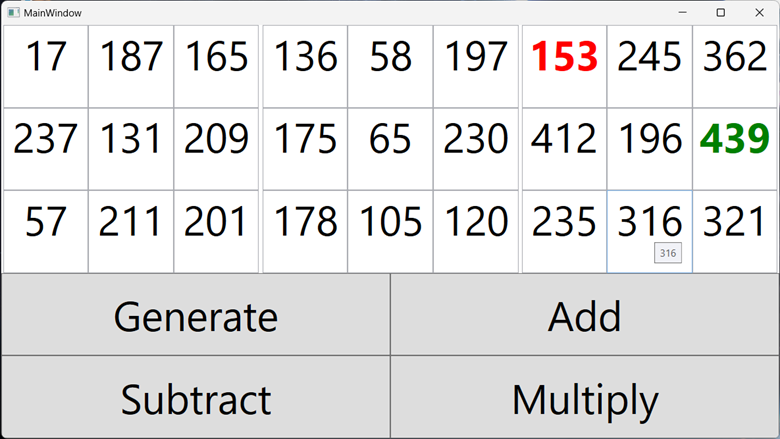
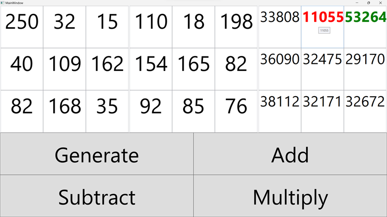

# Цель работы 
Отработка умений и навыков описания событий в приложениях.
## Задание
1. Создать интерфейс приложения задачи предложенного варианта. Используя лейауты, удобно расположить элементы приложения. Представить решение задачи и готовый исполняемый файл приложения.
2. Добавить созданному приложению новую функциональность на основе событий. Создать события обработки «горячих клавиш» дублирующих функции кнопок, а при наведении курсора мыши на ячейку таблицы в компоненте `ToolTip` должно отображаться ее текущее значение.
### Вариант 16(4)
Напишите программу, выполняющую операции сложения, вычитания и умножения матриц 3х3. Создайте интерфейс программы: в 2-х таблицах 3х3 числа получить случайным образом по сигналу от предусмотренной кнопки; кнопки «Сумма», «Разность» и «Произведение» должны выполнять соответствующие действия над массивами, результат должен быть выведен в третий массив, в котором подсветить цветом максимальное и минимальное значение.
#### Разметка 
```XAML
<Grid>
    <Grid.ColumnDefinitions>
        <ColumnDefinition />
        <ColumnDefinition />
        <ColumnDefinition />
    </Grid.ColumnDefinitions>

    <Grid.RowDefinitions>
        <RowDefinition Height="1.5*"/>
        <RowDefinition Height="*"/>
    </Grid.RowDefinitions>

    <UniformGrid Name="UniformGridA" Grid.Row="0" Grid.Column="0" Margin="2 0" Initialized="UniformGridA_Initialized"/>

    <UniformGrid Name="UniformGridB" Grid.Row="0" Grid.Column="1" Margin="2 0" Initialized="UniformGridB_Initialized"/>

    <UniformGrid Name="UniformGridC" Grid.Row="0" Grid.Column="2" Margin="2 0" Initialized="UniformGridC_Initialized"/>

    <UniformGrid Grid.Row="1" Grid.ColumnSpan="3">
        <Button Name="Generate" Content="Generate" Click="Generate_Click" FontSize="50" SizeChanged="Button_SizeChanged"/>
        <Button Name="Add"      Content="Add"      Click="Add_Click"      FontSize="50" SizeChanged="Button_SizeChanged"/>
        <Button Name="Subtract" Content="Subtract" Click="Subtract_Click" FontSize="50" SizeChanged="Button_SizeChanged"/>
        <Button Name="Multiply" Content="Multiply" Click="Multiply_Click" FontSize="50" SizeChanged="Button_SizeChanged"/>
    </UniformGrid>
</Grid>
```
#### Инициализация `UniformGrid` 
```C#
private static void InitializeUniformGrid(UniformGrid uniformGrid, int rows, int columns)
{
    uniformGrid.Children.Clear();
    uniformGrid.Rows = rows;
    uniformGrid.Columns = columns;

    for (int i = 0; i < rows; i++)
    {
        for (int j = 0; j < columns; j++)
        {
            var textBox = new TextBox
            {
                IsReadOnly = true,
                FontSize = 50,
                TextAlignment = TextAlignment.Center,
                ToolTip = "",
            };

            textBox.ToolTipOpening += (sender, e) =>
            {
                if (sender is TextBox textBox)
                {
                    textBox.ToolTip = textBox.Text;
                }
            };

            textBox.SizeChanged += (sender, e) =>
            {
                if (e.PreviousSize.Height == 0)
                {
                    return;
                }
                
                ((TextBox)sender).FontSize *= e.NewSize.Height / e.PreviousSize.Height;
            };

            textBox.TextChanged += (sender, e) =>
            {
                if (sender is TextBox textBox)
                {
                    var length = textBox.Text.Length;
                    var prevLength = e.Changes.First().RemovedLength;
                    double coef = length switch
                    {
                        0 => 50,
                        1 => 50,
                        2 => 50,
                        3 => 50,
                        4 => 45,
                        5 => 35,
                        6 => 30,
                        _ => 20,
                    };

                    coef /= prevLength switch
                    {
                        0 => 50,
                        1 => 50,
                        2 => 50,
                        3 => 50,
                        4 => 45,
                        5 => 35,
                        6 => 30,
                        _ => 20,
                    };

                    textBox.FontSize *= coef;
                }
            };

            uniformGrid.Children.Add(textBox);
        }
    }
}
```
#### Действие кнопки умножения 
```C#
private void Multiply_Click(object sender, RoutedEventArgs e)
{
    MatrixC = MatrixA * MatrixB;

    FillUniformGrid(UniformGridC, MatrixC);

    HighlightMaxMin(UniformGridC, MatrixC);
}
```
#### Реализация класса `Matrix` 
```C#
class Matrix<T>(int rows, int columns) where T : INumber<T>
{
    public int Columns { get; init; } = columns;
    public int Rows { get; init; } = rows;

    private readonly T[,] matrix = new T[rows, columns];

    public T this[int row, int column]
    {
        get => matrix[row, column];
        set => matrix[row, column] = value;
    }

    public static Matrix<T> operator +(Matrix<T> a, Matrix<T> b)
    {
        if (a.Rows != b.Rows || a.Columns != b.Columns)
        {
            throw new MatrixException("Matrixes must have the same size");
        }

        var result = new Matrix<T>(a.Rows, a.Columns);

        for (var i = 0; i < a.Rows; i++)
        {
            for (var j = 0; j < a.Columns; j++)
            {
                result[i, j] = a[i, j] + b[i, j];
            }
        }

        return result;
    }

    public static Matrix<T> operator -(Matrix<T> a, Matrix<T> b)
    {
        if (a.Rows != b.Rows || a.Columns != b.Columns)
        {
            throw new MatrixException("Matrixes must have the same size");
        }

        var result = new Matrix<T>(a.Rows, a.Columns);

        for (var i = 0; i < a.Rows; i++)
        {
            for (var j = 0; j < a.Columns; j++)
            {
                result[i, j] = a[i, j] - b[i, j];
            }
        }

        return result;
    }

    public static Matrix<T> operator *(Matrix<T> a, Matrix<T> b)
    {
        if (a.Columns != b.Rows)
        {
            throw new MatrixException("Matrixes must have the same size");
        }

        var result = new Matrix<T>(a.Rows, b.Columns);

        for (var i = 0; i < a.Rows; i++)
        {
            for (var j = 0; j < b.Columns; j++)
            {
                result[i, j] = T.Zero;

                for (var k = 0; k < a.Columns; k++)
                {
                    result[i, j] += a[i, k] * b[k, j];
                }
            }
        }

        return result;
    }

    public T Max()
    {
        return matrix.Cast<T>().Max();
    }

    public T Min()
    {
        return matrix.Cast<T>().Min();
    }
}
```
#### Результаты работы


#### Вывод 
Отработал умения и навыки описания событий в приложениях.
