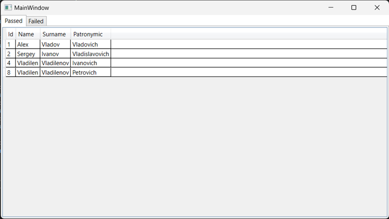
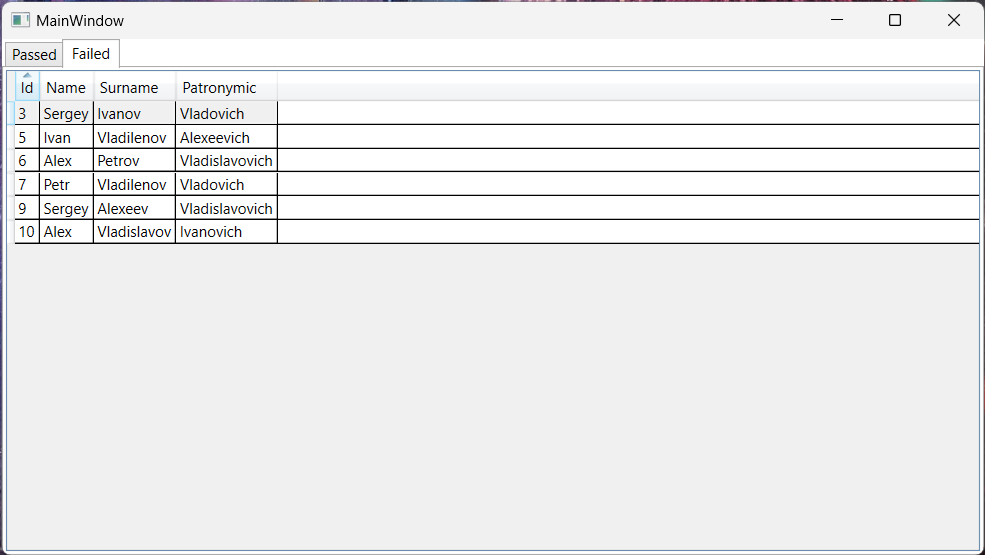

# Цель работы 
Отработка умений и навыков создания интерфейса баз данных.
### Вариант 16(4)
Напишите программу «Учет успеваемости». В программе использовать три таблицы: student (поля ***id, family, name, otch***), session (поля ***diss, vid***) и result (поля ***id, itog***). Создать запросы: создать список успешно сдавших сессию, создать список задолжников.
#### Визуальная часть 
```XAML
<Grid>
    <TabControl>
        <TabItem Header="Passed">
            <Grid Background="#FFE5E5E5">
                <DataGrid Name="PassedDataGrid" IsReadOnly="True" Initialized="PassedDataGrid_Initialized"/>
            </Grid>
        </TabItem>
        <TabItem Header="Failed">
            <Grid Background="#FFE5E5E5">
                <DataGrid Name="FailedDataGrid" IsReadOnly="True" Initialized="FailedDataGrid_Initialized"/>
            </Grid>
        </TabItem>
    </TabControl>
</Grid>
```
#### Инициализация таблиц 
```C#
private void PassedDataGrid_Initialized(object sender, EventArgs e)
{
    using var context = new MyContext();

    var students = context.Students;
    var results = context.Results;

    var passed = students
        .Where(student => results
        .Where(result => result.Student == student)
        .All(result => result.Passed == true))
        .ToList();

    PassedDataGrid.ItemsSource = passed;
}

private void FailedDataGrid_Initialized(object sender, EventArgs e)
{
    using var context = new MyContext();

    var students = context.Students;
    var results = context.Results;

    var failed = students
        .Where(student => results
        .Where(result => result.Student == student)
        .Any(result => result.Passed == false))
        .ToList();

    FailedDataGrid.ItemsSource = failed;
}
```
#### Создание класса студента 
```C#
public class Student : INotifyPropertyChanged
{
    public int Id { get; set; }

    private string _name = string.Empty;
    public string Name
    {
        get => _name;
        set
        {
            if (_name == value) return;
            _name = value;
            PropertyChanged?.Invoke(this, new(nameof(Name)));
        }
    }

    private string _surname = string.Empty;
    public string Surname
    {
        get => _surname;
        set
        {
            if (_surname == value) return;
            _surname = value;
            PropertyChanged?.Invoke(this, new(nameof(Surname)));
        }
    }

    private string _patronymic = string.Empty;
    public string Patronymic
    {
        get => _patronymic;
        set
        {
            if (_patronymic == value) return;
            _patronymic = value;
            PropertyChanged?.Invoke(this, new(nameof(Patronymic)));
        }
    }

    public event PropertyChangedEventHandler? PropertyChanged;

    public override string ToString()
    {
        return $"{Name} {Surname} {Patronymic}";
    }
}
```
#### Создание класса контекста 
``` C#
public class MyContext : DbContext
{
    public MyContext()
    {
        Database.EnsureCreated();
    }

    public DbSet<Student> Students { get; set; } = null!;
    public DbSet<Session> Sessions { get; set; } = null!;
    public DbSet<Result> Results { get; set; } = null!;

    protected override void OnConfiguring(DbContextOptionsBuilder optionsBuilder)
    {
        optionsBuilder.UseSqlServer(@"Server=(localdb)\mssqllocaldb;Database=lab5db;Trusted_Connection=True;");
    }
}
```
#### Результаты работы


#### Вывод 
Отработал умения и навыки создания интерфейса баз данных.
