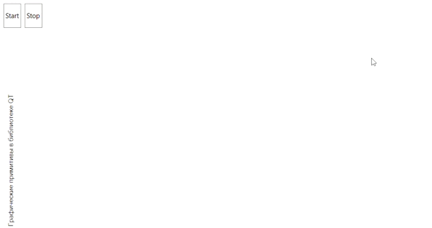

# Цель работы 
Изучить графические примитивы библиотеки.
### Вариант 16(2)
1. Вывести заданным шрифтом вертикально на экран наименование лабораторной работы – 2 балла.
2. Нарисовать цветную фигуру (2 балла) и организовать движение её по заданной траектории (6 баллов).

Шрифт - рубленный, фигура - три связанных разноцветных окружности, траектория движения - кубическая парабола $$y = ax^3$$.
#### Визуальная часть 
```XAML
<TextBlock Height="50" Width="400" FontFamily="Microsoft Sans Serif">
    <TextBlock.RenderTransform>
        <TransformGroup>
            <ScaleTransform/>
            <SkewTransform/>
            <RotateTransform Angle="-90"/>
            <TranslateTransform Y="{Binding ActualHeight, ElementName=MyGrid, Mode=OneWay}" X="-180"/>
        </TransformGroup>
    </TextBlock.RenderTransform>
        
        Графические примитивы в библиотеке QT
</TextBlock>

<StackPanel Orientation="Horizontal" Grid.Row="0">
    <Button Margin="3" Padding="3" Click="Start_Clicked">Start</Button>
    <Button Margin="3" Padding="3" Click="Stop_Clicked">Stop</Button>
</StackPanel>
<Canvas Name="MyCanvas" Grid.Row="1" Margin="3"/>
```
#### Вспомогательный класс 
```C#
internal class CircleComposition
{
    private Canvas Canvas { get; set; }
    private readonly List<Ellipse> EllipseList = [];

    private double Radius { get; set; }

    private int Vertices { get; set; }
    private double Phi0 { get; set; }
    

    public CircleComposition(Canvas canvas, int vertices, double radius, Color[] colors, double phi0 = 0)
    {
        Canvas = canvas;

        Vertices = vertices;
        Phi0 = phi0;

        Radius = radius / Math.Sin(Math.PI / vertices) / 2;


        var random = new Random();
        var buffer = new byte[3];

        var n = colors.Length;
        for (int i = 0; i < Vertices; i++)
        {
            Color color;
            
            if (i < n)
            {
                color = colors[i];
            }
            else
            {
                random.NextBytes(buffer);
                var r = buffer[0];
                var g = buffer[1];
                var b = buffer[2];

                color = Color.FromRgb(r, g, b);
            }

            var ellipse = new Ellipse()
            {
                Height = radius,
                Width = radius,
                Fill = new SolidColorBrush(color),
            };

            EllipseList.Add(ellipse);
            Canvas.Children.Add(ellipse);
        }
    }

    public void Draw(Point center, double phi = 0)
    {
        var xc = center.X;
        var yc = center.Y;

        var tau = Math.Tau;
        var n = Vertices;

        var degrees = phi * Math.PI / 180;

        for (int i = 0; i < n; i++)
        {
            var xi = xc + Radius * Math.Cos(Phi0 + degrees + tau * i / n);
            var yi = yc + Radius * Math.Sin(Phi0 + degrees + tau * i / n);

            var ellipse = EllipseList[i];
            Canvas.SetLeft(ellipse, xi);
            Canvas.SetTop(ellipse, yi);
        }
    }

    public void Collapse()
    {
        foreach (var ellipse in EllipseList)
        {
            Canvas.Children.Remove(ellipse);
        }
    }
}
```
#### Метод рендера кадра 
```C#
private void RenderFrame(object sender, EventArgs e)
{
    if (!rendering)
    {
        return;
    }

    if (Center.X < 50 && Velocity < 0)
    {
        Velocity = -Velocity;
    }

    if (Center.X > 700 && Velocity > 0)
    {
        Velocity = -Velocity;
    }

    var x = Center.X + Velocity;
    var centeredX = MyCanvas.ActualWidth / 2 - x;
    var centeredY = Math.Pow(centeredX, 3) / Math.Pow(MyCanvas.ActualWidth / 2, 3) * (MyCanvas.ActualHeight / 2);
    var y = MyCanvas.ActualHeight / 2 + centeredY - 10;

    var point = new Point(x, y);
    Center = point;

    Angle += Rotation;

    CircleComposition.Draw(point, Angle);
}
```
#### Результаты работы

#### Вывод 
Изучил графические примитивы библиотеки.
