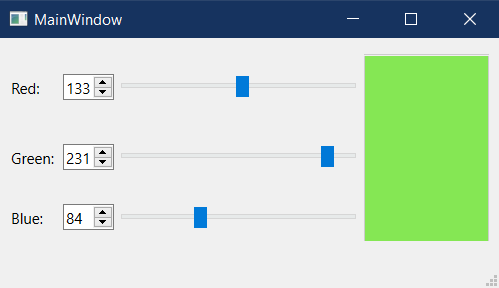
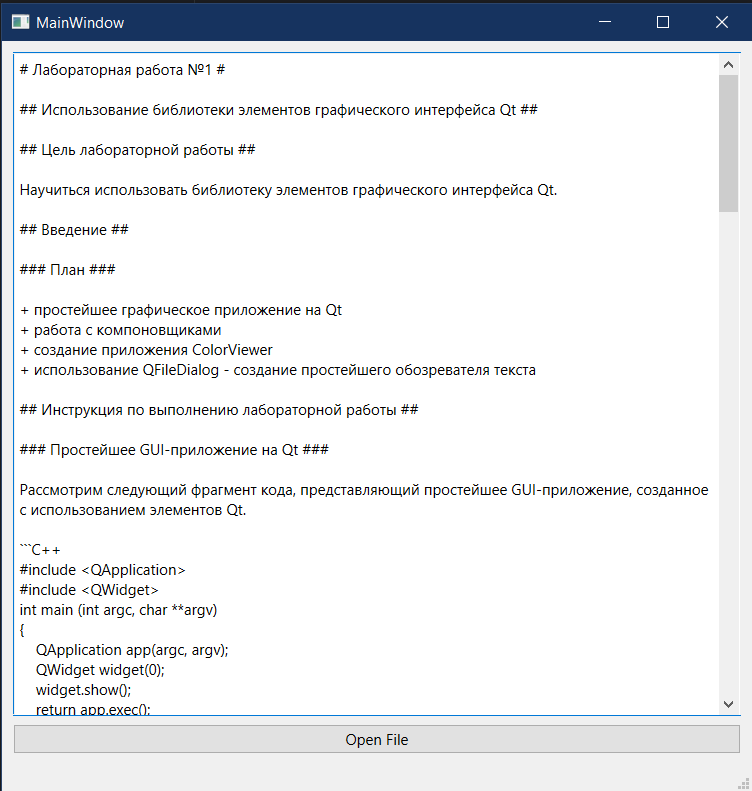

# Лабораторная работа №1 #

## Использование библиотеки элементов графического интерфейса Qt ##

## Реализация/ход работы ##

## Цель работы ##

Научиться использовать библиотеку элементов графического интерфейса Qt.

### План ###

+ простейшее графическое приложение на Qt
+ работа с компоновщиками
+ создание приложения ColorViewer
+ использование QFileDialog - создание простейшего обозревателя текста
#### Этот файл является общим для двух приложений ####

main.cpp

``` c++
...
int main(int argc, char *argv[])
{
    QApplication a(argc, argv);
    MainWindow w;
    TextReviwer t;
    w.resize( 400, 200 );
    w.show();
    t.resize( 600, 600 );
    t.show();
    return a.exec();
}
```

#### Создание приложения ColorViewer ####

mainwindow.h

``` c++
...
public:
    MainWindow(QWidget *parent = nullptr);
    ~MainWindow();
    QLabel *label1;
    QLabel *label2;
    QLabel *label3;
    QSpinBox *spinBox1;
    QSpinBox *spinBox2;
    QSpinBox *spinBox3;
    QSlider *slider1;
    QSlider *slider2;
    QSlider *slider3;
    QPlainTextEdit *textEdit;
    QGridLayout *gridLayout;

public slots:
    void setColor();
    void setRed(int value);
    void setGreen(int value);
    void setBlue(int value);

private:
    Ui::MainWindow *ui;
};
...
```

mainwindow.cpp

``` c++
MainWindow::MainWindow(QWidget *parent)
    : QMainWindow(parent)
    , ui(new Ui::MainWindow)
{
    ui->setupUi(this);

    label1 = new QLabel("Red:");
    label2 = new QLabel("Green:");
    label3 = new QLabel("Blue:");

    spinBox1 = new QSpinBox();
    slider1 = new QSlider(Qt::Horizontal);
    spinBox1->setMinimum(0);
    spinBox1->setMaximum(255);
    slider1->setMinimum(0);
    slider1->setMaximum(255);

    spinBox2 = new QSpinBox();
    slider2 = new QSlider(Qt::Horizontal);
    spinBox2->setMinimum(0);
    spinBox2->setMaximum(255);
    slider2->setMinimum(0);
    slider2->setMaximum(255);

    spinBox3 = new QSpinBox();
    slider3 = new QSlider(Qt::Horizontal);
    spinBox3->setMinimum(0);
    spinBox3->setMaximum(255);
    slider3->setMinimum(0);
    slider3->setMaximum(255);

    textEdit = new QPlainTextEdit();
    textEdit->setFixedSize(100, 150);
    textEdit->setEnabled(false);

    gridLayout = new QGridLayout();
    gridLayout->addWidget(label1, 0, 0);
    gridLayout->addWidget(spinBox1, 0, 1);
    gridLayout->addWidget(slider1, 0, 2);
    gridLayout->addWidget(label2, 1, 0);
    gridLayout->addWidget(spinBox2, 1, 1);
    gridLayout->addWidget(slider2, 1, 2);
    gridLayout->addWidget(label3, 2, 0);
    gridLayout->addWidget(spinBox3, 2, 1);
    gridLayout->addWidget(slider3, 2, 2);
    gridLayout->addWidget(textEdit, 0, 3, 3, 1);

    connect(slider1, &QSlider::valueChanged, this, &MainWindow::setRed);
    connect(slider2, &QSlider::valueChanged, this, &MainWindow::setGreen);
    connect(slider3, &QSlider::valueChanged, this, &MainWindow::setBlue);

    connect(spinBox1, &QSpinBox::valueChanged, this, &MainWindow::setRed);
    connect(spinBox2, &QSpinBox::valueChanged, this, &MainWindow::setGreen);
    connect(spinBox3, &QSpinBox::valueChanged, this, &MainWindow::setBlue);

    QWidget *centralWidget = new QWidget();
    centralWidget->setLayout(gridLayout);
    setCentralWidget(centralWidget);

}

MainWindow::~MainWindow()
{
    delete ui;
}

void MainWindow::setColor() {
    int red = spinBox1->value();
    int green = spinBox2->value();
    int blue = spinBox3->value();

    QColor color(red, green, blue);
    QPalette palette = textEdit->palette();
    palette.setColor(QPalette::Base, color);
    textEdit->setPalette(palette);

    slider1->setValue(red);
    slider2->setValue(green);
    slider3->setValue(blue);
}

void MainWindow::setRed(int value) {
    spinBox1->setValue(value);
    setColor();
}

void MainWindow::setGreen(int value) {
    spinBox2->setValue(value);
    setColor();
}

void MainWindow::setBlue(int value) {
    spinBox3->setValue(value);
    setColor();
}
```

#### Результат работы программы ####



#### Cоздание простейшего обозревателя текста ####

textreviwer.h

``` c++
...
namespace Ui {
class TextReviwer;
}

class TextReviwer : public QMainWindow
{
    Q_OBJECT

public:
    explicit TextReviwer(QWidget *parent = nullptr);
    ~TextReviwer();
    QTextEdit *textEdit;
    QPushButton *openButton;
    QGridLayout *gridLayout;

public slots:
    void openFile();

private:
    Ui::TextReviwer *ui;
};
```

textreviwer.cpp

``` c++
#include "textreviwer.h"
#include "ui_textreviwer.h"

TextReviwer::TextReviwer(QWidget *parent) :
    QMainWindow(parent),
    ui(new Ui::TextReviwer)
{
    ui->setupUi(this);

    textEdit = new QTextEdit(this);
    openButton = new QPushButton("Open File", this);
    gridLayout = new QGridLayout;

    gridLayout->addWidget(textEdit, 0, 0, 1, 2);
    gridLayout->addWidget(openButton, 1, 0, 1, 2);
    ui->centralwidget->setLayout(gridLayout);

    connect(openButton, &QPushButton::clicked, this, &TextReviwer::openFile);
}

TextReviwer::~TextReviwer()
{
    delete ui;
}

void TextReviwer::openFile(){
    QString filePath = QFileDialog::getOpenFileName(this, "Open File", "", "Text Files (*.txt);;All Files (*)");

    if (!filePath.isEmpty())
    {
        QFile file(filePath);

        if (file.open(QIODevice::ReadOnly | QIODevice::Text))
        {
            QTextStream in(&file);
            textEdit->setPlainText(in.readAll());
            file.close();
        }
        else
        {
            QMessageBox::critical(this, "Error", "Could not open the file.");
        }
    }
}
```
#### Результат работы программы ####



#### Вывод ####

Научились использовать библиотеку элементов графического интерфейса Qt.
