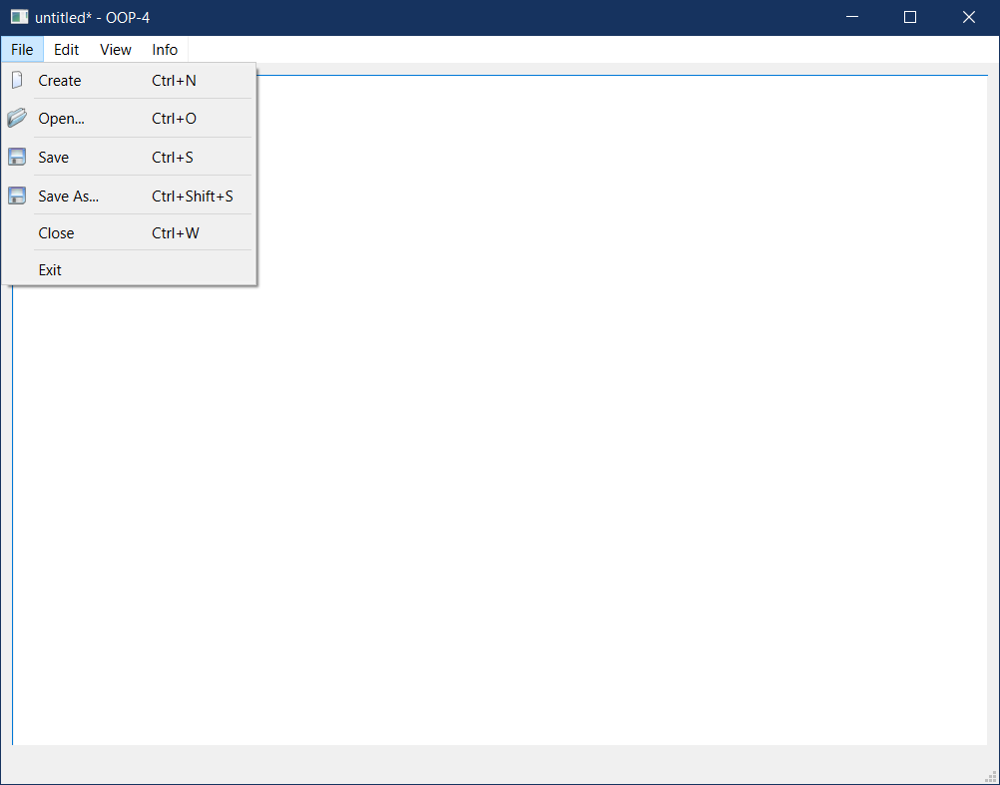
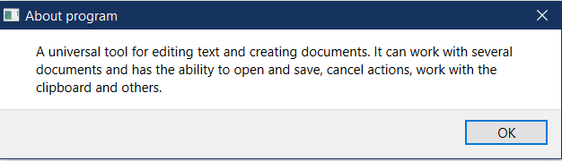
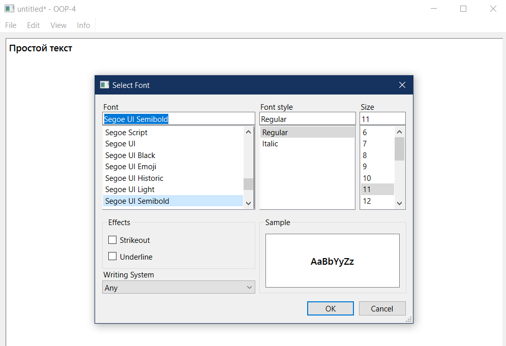
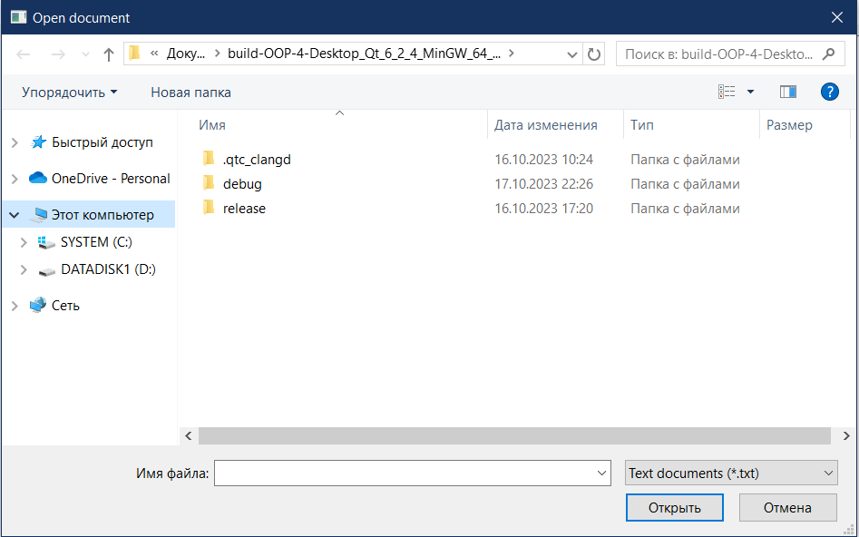
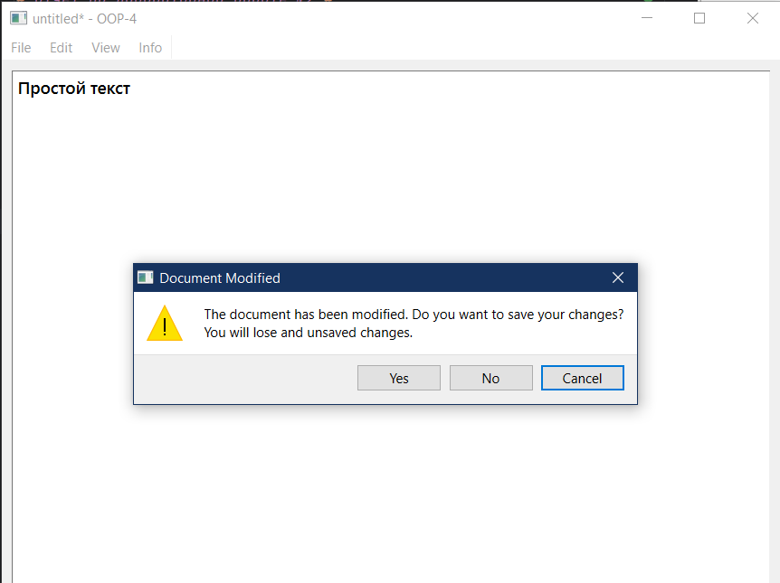

# Лабораторная работа №2 #

## Основы Qt ##

## Реализация/ход работы ##

## Цель работы ##

Целью этой лабораторной работы является применение полученных на предыдущих лекциях знаний и повторение их на практических примерах. Задачей будет разработка законченного оконного приложения — текстового редактора, работающего с несколькими документами с возможностями открытия и сохранения, отмены действий, работы с буфером обмена и другими.

### Создание приложения TextEditor ###

**main.cpp** содержит функцию main, которая инициализирует и запускает приложение.

```c++
#include "texteditor.h"

#include <QApplication>

int main(int argc, char *argv[])
{
    QApplication a(argc, argv);
    TextEditor w;
    w.show();
    return a.exec();
}
```

**texteditor.cpp** содержит реализацию класса TextEditor.

Реализации действия **actionNew**:

```c++
void TextEditor::on_actionNew_triggered()
{
    TextEditor *newEditor = new TextEditor;
    newEditor->updateFont(ui->textEdit->font());
    newEditor->show();
}
```

Для двух других действий, **actionClose** и **actionExit** выполнили соединение сигналов со слотами в конструкторе класса TextEditor:

```c++
{
//..
connect(ui->actionClose, SIGNAL(triggered()), this, SLOT(close()));
connect(ui->actionExit, SIGNAL(triggered()), qApp, SLOT(closeAllWindows()));
}
```

Подтверждение при закрытии измененного окна:

```c++
void TextEditor::closeEvent(QCloseEvent *e){
    if(isWindowModified())
    {
        switch(QMessageBox::warning(this, "Document Modified",
                                     "The document has been modified. "
                                     "Do you want to save your changes?\n"
                                     "You will lose and unsaved changes.",
                                     QMessageBox::Yes | QMessageBox::No | QMessageBox::Cancel,
                                     QMessageBox::Cancel))
        {
        case QMessageBox::Yes:
            saveFile();
            break;
        case QMessageBox::No:
            e->accept();
            break;
        case QMessageBox::Cancel:
            e->ignore();
            break;
        default:
            break;
        }
    }
    else
    {
        e->accept();
    }

}
```

Реализации действия **actionSelectFont**:

```c++
void TextEditor::on_actionSelectFont_triggered()
{
    bool ok;
    QFont initialFont = ui->textEdit->font();
    QFont selectedFont = QFontDialog::getFont(&ok, initialFont, this);

    if (ok) {
        updateFont(selectedFont);
    }
}
```

Для действий с работой буфера обмена (Вырезать, Копировать, Вставить, Отменить, Повторить, О программе, О Qt) выполнили соединение сигналов со слотами:

```c++
TextEditor::TextEditor(QWidget *parent)
    //...
{
    //...
    
    connect(ui->actionAboutQt, SIGNAL(triggered()), qApp, SLOT(aboutQt()));
    connect(ui->actionCut, SIGNAL(triggered()), ui->textEdit, SLOT(cut()));
    connect(ui->actionCopy, SIGNAL(triggered()), ui->textEdit, SLOT(copy()));
    connect(ui->actionPaste, SIGNAL(triggered()), ui->textEdit, SLOT(paste()));
    connect(ui->actionUndo, SIGNAL(triggered()), ui->textEdit, SLOT(undo()));
    connect(ui->actionRedo, SIGNAL(triggered()), ui->textEdit, SLOT(redo()));
    connect(ui->textEdit, SIGNAL(copyAvailable(bool)), ui->actionCopy, SLOT(setEnabled(bool)));
    connect(ui->textEdit, SIGNAL(copyAvailable(bool)), ui->actionCut, SLOT(setEnabled(bool)));
    connect(ui->textEdit, SIGNAL(undoAvailable(bool)), ui->actionUndo, SLOT(setEnabled(bool)));
    connect(ui->textEdit, SIGNAL(redoAvailable(bool)), ui->actionRedo, SLOT(setEnabled(bool)));

    ui->actionCopy->setEnabled(false);
    ui->actionCut->setEnabled(false);
    ui->actionUndo->setEnabled(false);
    ui->actionRedo->setEnabled(false);
}
```
Реализации действия **actionAbout**:

```c++
void TextEditor::on_actionAbout_triggered()
{
    QMessageBox::about(this, "About program",
                       "A universal tool for editing text and creating documents. It can work with several documents and has the ability to open and save, cancel actions, work with the clipboard and others.");
}
```
Реализации действия **actionOpen**:

```c++
void TextEditor::on_actionOpen_triggered()
{
    QString fileName = QFileDialog::getOpenFileName(this,
                                                    "Open document", QDir::currentPath(), "Text documents (*.txt)");
    if(fileName.isNull())
        return;
    if (m_fileName.isNull() && !isWindowModified()) {
        loadFile(fileName);
    }
    else {
        TextEditor *newEditor = new TextEditor;
        newEditor->show();
        newEditor->loadFile(fileName);
    }
}
```

Создание приватных слотов для реализации функциональности сохранения файлов:

```c++
private slots:
    bool saveFile();
    bool saveFileAs();
```

Реализации функции **saveFileAs**:

```c++
bool TextEditor::saveFileAs() {
    QString fileName = QFileDialog::getSaveFileName(this, "Save document",
                                                    m_fileName.isNull() ? QDir::currentPath() : m_fileName, "Text documents (*.txt)");

    if (fileName.isEmpty()) {
        return false;
    }

    setFileName(fileName);
    return saveFile();
}
```

Реализации функции **saveFile**:

```c++
bool TextEditor::saveFile() {
    if (m_fileName.isNull()) {
        return saveFileAs();
    }

    QFile file(m_fileName);
    if (file.open(QIODevice::WriteOnly | QIODevice::Text)) {
        QTextStream out(&file);
        out << ui->textEdit->toPlainText();
        file.close();

        setWindowModified(false);
        return true;
    } else {
        QMessageBox::warning(this, "Warning", "Can't save in this file.");
        setFileName(QString());
        return false;
    }
}
```

#### Результат работы программы ####






Возможность изменения шрифтов:


Возможность открытия файлов:


Поддержка работы нескольких окон:


Уведомление о том, что файл не сохранен при выходе из приложения:


#### Вывод ####

Разработали законченное оконное приложение — текстовый редактор, работающий с несколькими документами с возможностями открытия и сохранения, отмены действий, работы с буфером обмена и другими.
