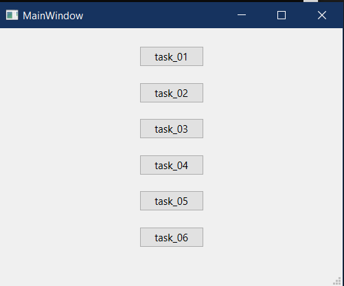
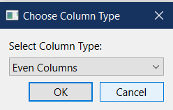
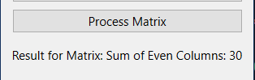

# Лабораторная работа №3 #

## Вариант №3 ##

### Задание №1 ###

Из трех данных чисел выбрать наименьшее и наибольшее (числа вводятся в lineedit), и заменить третье число иx разностью (число должно быть изменено в текущем lineedit).
### Задание №2 ###

Реализовать для одномерных массивов консольный вариант приложения, для двумерных – с (консольным)графическим интерфейсом. В консольном приложении значения элементов массива вводятся пользователем, в графическом – задаются произвольно.

1. Дан массив размера N. Вывести вначале его элементы с четными индексами, а затем − с нечетными

2. Дана матрица размера m x n. Найти суммы элементов всех ее четных и нечетных столбцов (нахождение суммы четных/нечетных столбцов определяется пользователем в виджете comboBox).

### Задание №3 ###

Для работы со связным списком реализовать консольное приложение, со списком – использовать консольный(графический) интерфейс. Перебор элементов осуществлять с помощью итераторов.

1. Заполнить список случайными элементами. Реализовать добавление элемента в конец списка и удаления с начала (использовать RadioButton для выбора действия).

2. Создать два связных списка. Реализовать замену одного связного списка на другой.

### Задание №4 ###

1. Сформировать стек из 10 случайных целых чисел. Заменить в стеке все положительные значения на 1, а отрицательные - на -1.

2. Сформировать очередь из 10 чисел. Увеличить все значения в очереди на ее максимальный элемент. Результат поместить в очередь.

### Задание №5 ###

Заданы имена девочек. Определить, какие из этих имен встречаются во всех классах данной параллели, какие есть только в некоторых классах, какие из этих имен не встречаются ни в одном классе.

### Задание №6 ###

Даны символьные файлы f1 и f2. Перепишите с сохранением порядка следования компоненты файла f1 в файл f2, а компоненты файла f2 – в файл f1. Используйте вспомогательный файл h.

## Код программы ##

* [mainwindow.cpp](./src/mainwindow.cpp)
* [task01.cpp](./src/task01.cpp)
* [task01.h](./src/task01.h)
* [task02.cpp](./src/task02.cpp)
* [task02.h](./src/task02.h)
* [task03.cpp](./src/task03.cpp)
* [task03.h](./src/task03.h)
* [task04.cpp](./src/task04.cpp)
* [task04.h](./src/task04.h)
* [task05.cpp](./src/task05.cpp)
* [task05.h](./src/task05.h)
* [task06.cpp](./src/task06.cpp)
* [task06.h](./src/task06.h)

## Результат работы программы ##

При открытии программы:

### Задание 1 ###

### Задание 2 ###

### Задание 3 ###

### Задание 4 ###

### Задание 5 ###

### Задание 6 ###

