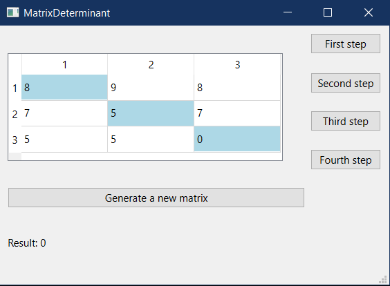
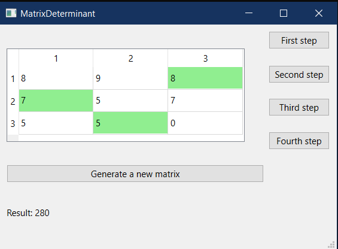
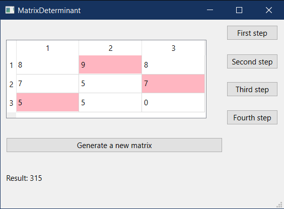
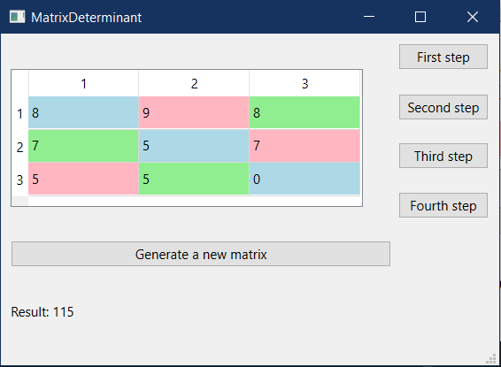
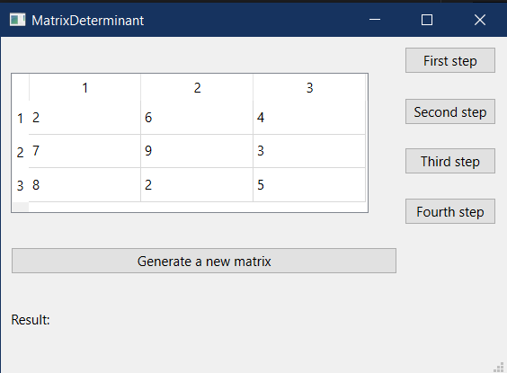

# Лабораторная работа №4 #

## Создание интерфейса простых приложений ##

## Вариант 5 ##

## Цель лабораторной работы ##

Отработка умений и навыков описания событий в приложениях.

## Ход работы ##

Файлы проекта:

- [main.cpp](./src/main.cpp)
- [matrixdeterminant.h](./src/matrixdeterminant.h)
- [matrixdeterminant.cpp](./src/matrixdeterminant.cpp)
- [matrixdeterminant.ui](./src/matrixdeterminant.ui)

## Результат работы программы ##

Первый шаг нахождения определителя:

Второй шаг нахождения определителя:

Третий шаг нахождения определителя:

Четвертый шаг нахождения определителя:

Есть возможность сгенерировать новую матрицу:

## Вывод ##

Отработали умения и навыки описания событий в приложениях.
