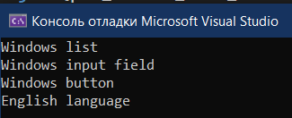

# Лабораторная работа №8 #

## Паттерны проектирования ##

## Вариант 17 ##

## Цель лабораторной работы ##

Отработка умений и навыков применения паттернов проектирования.

## Задание №2 ##
- Применить паттерн абстрактная фабрика при построении интерфейса пользователя. 
  Продукты фабрики: список, поле ввода, кнопка, язык отображения. 
  
  Применить паттерн проектирования “Prototype” совместно с абстрактной фабрикой, то есть внести изменения в проект “Порождающие паттерны. Абстрактная фабрика”, чтобы абстрактная фабрика параметризировалась прототипами.

  Применить паттерн проектирования  “Singleton” совместно с абстрактной фабрикой.

- Применить паттерн “Строитель” для построения представления робота в игровой программе.
  
  Части: Head, Body, Engine.
  
  ConcreteBuilder выбрать самостоятельно

  Применить паттерн  “Фабричный метод” при создании конкретного строителя и передачи его клиенту. 

## Ход работы ##

Файлы проекта:

- [Builder.h](./src/Builder.h)

- [AbstractFactory.h](./src/AbstractFactory.h)

## Результат работы программы ##

## Вывод ##

Реализовали паттерны проектирования.
