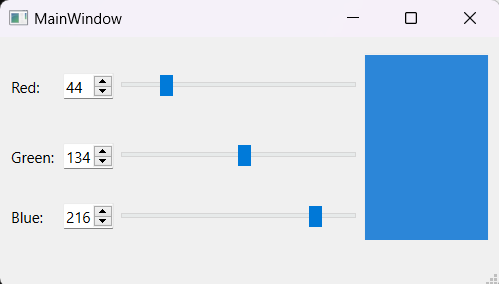
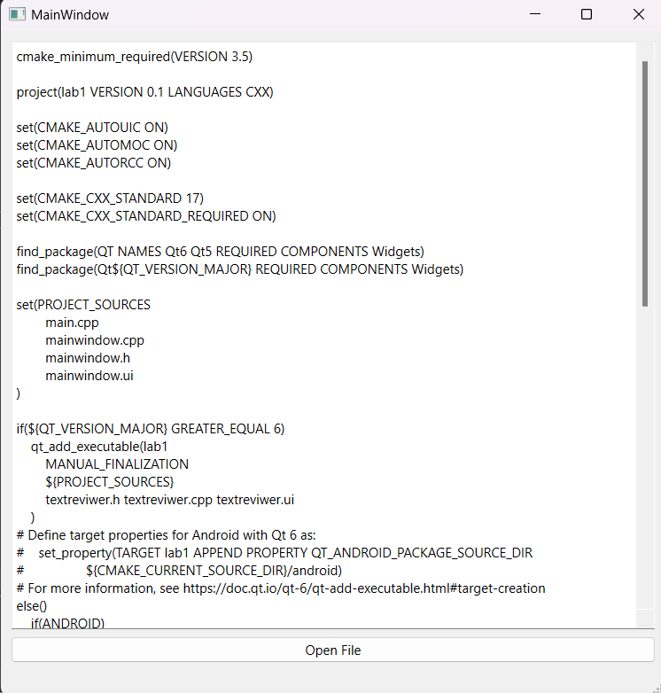

# Лабораторная работа №1 #

## Использование библиотеки элементов графического интерфейса Qt ##

## Реализация/ход работы ##

## Цель работы ##

Научиться использовать библиотеку элементов графического интерфейса Qt.

### План ###

+ простейшее графическое приложение на Qt
+ работа с компоновщиками
+ создание приложения ColorViewer
+ использование QFileDialog - создание простейшего обозревателя текста

Файлы проекта:

-  [mainwindow.h](./src/mainwindow.h)
-  [mainwindow.cpp](./src/mainwindow.cpp)

#### Результат работы программы ####

### Обозреватель текстовых файлов ###

Файлы проекта:

-  [textreviwer.h](./src/textreviwer.h)
-  [textreviwer.cpp](./src/textreviwer.cpp)

#### Результат работы программы ####

#### Вывод ####

Научились использовать библиотеку элементов графического интерфейса Qt.
