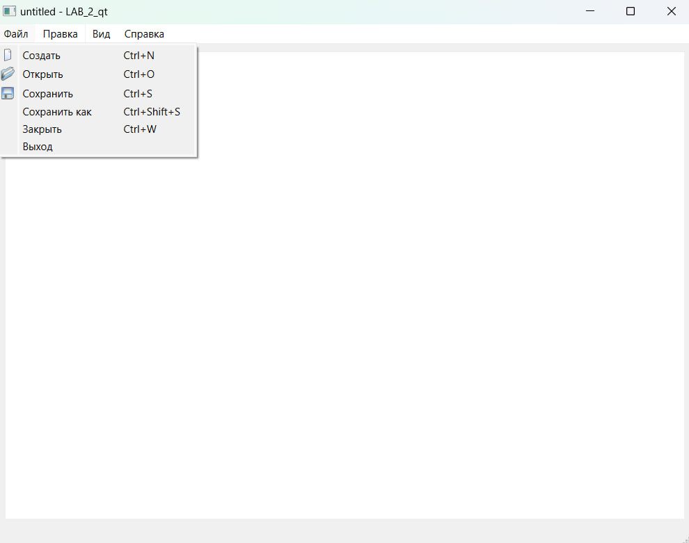
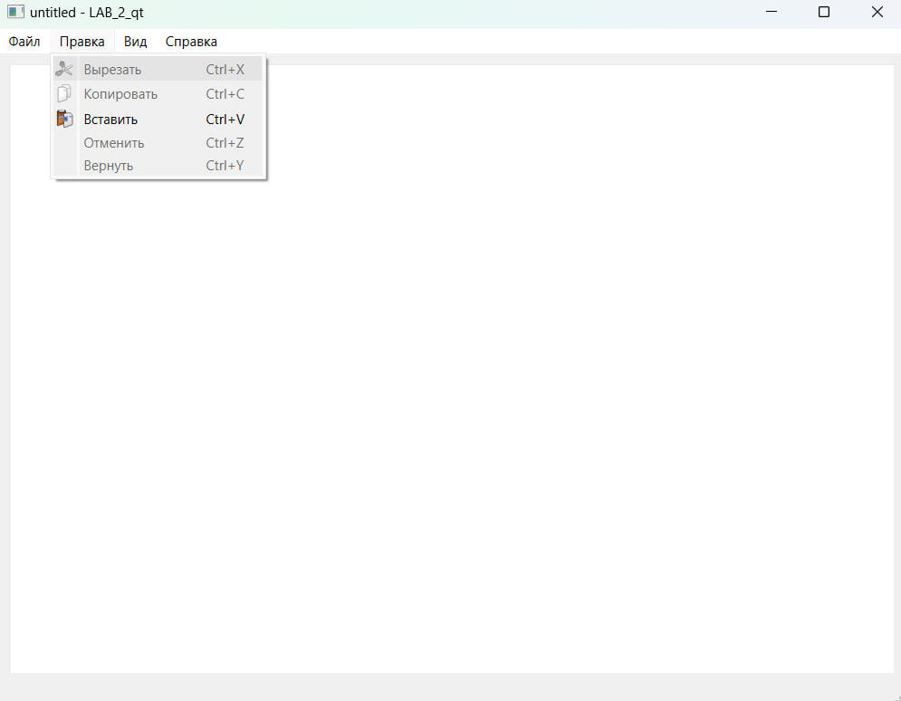
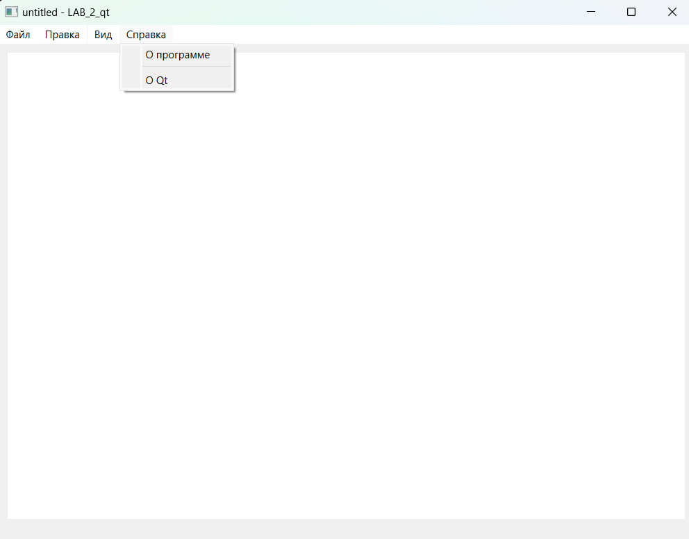
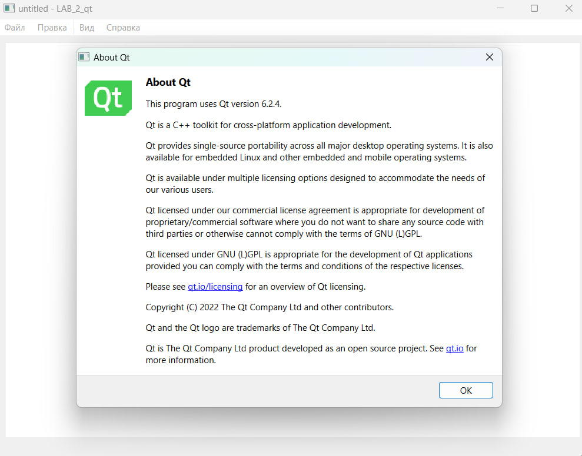
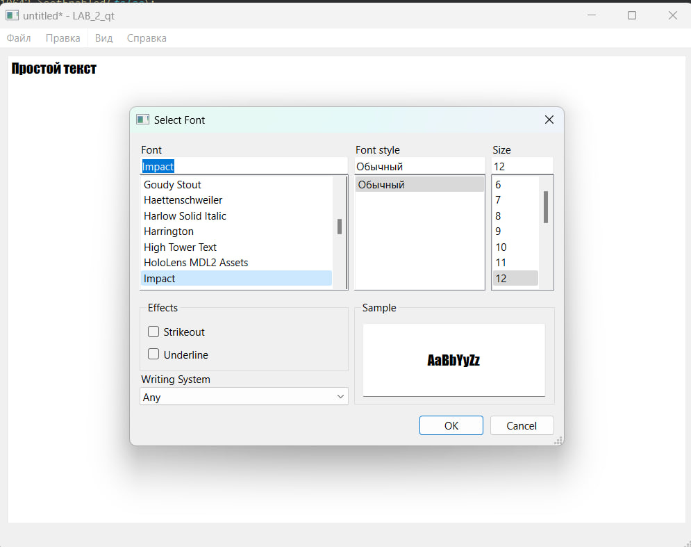
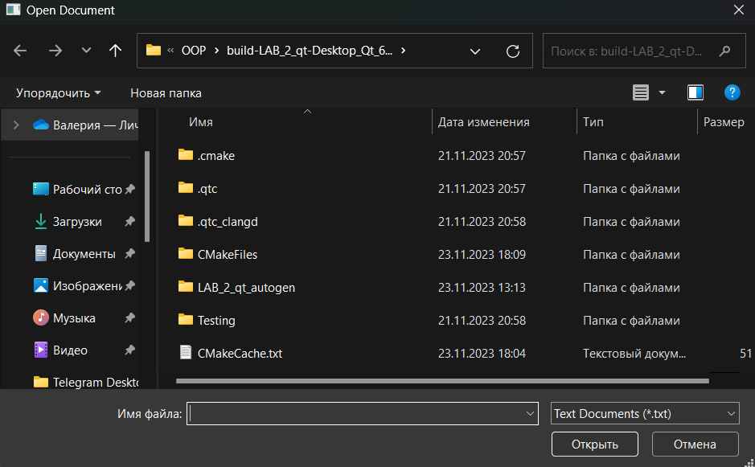
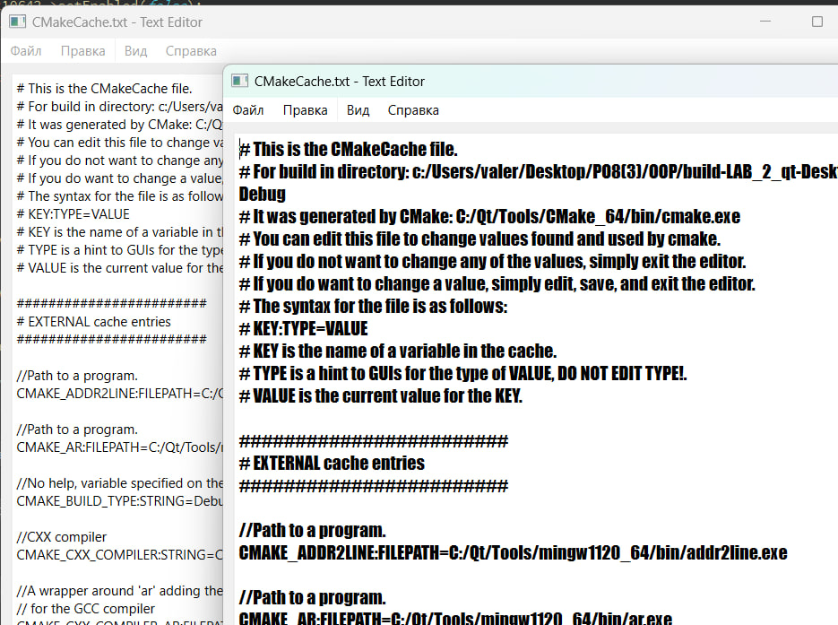

# Лабораторная работа №2 #

## Основы Qt ##

## Реализация/ход работы ##

## Цель работы ##

Целью этой лабораторной работы является применение полученных на предыдущих лекциях знаний и повторение их на практических примерах. Задачей будет разработка законченного оконного приложения — текстового редактора, работающего с несколькими документами с возможностями открытия и сохранения, отмены действий, работы с буфером обмена и другими.

### Создание приложения TextEditor ###

**main.cpp** содержит функцию main, которая инициализирует и запускает приложение.

- [main.cpp](./src/main.cpp)

**notepad.cpp** содержит реализацию класса NotePad.

- [notepad.cpp](./src/notepad.cpp)

#### Результат работы программы ####

Возможность изменения шрифтов:

Возможность открытия файлов:

Поддержка работы нескольких окон:

Уведомление о том, что файл не сохранен при выходе из приложения:

#### Вывод ####

Разработали законченное оконное приложение — текстовый редактор, работающий с несколькими документами с возможностями открытия и сохранения, отмены действий, работы с буфером обмена и другими.
