# Лабораторная работа №3 #

## Вариант №3 ##

### Задание №1 ###

Заменить наименьшее из трех чисел (числа вводятся в lineedit) суммой двух других чисел и вывести результат в label.

### Задание №2 ###

Реализовать для одномерных массивов консольный вариант приложения, для двумерных – с (консольным)графическим интерфейсом. В консольном приложении значения элементов массива вводятся пользователем, в графическом – задаются произвольно.

1. Дан целочисленный массив A. Вывести номер первого из тех его элементов A(i), которые удовлетворяют двойному неравенству: A(1) < A(i) < A(10). Если таких элементов нет, то вывести 0.

2. Дана матрица размера m x n. Найти минимальное и максимальное значение в каждой строке (нахождение максимального/минимального значения определяется пользователем в виджете comboBox).

### Задание №3 ###

Для работы со связным списком реализовать консольное приложение, со списком – использовать консольный(графический) интерфейс. Перебор элементов осуществлять с помощью итераторов.

1. Заполнить 2 списка случайными элементами. Реализовать добавление введенного элемента в 1 список или второй, или в оба (использовать CheckBox).

2. Заполнить связный список случайными элементами и отсортировать их по возрастанию.

### Задание №4 ###

1. Заполнить стек 10 случайными числами из интервала (-10; 80). Заменить все значения остатками от деления на номер элемента в стеке.

2. Сформировать очередь из 8 чисел. Заменить значение первого элемента очереди суммой первого и последнего, значение второго элемента очереди − суммой второго и предпоследнего и т.д.

### Задание №5 ###

Заданы имена девочек. Определить, какие из этих имен встречаются во всех классах данной параллели, какие есть только в некоторых классах, какие из этих имен не встречаются ни в одном классе.

### Задание №6 ###

Даны символьные файлы f1 и f2. Перепишите с сохранением порядка следования компоненты файла f1 в файл f2, а компоненты файла f2 – в файл f1. Используйте вспомогательный файл h.

## Код программы ##

* [mainwindow.cpp](./src/mainwindow.cpp)
* [task01.cpp](./src/task01.cpp)
* [task01.h](./src/task01.h)
* [task02.cpp](./src/task02.cpp)
* [task02.h](./src/task02.h)
* [task03.cpp](./src/task03.cpp)
* [task03.h](./src/task03.h)
* [task04.cpp](./src/task04.cpp)
* [task04.h](./src/task04.h)
* [task05.cpp](./src/task05.cpp)
* [task05.h](./src/task05.h)
* [task06.cpp](./src/task06.cpp)
* [task06.h](./src/task06.h)

## Результат работы программы ##

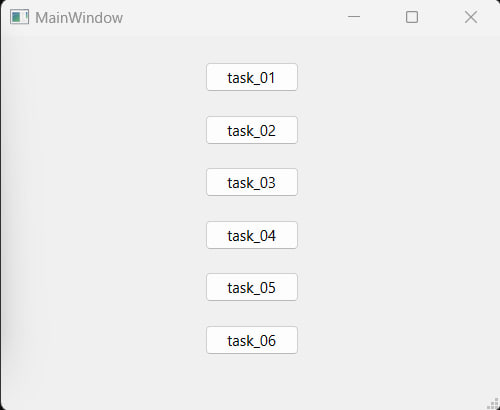

### Задание 1 ###

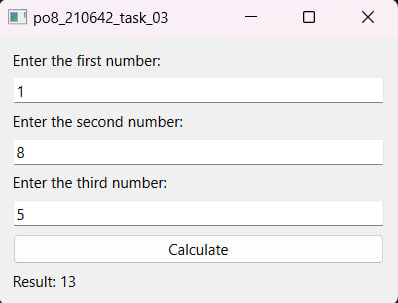

### Задание 2 ###

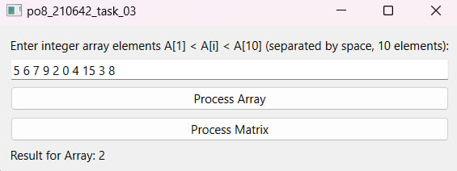

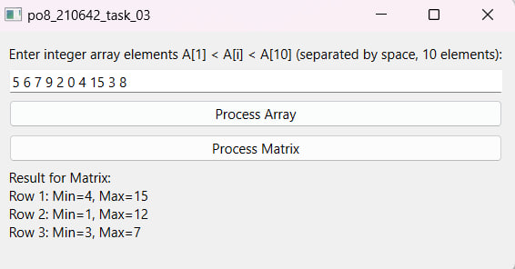

### Задание 3 ###

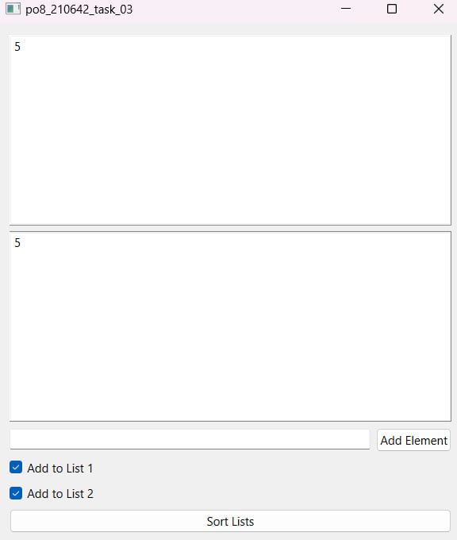

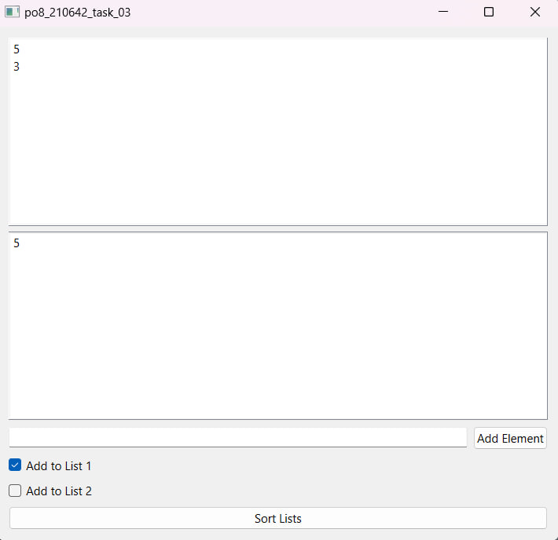

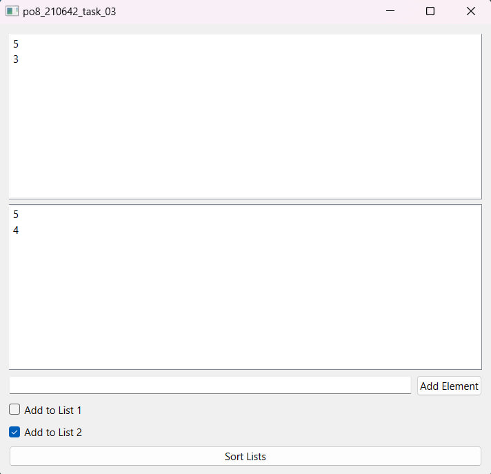

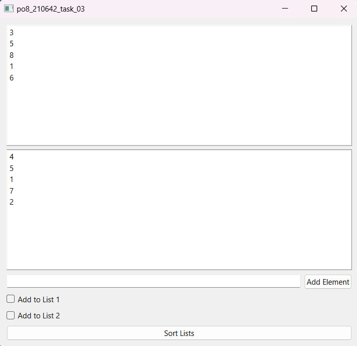

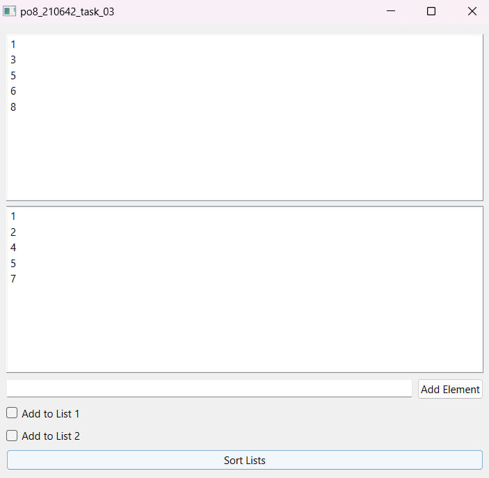

### Задание 4 ###

.jpg)

### Задание 5 ###

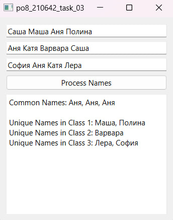

### Задание 6 ###

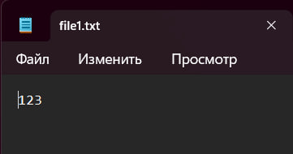

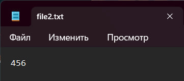

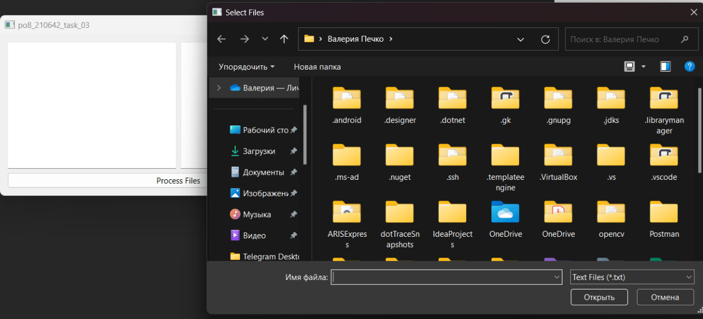

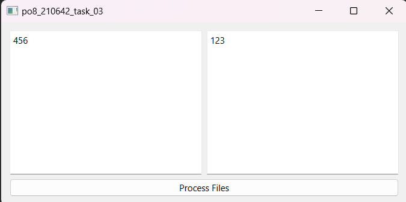

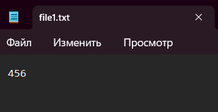

