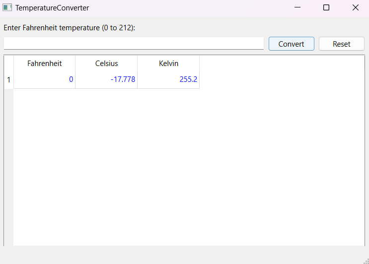
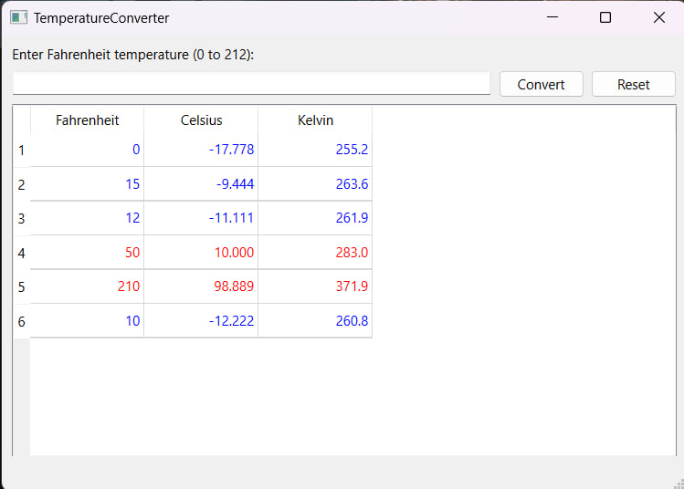

# Лабораторная работа №4 #

## Создание интерфейса простых приложений ##

## Цель лабораторной работы ##

Отработка умений и навыков описания событий в приложениях.

## Вариант 6 ##

 Напишите программу, которая преобразует температуру в целых числах по `Фаренгейту` от 0 до 212 градусов к значениям с плавающей запятой температуры по `Цельсию` с точностью до 3 знаков и к значениям `абсолютной` температуры с точностью до 1 знака. Используйте для вычислений формулы: $Т_С = 5.0/9.0 * (Т_F - 32)$ и $Т_К = Т_С + 273$. Создайте интерфейс программы: выходные данные должны быть отпечатаны в таблице с выравниванием по правой границе поля, причем значения температуры по `Цельсию` должны содержать знак и перед положительными, и перед отрицательными температурами. Отрицательные значения $Т_С$ в таблице указать синим шрифтом, а положительные – красным.

## Ход работы ##

Файлы проекта:

- [main.cpp](./src/main.cpp)
- [temperatureconverter.h](./src/temperatureconverter.h)
- [temperatureconverter.cpp](./src/temperatureconverter.cpp)
- [temperatureconverter.ui](./src/temperatureconverter.ui)

## Результат работы программы ##

## Вывод ##

Отработали умения и навыки описания событий в приложениях.
