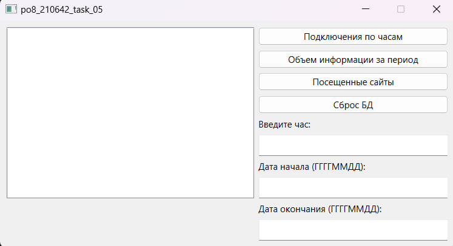
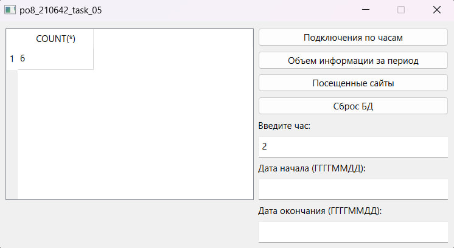
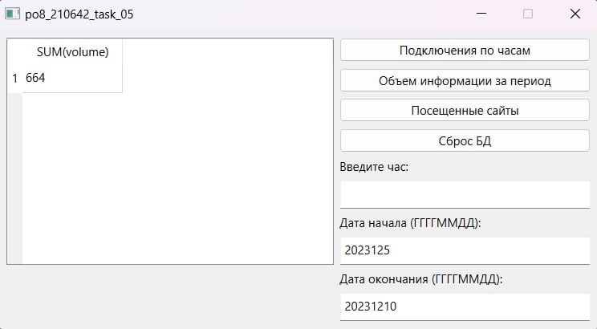
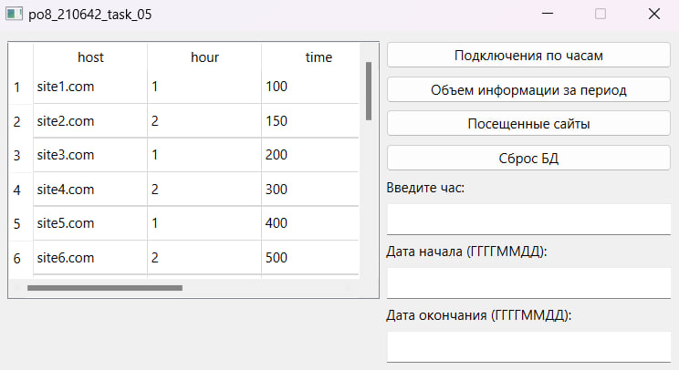

# Лабораторная работа №5 #

## Создание интерфейса простых приложений ##

## Вариант 6 ##

## Цель лабораторной работы ##

Отработка умений и навыков создания интерфейса баз данных.

## Реализация ##

Файлы проекта:

- [main.cpp](./src/main.cpp)
- [mainwindow.h](./src/mainwindow.h)
- [mainwindow.cpp](./src/mainwindow.cpp)

## Результат работы программы ##

Окно программы:

Вывод таблицы Подключение по часм:

Вывод таблицы Объем информации за период:

Вывод таблицы Посещённые сайты:

## Вывод ##

Отработали умения и навыки создания интерфейса баз данных.
