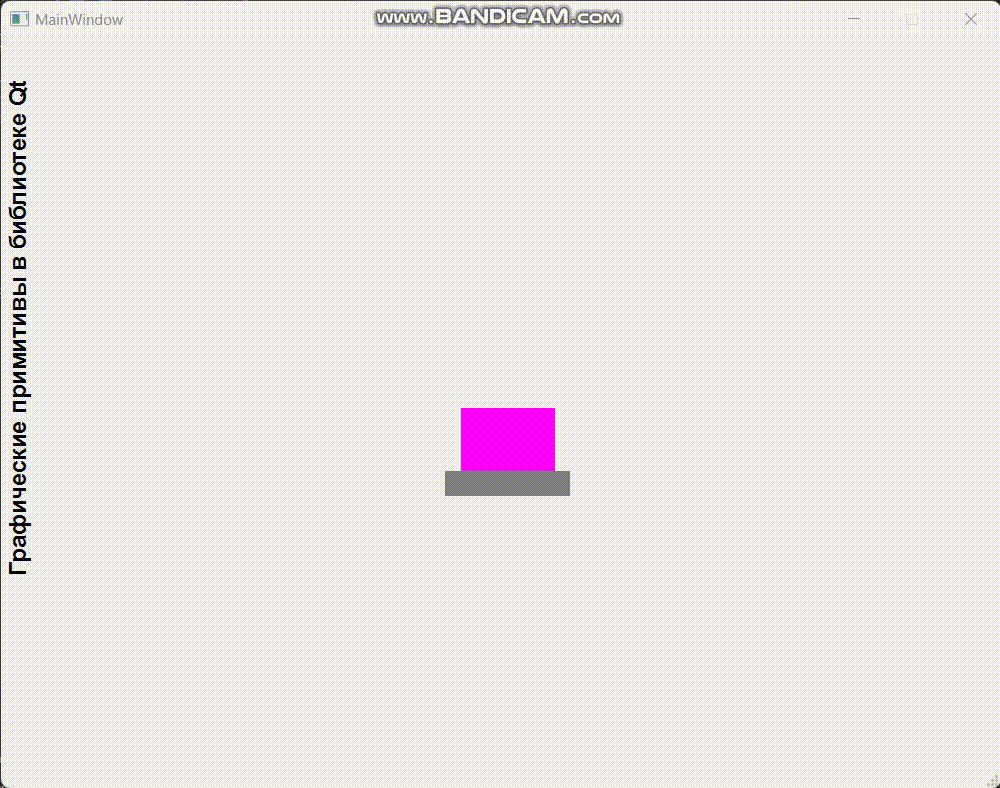

# Лабораторная работа №7 #

## Графические примитивы в библиотеке QT ##

## Вариант 4 ##

## Цель лабораторной работы ##

Изучить графические примитивы библиотеки QT.

## Задание ##

- Вывести заданным шрифтом вертикально на экран наименование лабораторной работы.
- Нарисовать цветную фигуру и организовать движение её по заданной траектории.

|№ варианта|Шрифт|Фигура|Траектория движения|
| :-: | :-: | :-: | :-: |
|4|Полужирный|Прямоугольник, поставленный на пьедестал|Закручивающаяся спираль|

## Ход работы ##

Файлы проекта:

- [main.cpp](./src/main.cpp)
- [mainwindow.h](./src/mainwindow.h)
- [mainwindow.cpp](./src/mainwindow.cpp)
- [mainwindow.ui](./src/mainwindow.ui)

## Результат работы программы ##

## Вывод ##

Изучили графические примитивы библиотеки QT.
