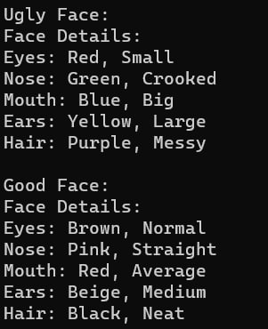
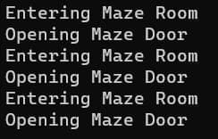

# Лабораторная работа №8 #

## Паттерны проектирования ##

## Вариант 18 ##

## Цель лабораторной работы ##

Отработка умений и навыков применения паттернов проектирования.

## Задание №3 ##

Применить паттерн абстрактная фабрика при построении логической структуры лабиринта. Продукты фабрики: комната, дверь.

Применить паттерн проектирования “Prototype” совместно с абстрактной фабрикой. То есть теперь в проекте абстрактная фабрика должна параметризоваться прототипами.

Применить паттерн проектирования  “Singleton” совместно с абстрактной фабрикой.

Применить паттерн “Строитель” для построения:

- Представления лица героя в ролевой игровой программе

- Части: Eyes  - параметры (Color, Figure), Nose (Color , Figure), Mouth (Color, Figure), Ears (Color, Figure), Hair (Color, Figure)

- ConcreteBuilder: UglyFaceBuilder, GoodFaceBuilder, SmileFaceBuilder

Применить паттерн  “Фабричный метод” при создании конкретного строителя и передачи его клиенту.  Самостоятельно продумать контекст в каркасе для вызова шаблонного метода.

## Ход работы ##

Паттерн строитель:

- [Builder.cpp](./src/Builder.cpp)

Паттерн абстрактная фабрика:

- [AbstractFactory.cpp](./src/AbstractFactory.cpp)

## Результат работы программы ##

## Вывод ##

Отработали умения и навыки применения паттернов проектирования.
