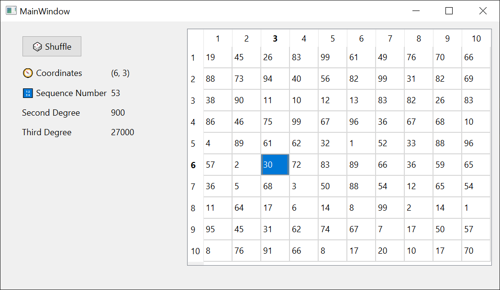
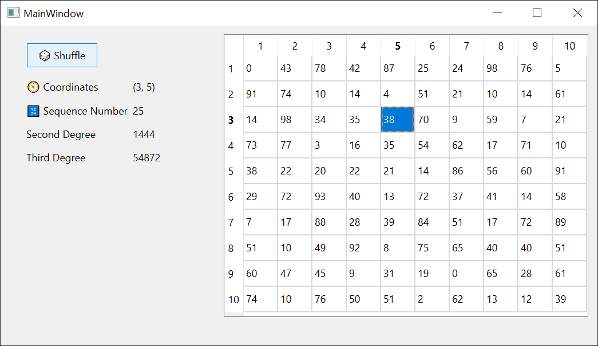

# Лабораторная работа №4 #

## Создание интерфейса простых приложений ##

## Вариант 7 ##

## Цель работы ##

Отработка умений и навыков описания событий в приложениях.

mainwindow.cpp
Наши действия:

- Определяем конструктор MainWindow, который принимает указатель на QWidget в качестве родительского объекта. В конструкторе инициализируем пользовательский интерфейс, настраиваем таблицу и генерируем начальное содержимое таблицы.
- Определяем деструктор MainWindow, который удаляет объект пользовательского интерфейса.
- В функции-слоте on_tableView_clicked() обрабатываем событие нажатия на ячейку в таблице. Получаем индекс нажатой ячейки, извлекаем значение этой ячейки и обновляем несколько меток с информацией о позиции и значении ячейки.
- В функции generateTable() создаем новый объект QTableWidget и заполняем его случайными числами. Затем устанавливаем эту таблицу в качестве модели для таблицы в пользовательском интерфейсе и очищаем несколько меток.
- В функции-слоте on_pushButton_clicked() обрабатываем событие нажатия на кнопку. Вызываем функцию generateTable() для повторной генерации таблицы.

```c++

#include "mainwindow.h"
#include "./ui_mainwindow.h"
#include <QTableWidget>
#include <QTime>
#include <cstdlib>
#include <QModelIndex>
using namespace std;
    MainWindow::MainWindow(QWidget *parent)
    : QMainWindow(parent)
    , ui(new Ui::MainWindow)
{
    ui->setupUi(this);
    srand(time(0));
    ui->tableView->horizontalHeader()->setDefaultSectionSize(40);
    ui->tableView->verticalHeader()->setDefaultSectionSize(30);
    ui->tableView->setSelectionMode(QAbstractItemView::SingleSelection);
    generateTable();
}

MainWindow::~MainWindow()
{
    delete ui;
}


void MainWindow::on_tableView_clicked
(const QModelIndex &index)
{
    int rowValue = index.row(), columnValue = index.column();
    QAbstractItemModel *itemModel = ui->tableView->model();
    int value = model->data(index).toInt();

    ui->textLabel5->setText(QString("(%1, %2)").arg(rowValue+1).arg(columnValue+1));
    ui->textLabel6->setText(QString("%1").arg(rowValue*10+columnValue+1));
    ui->textLabel7->setText(QString("%1").arg(value * value));
    ui->textLabel8->setText(QString("%1").arg(value * value * value));
}

void MainWindow::generateTable(){
    QTableWidget *tableWidget = new QTableWidget(10, 10);

    for (int i = 0; i < 10; ++i) {
        for (int j = 0; j < 10; ++j) {
            int randNum = rand() % 100;
            QTableWidgetItem *tableItem = new QTableWidgetItem(QString::number(randNum));
            tableWidget->setItem(i, j, tableItem);
        }
    }
    ui->tableView->setModel(tableWidget->model());

    ui->textLabel5->clear();
    ui->textLabel6->clear();
    ui->textLabel7->clear();
    ui->textLabel8->clear();
}

void MainWindow::on_pushButton_clicked()
{
    generateTable();
}

```

В mainwindow.h

- Объявляем класс MainWindow, который является подклассом QMainWindow.
- Внутри пространства имен Ui определяем класс MainWindow.
- Внутри класса MainWindow объявлены конструктор и деструктор.
- Также объявлены две функции-слота: on_tableView_clicked(), которая будет вызываться при нажатии на ячейку в таблице, и onpushButtonclicked(), которая будет вызываться при нажатии на кнопку.
- В приватной секции класса объявлен указатель на объект класса Ui::MainWindow.

### Результат работы программы ###




### Вывод ###

Отработали умения и навыки описания событий в приложениях.
