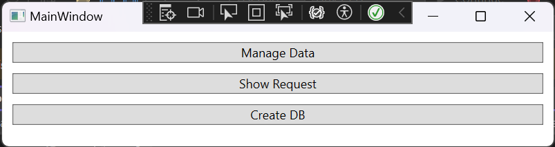
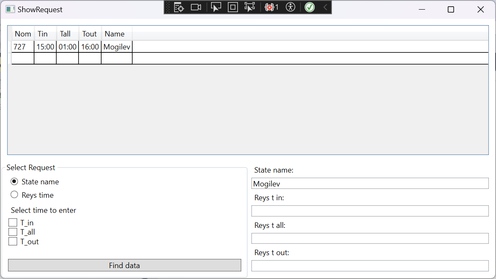
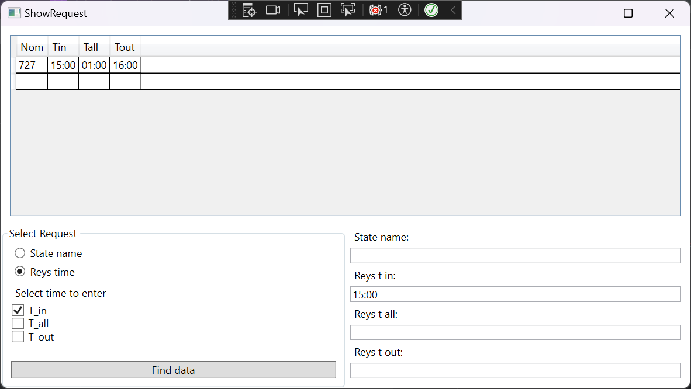
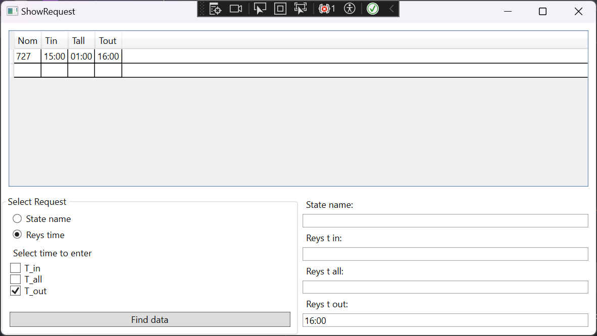

# Лабораторная работа № 5 #

## Создание приложений баз данных ##

### Цель работы ###

Отработка умений и навыков создания интерфейса баз данных.

## Вариант 7 ##

### Условие ###

Напишите программу «Расписание движения поездов». В программе использовать три таблицы: machine (поля ***id, nom, _in, _out***), reys (поля ***id, t_out, t_all, t_in***) и states (поля ***id, state1, state2, state3, state4, state5***). Создать запросы: вывод списка поездов по заданному направлению и времени отправления, прибытия и общего времени в пути; вывод списка маршрутов, проходящих через заданную станцию (state).    |

### Реализация/ ход работы ###

```c++

Создание базы данных
 public static void CreateDb()
 {
     using (var connection = new SqlConnection(connectionString))
     {
         connection.Open();
         SqlCommand command = new SqlCommand();
         command.Connection = connection;
         command.CommandText =
             "CREATE TABLE reys (Id INT IDENTITY  PRIMARY KEY , T_in VARCHAR(10) NOT NULL , T_all VARCHAR(10) NOT NULL, T_out VARCHAR(10) NOT NULL);" +
             "CREATE TABLE machine (Id INT IDENTITY PRIMARY KEY, Nom INT NOT NULL, Id_reys INT, FOREIGN KEY (Id_reys) REFERENCES reys (Id) ON DELETE SET NULL);" +
             "CREATE TABLE states (Id INT IDENTITY PRIMARY KEY, Name VARCHAR(20) NOT NULL );" +
             "CREATE TABLE reys_states (Id INT IDENTITY PRIMARY KEY, Id_reys INT, Id_state INT, FOREIGN KEY (Id_reys) REFERENCES reys(Id) ON DELETE SET NULL , FOREIGN KEY (Id_state) REFERENCES states(Id) ON DELETE SET NULL );";
         command.ExecuteNonQuery();
     }
 }
 
 ```
Осуществление поиска по станции

```c++ 
 
   private void RadioButtonState_OnChecked(object sender, RoutedEventArgs e)
  {
      selectedValue = 0;
      sqlCommand = $"SELECT machine.Nom, reys.T_in, reys.T_all,reys.T_out, states.Name FROM machine, reys, states, reys_states WHERE machine.Id_Reys = reys.Id AND reys.Id = reys_states.Id_reys AND states.Id = reys_states.Id_state AND states.name = '{TextBoxState.Text}'";
  }
  
  ```

Осуществление поиска по рейсу

```c++ 

  private void RadioButtonReysTime_OnChecked(object sender, RoutedEventArgs e)
  {
      selectedValue = 1;
      sqlCommand = $"SELECT machine.Nom, reys.T_in, reys.T_all, reys.T_out FROM machine, reys" +
                   $" WHERE machine.Id_Reys = reys.Id";
      if (CheckBoxTin.IsChecked == true)
      {
          sqlCommand += $" AND reys.T_in = '{TextBoxTin.Text}'";
      }
      if (CheckBoxTall.IsChecked == true)
      {
          sqlCommand += $" AND reys.T_all = '{TextBoxTall.Text}'";
      }
      if (CheckBoxTout.IsChecked == true)
      {
          sqlCommand += $" AND reys.T_out = '{TextBoxTout.Text}'";
      }
  }
 
 ```

#### Результат работы программы ####






#### Вывод ####

Отработали умения и навыки создания интерфейса баз данных.


