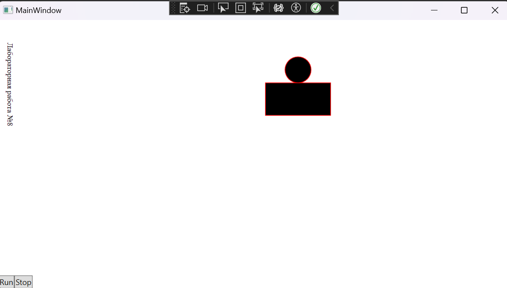

# Лабораторная работа № 7 #

## Графические примитивы в библиотеке QT ##

### Цель работы ###

Изучить графические примитивы библиотеки QT.

### Вариант 5 ###

|№ варианта|Шрифт|Фигура|Траектория движения|
| :-: | :-: | :-: | :-: |

|5|Книжная гарнитура|Окружность на поставленном прямоугольнике|Синусоида $$y(x) = asin(x + b)$$|

```c#

 Основная логика
 private void RenderFrame(object? sender, EventArgs e)
    {
        if (isEmpty)
        {
            _path = new Path();
            
            GeometryGroup geometryGroup = new GeometryGroup();
            geometryGroup.Children.Add(new EllipseGeometry(new Point(50,0), 20,20));
            geometryGroup.Children.Add(new RectangleGeometry(new Rect(0,20,100,50)));
            _path.Data = geometryGroup;
            _path.Fill = Brushes.Black;
            _path.Stroke = Brushes.Red;
            Canvas.Children.Add(_path);
            isEmpty = false;
        }
        else
        {
            double y = 50 * Math.Sin(x + 100);
            x += 10;
            Canvas.SetTop(_path,y+100);
            Canvas.SetLeft(_path, x);

        }
    }

```


#### Результат работы программы ####



#### Вывод ####

Изучила графические примитивы библиотеки QT.


