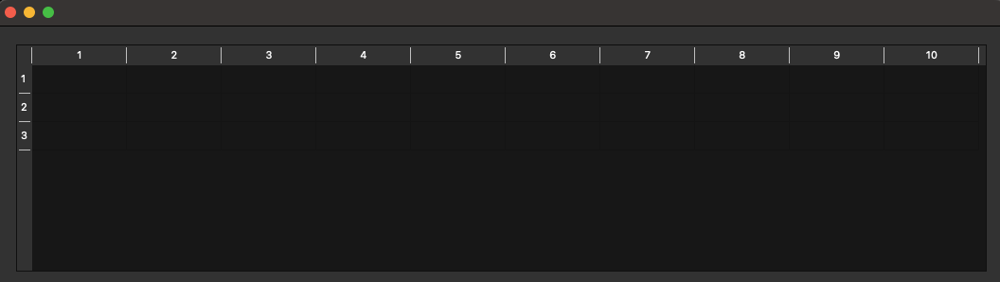
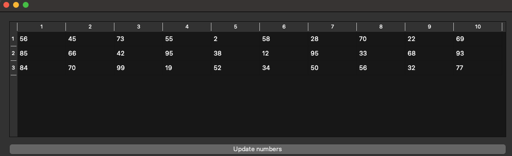

# Лабораторная работа №4 #

## Создание интерфейса простых приложений ##

## Цель лабораторной работы ##

Отработка умений и навыков описания событий в приложениях.

## Вариант №12 ##

`Таразевич Никита Александрович (ПО-8)`

## Ход работы ##
1. Создал таблицу 3х10.
   

2. Добавил кнопку для заполнения таблицы случайными числами.
   

3. Реализовал сортировку по возрастанию для каждого отдельного столбца. Сортировка происходит по нажатию на заголовок столбца

4. Реализовал сортировку по убыванию для каждого отдельного столбца.

5. Также реализовал сортировку по ASCII коду. Для наглядности добавил кнопку перевода значений в формат ASCII кода.

## Вывод лабораторной работы ##

Отработал умения и навыки описания событий в приложениях.
