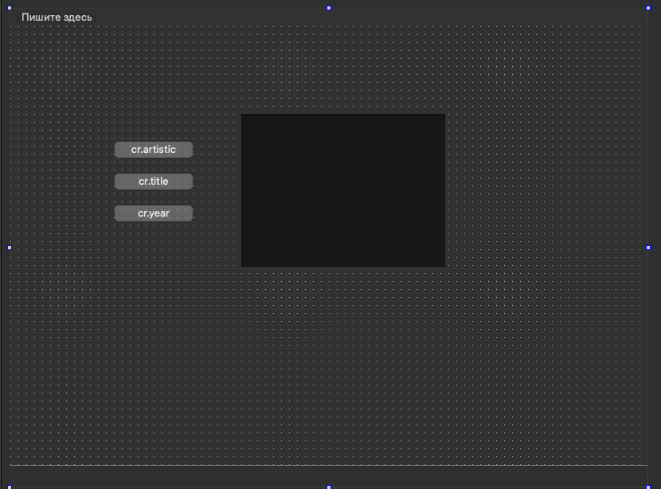
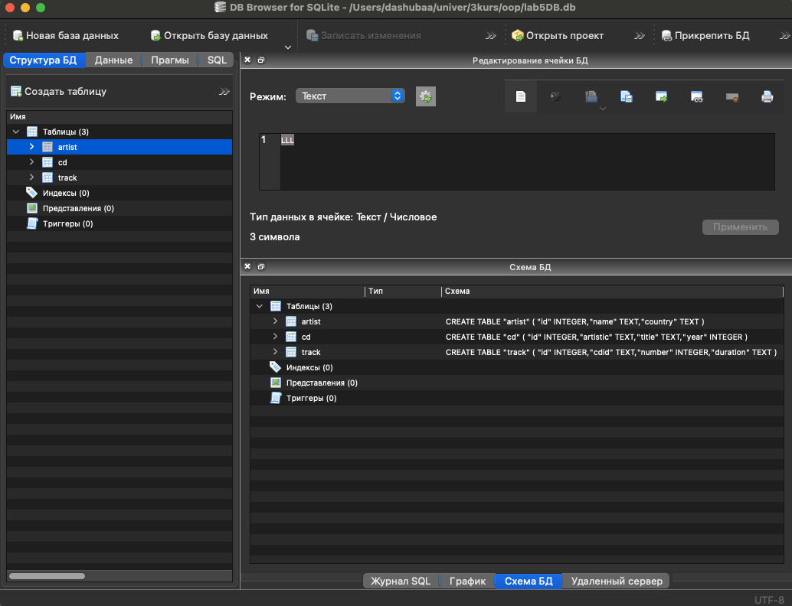
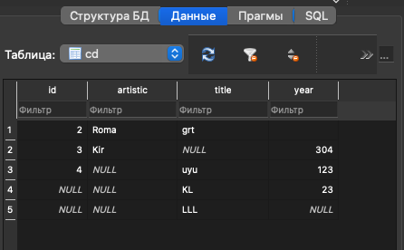
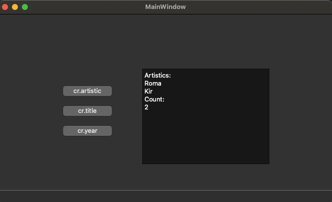
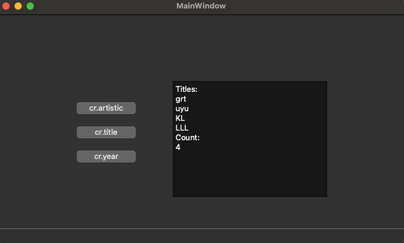
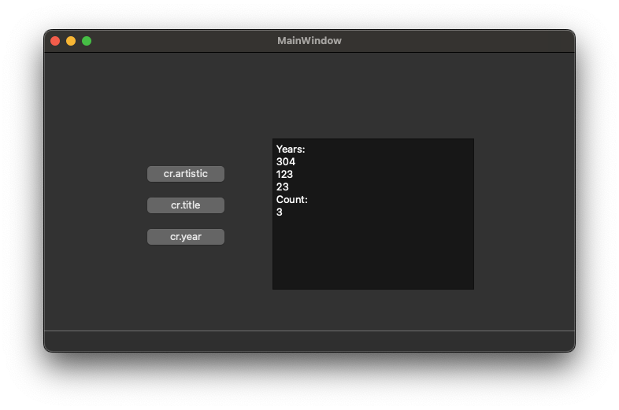

# Лабораторная работа № 5 #

`Таразевич Никита Александрович (ПО-8)`

## Создание приложений баз данных ##

### Цель работы ###

Отработка умений и навыков создания интерфейса баз данных.

### Вариант 1 ###
Напишите программу «Коллекция компакт-дисков». В программе использовать три таблицы: artist (поля ***id, name, country***), cd (поля ***id, artistic, title, year***) и track (поля ***id, cdid, number, title, duration***). Создать запросы: определение количества записей по полям ***cd.artistic, cd.title, cd.year***.

## Ход работы ##
1. Средствами IDE Qt designer создал интерфейс программы

2. С помощью программы SQLiteManager создал необходимые таблицы в файле базы данных.

3. Создал запросы: определение количества записей по полям ***cd.artistic, cd.title, cd.year***.

### Вывод ###

Отработал умения и навыки создания интерфейса баз данных.
