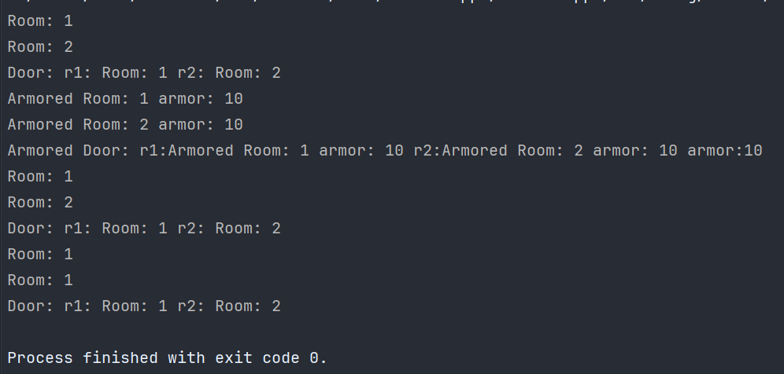
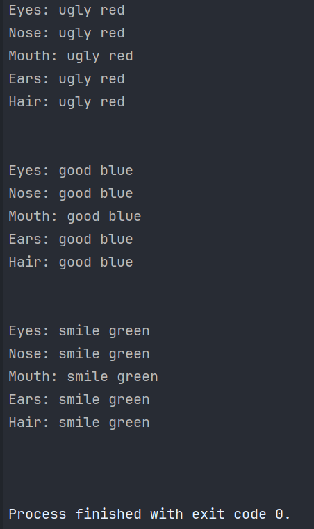

# Отчет по лабораторной работе №7 #

## Паттерны проектирования ##

## Вариант №3 ##

Применить паттерн абстрактная фабрика при построении логической структуры лабиринта. Продукты фабрики: комната, дверь.

Применить паттерн проектирования “Prototype” совместно с абстрактной фабрикой. То есть теперь в проекте абстрактная фабрика должна параметризоваться прототипами.

Применить паттерн проектирования  “Singleton” совместно с абстрактной фабрикой.

Применить паттерн “Строитель” для построения:

- Представления лица героя в ролевой игровой программе

- Части: Eyes  - параметры (Color, Figure), Nose (Color , Figure), Mouth (Color, Figure), Ears (Color, Figure), Hair (Color, Figure)

- ConcreteBuilder: UglyFaceBuilder, GoodFaceBuilder, SmileFaceBuilder

Применить паттерн  “Фабричный метод” при создании конкретного строителя и передачи его клиенту.  Самостоятельно продумать контекст в каркасе для вызова шаблонного метода.

## Код программы ##

[AbstractFabric](ConsoleApp1/AbstractFabric.cs)
[Door](ConsoleApp1/Door.cs)
[Program](ConsoleApp1/Program.cs)
[Room](ConsoleApp1/Room.cs)
[Singleton](ConsoleApp1/FabricSingleton.cs)
[Builder](ConsoleApp2/Builder.cs)
[Director](ConsoleApp2/Director.cs)
[GoodFaceBuilder](ConsoleApp2/GoodFaceBuilder.cs)
[Product](ConsoleApp2/Product.cs)
[Program](ConsoleApp2/Program.cs)
[SmileFaceBuilder](ConsoleApp2/SmileFaceBuilder.cs)
[UglyFaceBuilder](ConsoleApp2/UglyFaceBuilder.cs)

## Результат работы программы ##

