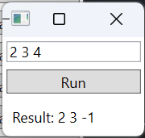
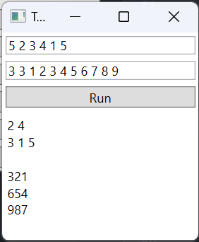
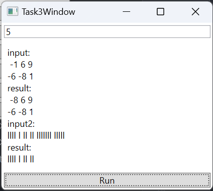
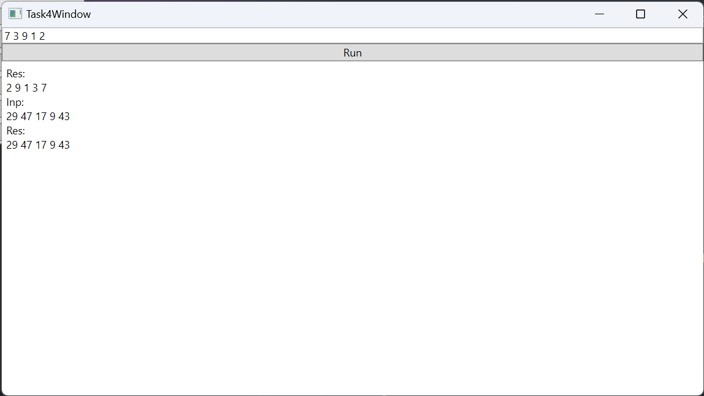
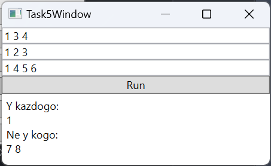
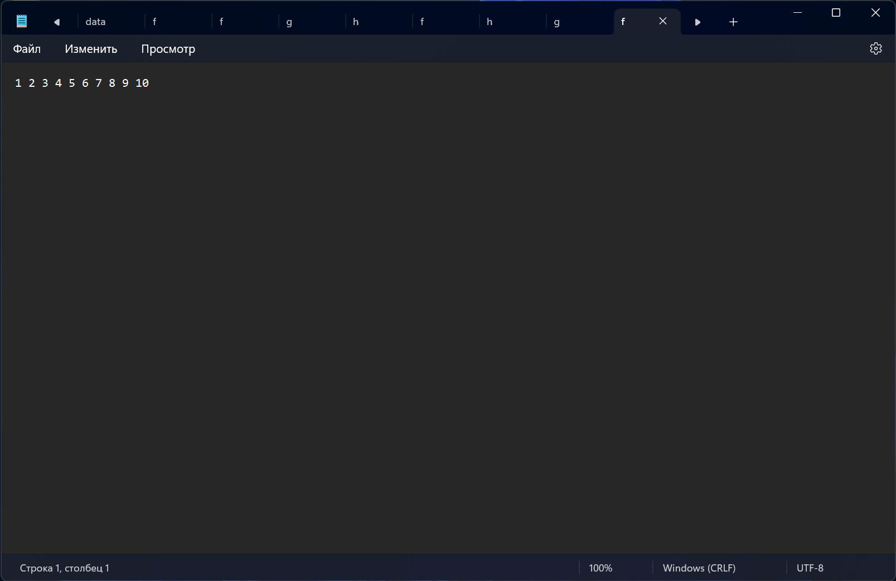
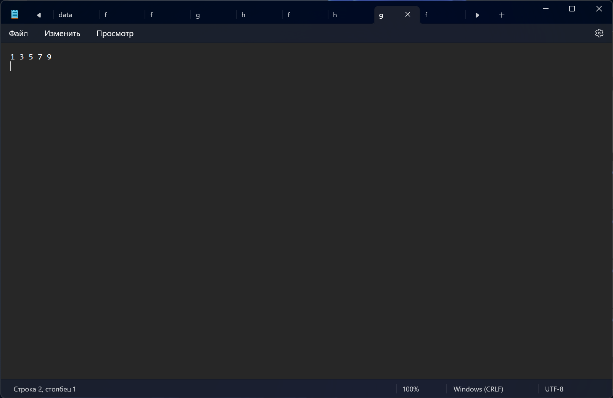
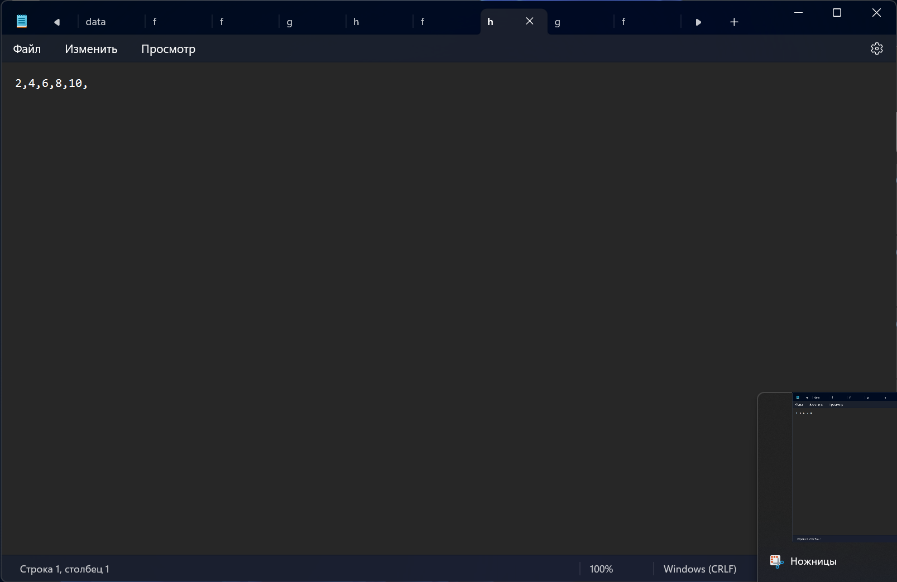

# Лабораторная работа №3 #

## Вариант №5 ##

### Задание №1 ###

Заменить наибольшее из трех чисел (числа вводятся в lineedit) разностью двух других чисел и вывести результат в label.

### Задание №2 ###

Реализовать для одномерных массивов консольный вариант приложения, для двумерных – с (консольным)графическим интерфейсом. В консольном приложении значения элементов массива вводятся пользователем, в графическом – задаются произвольно.

1. Дан целочисленный массив размера N. Вывести вначале все его четные
   элементы, а затем − нечетные, сохраняя порядок следования элементов.
2. Дана матрица размера m x n. Преобразовать матрицу, поменяв местами
   минимальный и максимальный элемент в каждой строке.
### Задание №3 ###

Для работы со связным списком реализовать консольное приложение, со списком – использовать консольный(графический) интерфейс. Перебор элементов осуществлять с помощью итераторов.

1. Заполнить 2 списка случайными элементами и заменить все положительные
   элементы первого списка на значение минимального из второго списка.
2. Заполнить связный список случайными элементами. Удалить из списка все
   элементы, длина которых больше k.
### Задание №4 ###

1. Сформировать стек из 5 чисел. Поменять местами максимальный и
   минимальный элементы стека.
2. Заполнить очередь 8 случайными числами из интервала
   [0; 50]. Заменить все четные числа их средним арифметическим значением.
### Задание №5 ###

В озере водится несколько видов рыб. Три рыбака поймали рыб,
представляющих некоторые из имеющихся видов. Определить, какие виды
рыб есть у каждого рыбака, какие рыбы есть в озере, но нет ни у одного из
рыбаков

### Задание №6 ###

Дан файл f, компоненты которого являются целыми числами. Запишите в файл g все чётные числа файла f, а в файл h - все нечётные. Порядок следования чисел сохранить.

## Код программы ##

* [mainwindow.cpp](lab3/MainWindow.xaml.cs)
* [task01.cpp](lab3/Task1Window.xaml.cs)
* [task02.cpp](lab3/Task2Window.xaml.cs)
* [task03.cpp](lab3/Task3Window.xaml.cs)
* [task04.cpp](lab3/Task4Window.xaml.cs)
* [task05.cpp](lab3/Task5Window.xaml.cs)
* [task06.cpp](lab3/Task6Window.xaml.cs)

## Результат работы программы ##

### Задание 1 ###

### Задание 2 ###

### Задание 3 ###

### Задание 4 ###

### Задание 5 ###

### Задание 6 ###

