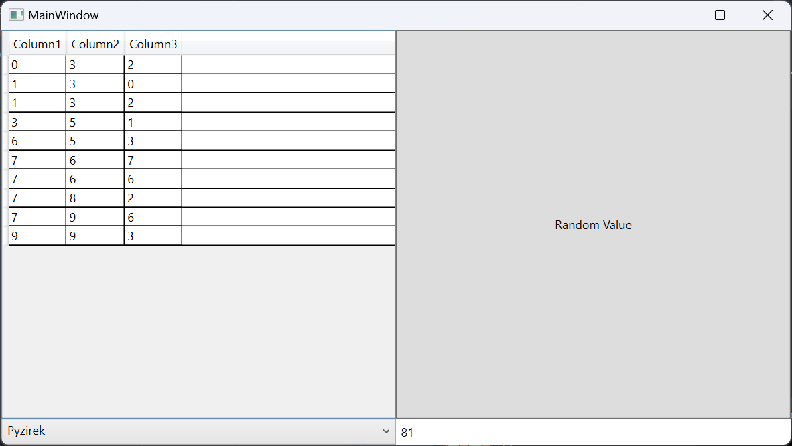
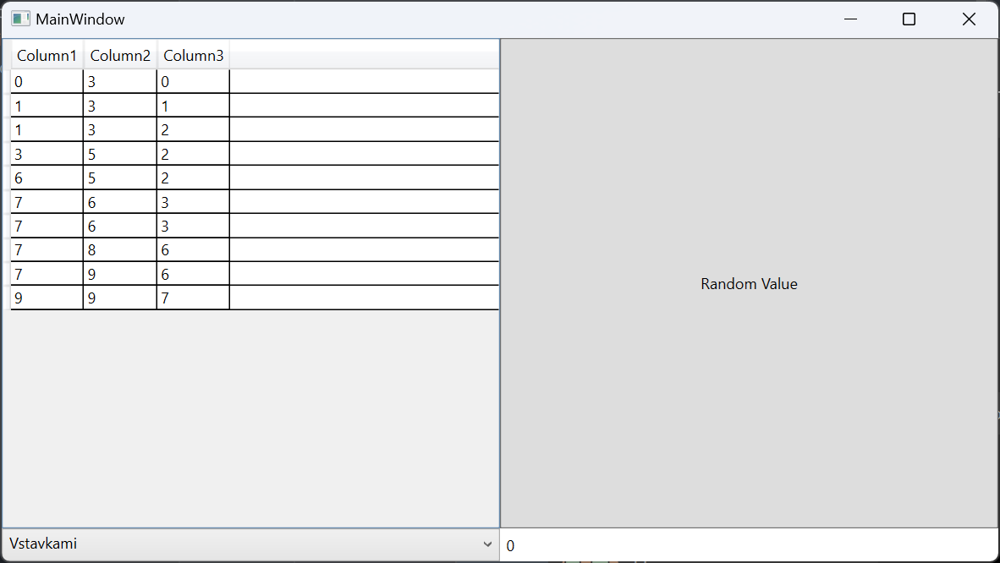

# Лабораторная работа №4 #

## Создание интерфейса простых приложений ##

## Вариант 2 ##

## Цель лабораторной работы ##

Отработка умений и навыков описания событий в приложениях.

## Ход работы ##

Файлы проекта:

- [MainWindow.xaml.cs](./WpfApp1/MainWindow.xaml.cs)
- [MainWindow.xaml](./WpfApp1/MainWindow.xaml)

## Результат работы программы ##

Нажатие на кнопку Random Value:

Нажатие на 1 колонку:

Нажатие на 2 колонку:

Нажатие на 3 колонку:

## Вывод ##

Отработали умения и навыки описания событий в приложениях.
