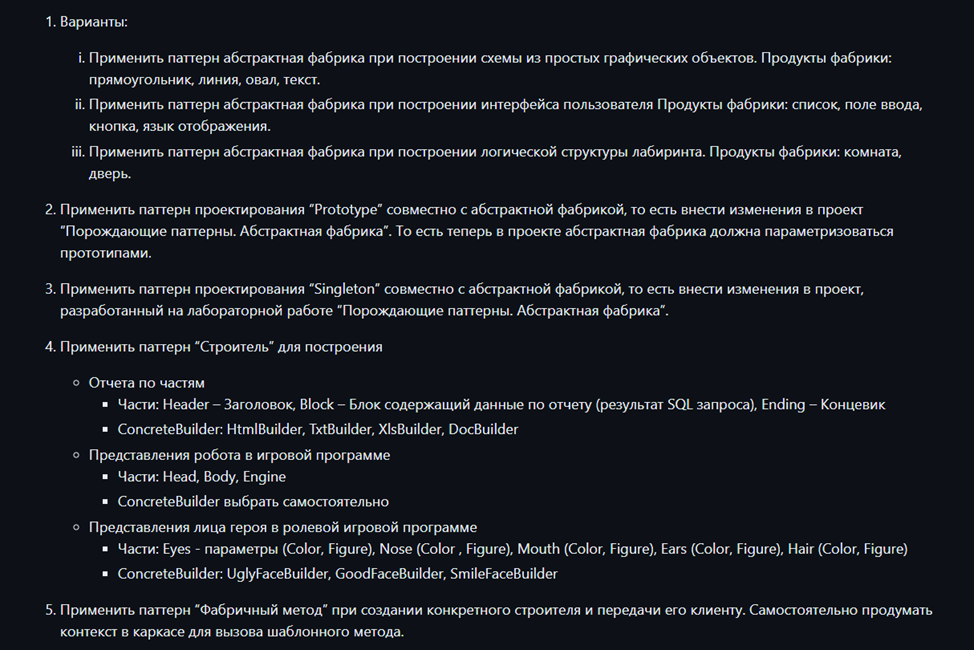
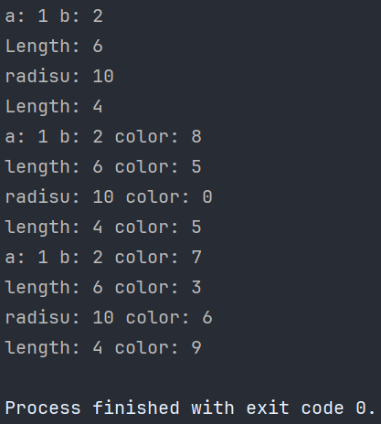
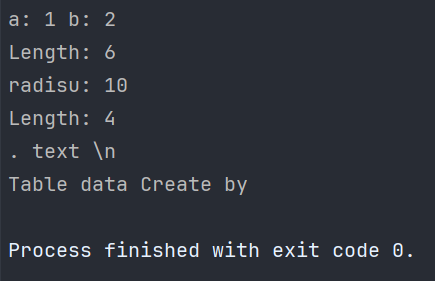

# Отчет по лабораторной работе №7 #

## Паттерны проектирования ##

## Вариант №1 ##

## Код программы ##

[mazeFactory.h](ConsoleApp1/Fabric.cs)
[mazeFactory.h](ConsoleApp1/Line.cs)
[mazeFactory.h](ConsoleApp1/Oval.cs)
[mazeFactory.h](ConsoleApp1/Program.cs)
[mazeFactory.h](ConsoleApp1/Rectangle.cs)
[mazeFactory.h](ConsoleApp1/Text.cs)
[mazeFactory.h](ConsoleApp2/Builder.cs)
[mazeFactory.h](ConsoleApp2/Director.cs)
[mazeFactory.h](ConsoleApp2/DocBuilder.cs)
[mazeFactory.h](ConsoleApp2/Fabric.cs)
[mazeFactory.h](ConsoleApp2/HtmlBuilder.cs)
[mazeFactory.h](ConsoleApp2/Line.cs)
[mazeFactory.h](ConsoleApp2/Oval.cs)
[mazeFactory.h](ConsoleApp2/Product.cs)
[mazeFactory.h](ConsoleApp2/Program.cs)
[mazeFactory.h](ConsoleApp2/Rectangle.cs)
[mazeFactory.h](ConsoleApp2/Text.cs)
[mazeFactory.h](ConsoleApp2/TxtBuilder.cs)
[mazeFactory.h](ConsoleApp2/XlsBuilder.cs)

## Результат работы программы ##

