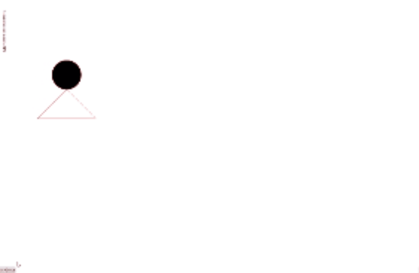

# Отчет по лабораторной работе №8 #

## Вариант №13 ##

| № варианта | Шрифт   | Фигура                              |Траектория движения|
|------------|---------|-------------------------------------|---|
| 13         | Светлый | Окружность на треугольнике |Циссоида Диокла|

## Код программы ##

[MainWindow.xaml.cs](WpfApp1/MainWindow.xaml.cs)
[MainWindow.xaml](WpfApp1/MainWindow.xaml)

## Результат работы программы ##

