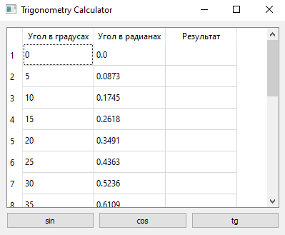
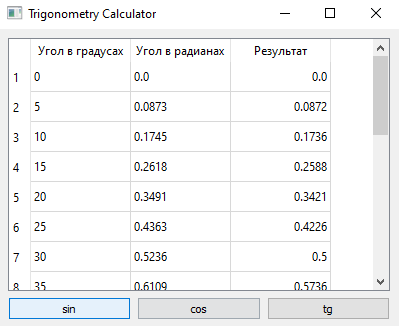
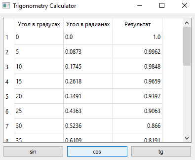

# Отчет по лабораторной работе №4

## Создание интерфейса простых приложений

## Вариант 1
Напишите программу, способную высчитывать тригонометрические функции sin, cos, tg заданных углов от 0 до 90º. 
Создайте интерфейс программы: в таблице 3 поля – «угол в градусах», «угол в радианах» и «результат», 
три кнопки – «sin», «cos», «tg» - выполняют действия и выводят результат в третье поле таблицы. 
Данные углов выбрать с шагом 5º. В таблице использовать выравнивание элементов справа.

## Реализация/ход работы

При запуске программы видим следующее.

sin
Окно приложения:

cos
Окно приложения:

tg
Окно приложения:

