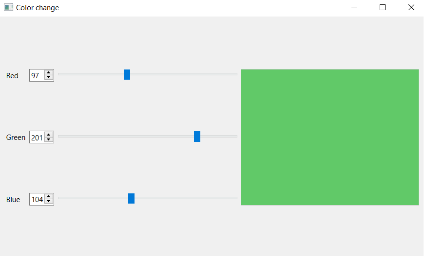
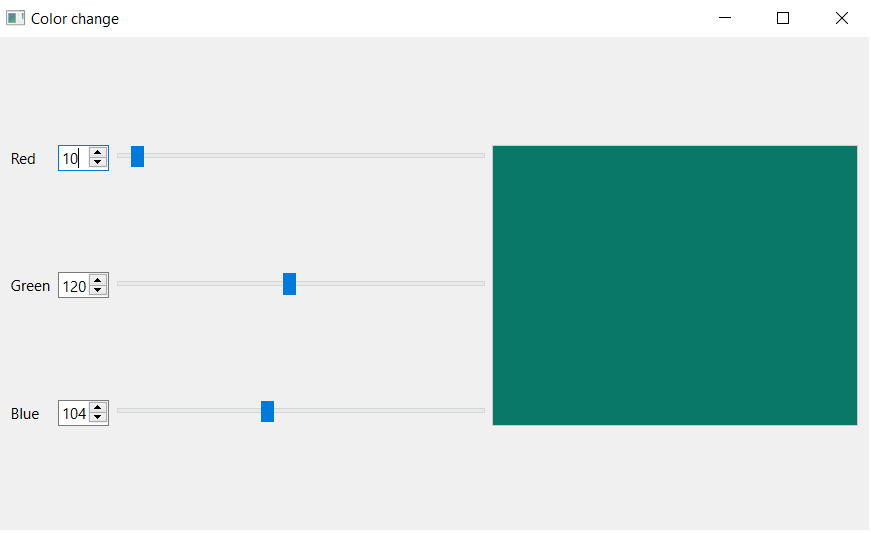
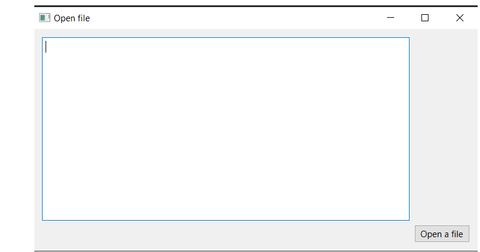
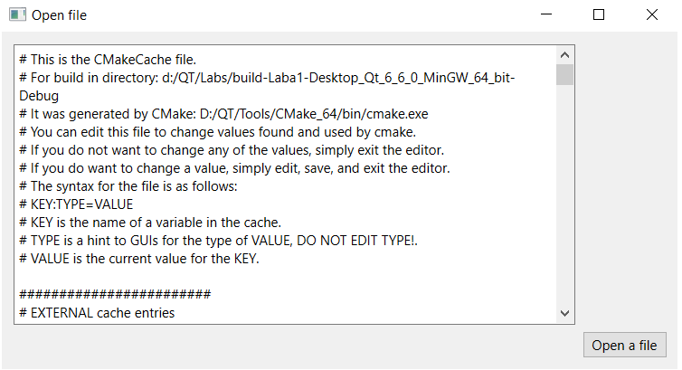

# Отчет по лабораторной работе №1

## Тема "Использование библиотеки элементов графического элемента"

## Вариант №2

`Бердникова Вероника Анатольевна (ПО-9) `

## Цель лабораторной работы

Научиться использовать библиотеку элементов графического интерфейса Qt.

## Ход работы
### Изменение цвета

При запуске первой программы открывается данное окно:

При изменении положения ползунка меняется цвет и отображается в поле справа.

Цвет меняется и при изменении числовых значений в полях SpinBox. Все изменения между числовыми значениями и значениями ползунков синхронизированы.

### Обозреватель файлов

При запуске программы открывается данное окно:

Откроем файл и увидим следующий результат:

