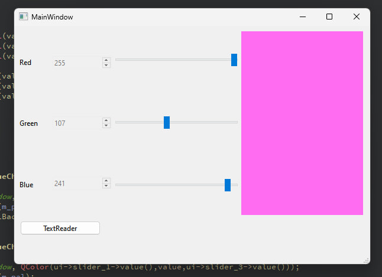
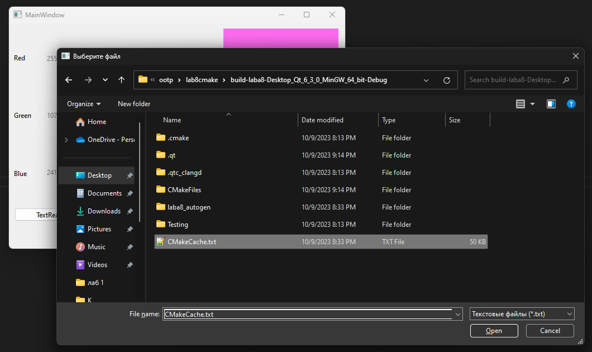
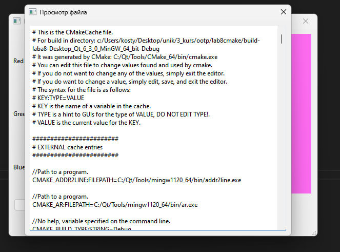

# Отчет по лабораторной работе №1

## Вариант №6

`Зеленков Константин Игоревич (ПО-9) `

## Цель лабораторной работы

Научиться использовать библиотеку элементов графического интерфейса Qt.

## Задание _(4 балла)_

- пользуясь примером в каталоге lab08/02, создайте приложение с графическим интерфейсом, аналогичным представленному ---сверху---
- используйте классы QLabel, QSpinBox, QSlider, QPlainTextEdit.

## Знакомство с элементами интерфейса: добавим функциональность. _(3 балла)_

- Добавим функциональность созданному на предыдущем этапе приложению:
  - спин-боксы и слайдеры будут перемещаться синхронизировано в диапазоне значений от 0 до 255.
  - Цвет фона QPlainTextEdit будет меняться соответственно
- Выполнение:
  - Выставляем диапазон допустимых значений для QSpinBox и QSlider при помощи методов setMinimum() и setMaximum()
  - запрещаем ввод в текстовое поле: setEnabled(false)
  - Реализуем метод setColor() и слоты setRed(int), setGreen(int), setBlue(int)
  - к слотам подключаем сигналы QSlider::sliderMoved() и QSpinBox::valueChanged()
  - в реализации слотов синхронизируем значения слайдера и спин-бокса и вызываем setColor()
- Для изменения цвета фона текстового поля воспользуемся таблицами стилей для описания стиля элементов.
  - таблицы стилей используют синтаксис CSS
  - будем задавать цвет в виде строки типа #rrggbb
  - таким образом, надо задать QPlainTextEdit следующий стиль:
  - QPlainTextEdit { background: #rrggbb; }
  - задаём стиль при помощи метода setStyleSheet() (таблица стиля передаётся в виде строки).

## Диалоги _(3 балла)_

Библиотека графических элементов Qt предлагает набор из нескольких полнофункциональных диалоговых окон, позволяющих выполнять некоторые стандартные операции. Среди них такие, как выбор файла в файловой системе, выбор шрифта, выбор цвета, диалог печати и некоторые другие. Мы рассмотрим в настоящей работе пример использования диалога выбора файла - QFileDialog.

**Создаём простейший обозреватель текстовых файлов.**

- Создайте новый виджет и поместите на него элемент QTextEdit.
- Добавьте кнопку QPushButton и подключите её сигнал clicked() к слоту openFile()
- Реализуйте в слоте выбор имени файла пользователем: QFileDialog::getOpenFileName()
- Откройте QFile в соответствии с выбранным названием
- Прочитайте его содержимое и поместите в виде текста в элемент QTextEdit

## Код программы

main.cpp:

```c++
#include "mainwindow.h"
#include "ui_mainwindow.h"
#include "QPalette"
#include "QFile"
#include "QFileDialog"
#include "QMessageBox"
#include "QTextEdit"

QPalette m_pal;

MainWindow::MainWindow(QWidget *parent)
    : QMainWindow(parent)
    ,ui(new Ui::MainWindow)
{
    ui->setupUi(this);

    connect(ui->counter_1, SIGNAL(valueChanged(int)), ui->slider_1, SLOT(setValue(int)));
    connect(ui->counter_2, SIGNAL(valueChanged(int)), ui->slider_2, SLOT(setValue(int)));
    connect(ui->counter_3, SIGNAL(valueChanged(int)), ui->slider_3, SLOT(setValue(int)));

    connect(ui->slider_1, SIGNAL(valueChanged(int)), ui->counter_1, SLOT(setValue(int)));
    connect(ui->slider_2, SIGNAL(valueChanged(int)), ui->counter_2, SLOT(setValue(int)));
    connect(ui->slider_3, SIGNAL(valueChanged(int)), ui->counter_3, SLOT(setValue(int)));
}

MainWindow::~MainWindow()
{
    delete ui;
}

void MainWindow::on_slider_1_valueChanged(int value)
{
    m_pal.setColor(QPalette::Window, QColor(value,ui->slider_2->value(),ui->slider_3->value()));
    ui->color_widget->setPalette(m_pal);
    ui->color_widget->setAutoFillBackground(true);
}

void MainWindow::on_slider_2_valueChanged(int value)
{
    m_pal.setColor(QPalette::Window, QColor(ui->slider_1->value(),value,ui->slider_3->value()));
    ui->color_widget->setPalette(m_pal);
    ui->color_widget->setAutoFillBackground(true);
}

void MainWindow::on_slider_3_valueChanged(int value)
{
    m_pal.setColor(QPalette::Window, QColor(ui->slider_1->value(),ui->slider_2->value(),value));
    ui->color_widget->setPalette(m_pal);
    ui->color_widget->setAutoFillBackground(true);
}


void MainWindow::on_pushButton_clicked()
{
    QString fileName = QFileDialog::getOpenFileName(this, "Выберите файл", "", "Текстовые файлы (*.txt);;Все файлы (*)");

    if (!fileName.isEmpty())
    {
        QDialog *dialog = new QDialog(this);
        dialog->setWindowTitle("Просмотр файла");

        QTextEdit *textEdit = new QTextEdit(dialog);
        textEdit->setGeometry(10, 10, 500, 400);

        QFile file(fileName);

        if (file.open(QIODevice::ReadOnly | QIODevice::Text))
        {
            QTextStream in(&file);
            QString fileContents = in.readAll();

            file.close();

            textEdit->setPlainText(fileContents);

            dialog->exec();
        }
        else
        {
            QMessageBox::critical(this, "Ошибка", "Не удалось открыть файл.");
            delete dialog;
        }
    }
}

```

## Пример работы программы

1. Окно выбора цвета
   

2. Выбор файла
   

3. Содержимое открытого файла
   
