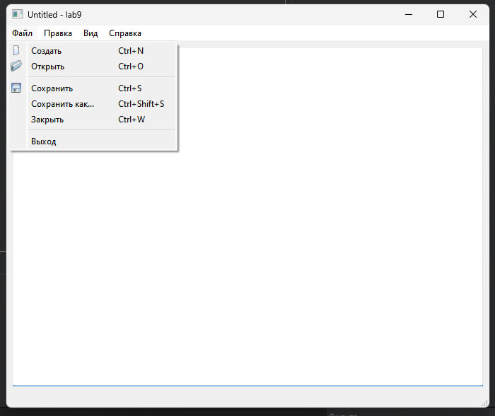
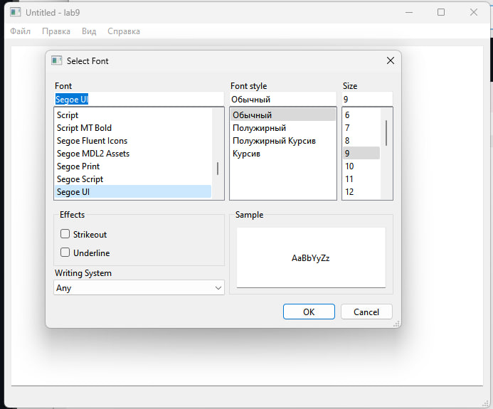
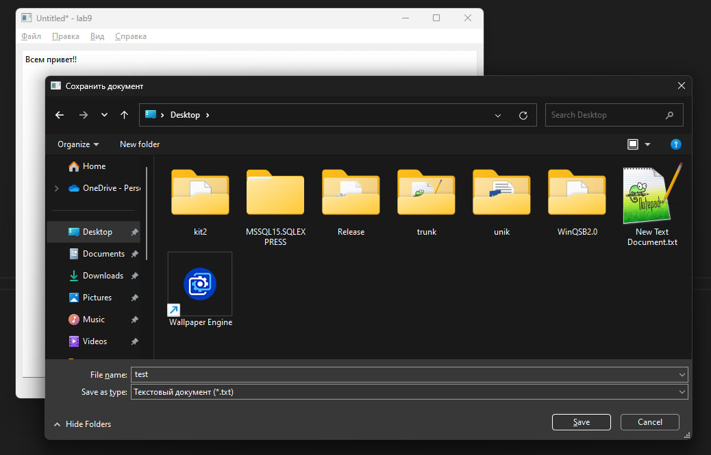
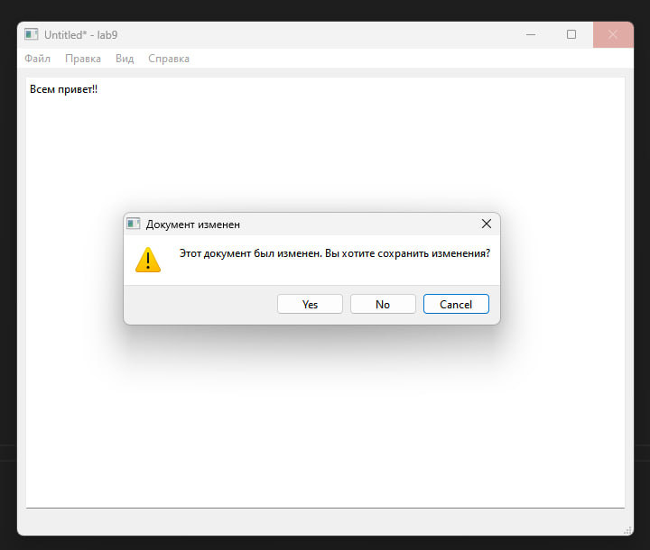
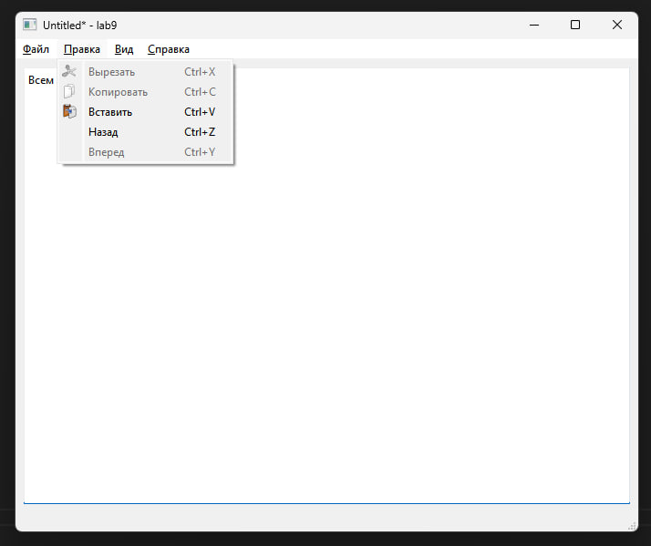

# Лабораторная работа №2

## Основы Qt

## Вариант 6

`Зеленков Константин Игоревич`
`ПО-9`

## Цель лабораторной работы

Понимание структуры приложения на Qt и получение опыта использования стандартной документации Qt.

## Ход работы

Файлы проекта:

- [main.cpp](./src/main.cpp)
- [mainwindow.h](./src/mainwindow.h)
- [mainwindow.cpp](./src/mainwindow.cpp)

Файл ресурсов:

- [icons.qrc](./src/icons.qrc)

## Демонстрация работы приложения

Основное окно текстового редактора:

Меню Файл:

Меню выбора шрифтов:

Сохранение файла:

Подтверждение на изменение файла при закрытии:

Меню Правка:

## Вывод

Было создано приложение Qt, реализующее базовый функционал текстового редактора windows.
