# Лабораторная работа №3

## Контейнеры в Qt5

## Вариант 6

Зеленков Константин Игоревич

## Цель лабораторной работы

Научиться использовать контейнеры в Qt

## Задания

### Задание 1, Вариант 6

Формулировка

- Даны две переменные целого типа: A и B (переменные вводятся в lineedit).
  Если их значения не равны, то присвоить каждой переменной максимальное из этих значений,
  а если равны, то присвоить переменным нулевые значения.

Демонстрация работы приложения

Введем 2 разнах числа, одно из них больше другого:

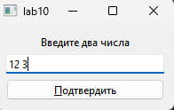

Нажимаем на кнопку подтвердить, вывод:

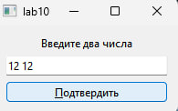

Введем 2 одинаковых числа:

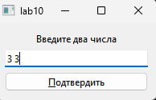

Нажимаем на кнопку подтвердить, вывод:

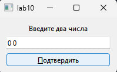

### Задание 2, Вариант 1

Формулировка

- Дано число k (0 < k < 11) и матрица размера m x n.
  Найти сумму и произведение элементов k-го столбца данной матрицы
  (нахождение суммы или произведения определяется пользователем в виджете comboBox).

Демонстрация работы приложения

Сумма элементов k-го столбца:

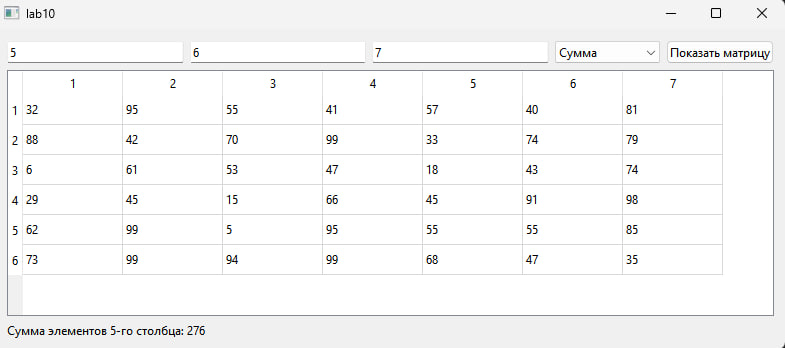

Произведение элементов k-го столбца:

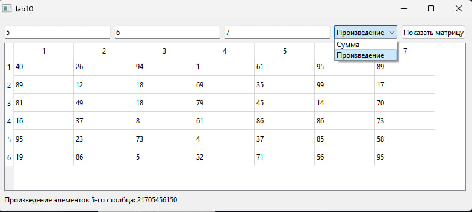

### Задание 3, Вариант 1

Формулировка

1. Заполнить список случайными элементами. Реализовать добавление элемента
   в конец списка и удаления с конца (использовать RadioButton для выбора действия).

2. Создать два связных списка. Скопировать элементы первого во второй.

Демонстрация работы приложения

Основное окно, первый лист автоматически генерируется изначально:

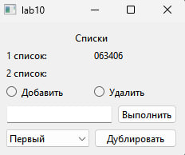

Добавление элемента в список (в данном случае число 3):

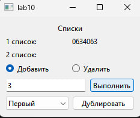

Удаление одного последнего элемента из списка (в данном случае кнопка была нажата 2 раза):

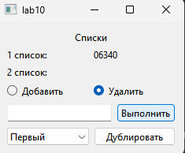

Дублирование списка (в данном случае выбран список 1, значит дублируется список 1):

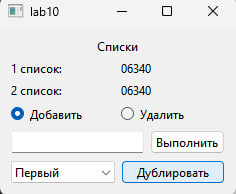

### Задание 4, Вариант 1

Формулировка

1. Заполнить стек 10 случайными числами из интервала -10; 20.
   Просмотреть содержимое стека. Найти сумму положительных чисел, хранящихся в стеке.

2. Сформировать очередь из 8 чисел. Записать в очередь модуль разности
   между двумя соседними элементами очереди.

Демонстрация работы приложения

Основное окно, при нажатии на кнопку генерируется стек и очередь, выводится исходные и модифицированные данные по заданию.

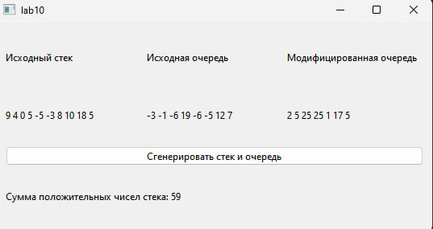

### Задание 5, Вариант 1

Формулировка

- Имеется список класса (все имена различны). Определить, есть ли в классе человек,
  который побывал в гостях у всех. (Для каждого ученика составить множество
  побывавших у него в гостях друзей, сам ученик в это множество не входит.)

Демонстрация работы приложения

Основое окно, 1 выбор ученика - ученик который был в гостях, 2 выбор ученика - ученик у
которого были в гостях (в данном случае ученик 3 был в гостях у учение 1 и 4):

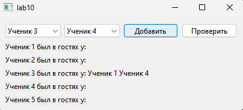

Проверка на поход в гости к самому себе:

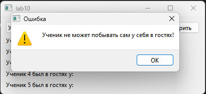

Проверка на повторное посещение:

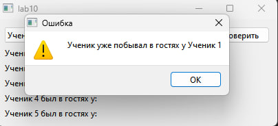

При нажатии на кнопку ПРОВЕРИТЬ программа проверяет списки на посещаемость всех учеников (в данном случае ни один и учеников не побыл в гостях у всех):

Проверка на посещаемость (в данном случае ученик 3 побывал у всех учеников в гостях):

### Задание 6, Вариант 2

Формулировка

- Дан файл f, компоненты которого являются действительными числами. Найдите:
  а наибольший компонент;
  б наименьший компонент с четным номером;
  в наибольший модуль компонента с нечётным номером;
  г разность первого и последнего компонента файла.

Демонстрация работы приложения

Основное окно приложения:

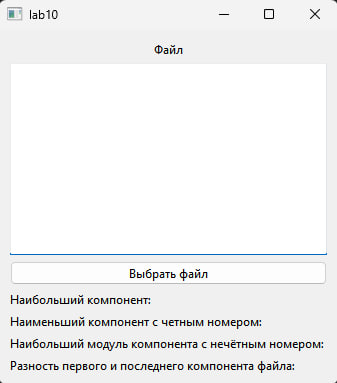

Окно выбора файла:

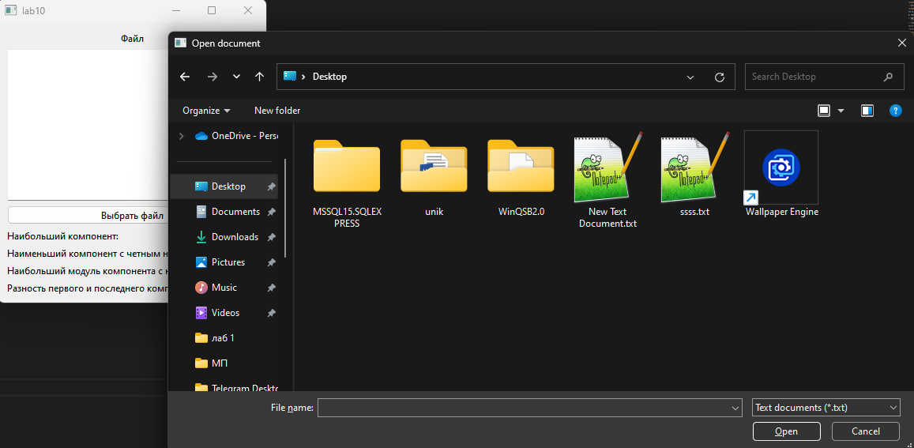

При выборе файла в основном окне показывает его содержимое, ниже кнопки выбора файла - выполнение каждого пункта задания:

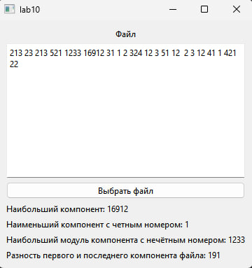

## Вывод

Научились использовать на практике контейнеры в Qt.
