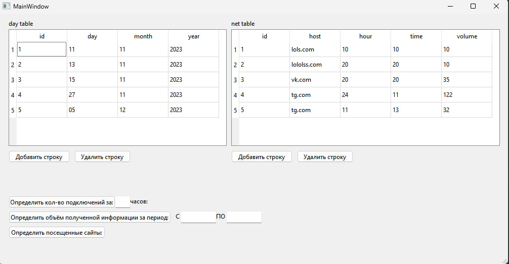
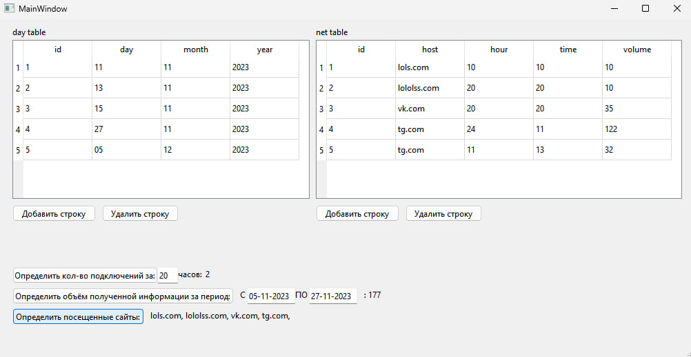

# Отчет по лабораторной работе №5

## Создание приложений баз данных

## Вариант №6

Зеленков Константин Игоревич

Средствами IDE Qt designer создать интерфейс программы, осуществляющей подключение
к базе данных SQLite. С помощью программы SQLiteManager создать необходимые таблицы
в файле базы данных. Наполнение таблиц осуществлять из созданной программы.

Напишите программу «Учет работы в Internet». В программе использовать две таблицы: day (поля id, day, month, year) и net (поля id, host, hour, time, volume). Создать запросы: определение количества подключений за указанный час; объем полученной информации за указанный период; посещенные сайты.

## Код программы

- [main.cpp](./src/main.cpp)
- [mainwindow.cpp](./src/mainwindow.cpp)
- [mainwindow.h](./src/mainwindow.h)

А также файл формы

- [mainwindow.ui](./src/mainwindow.ui)

## Пример работы программы

Основное окно программы, информация не введена, кнопки не нажаты:

Информация введена, кнопки нажаты:

