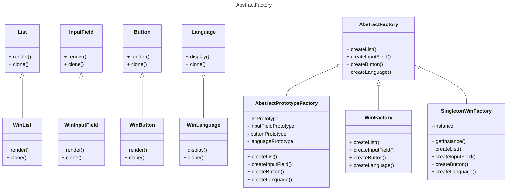

# Лабораторная работа № 6

## UML - диаграммы

## Зеленков Константин Игореич

## Цель работы

Изучить UML-диаграммы, применить их на практике.

## Задания для выполнения

Создание UML-диаграммы для лабораторной работы №8



```mermaid
---
title: Builder
---
classDiagram
    class Head {
        + getInfo(): string
    }

    class Body {
        + getInfo(): string
    }

    class Engine {
        + getInfo(): string
    }

    class Robot {
        - head: Head
        - body: Body
        - engine: Engine
        + setHead(newHead: Head)
        + setBody(newBody: Body)
        + setEngine(newEngine: Engine)
    }

    class RobotBuilder {
        + buildHead()
        + buildBody()
        + buildEngine()
    }

    class ConcreteRobotBuilder {
        - robot: Robot
        + buildHead()
        + buildBody()
        + buildEngine()
        + getRobot(): Robot
    }

    class Director {
        + buildRobot(builder: RobotBuilder)
    }

    Head --> Robot
    Body --> Robot
    Engine --> Robot
    RobotBuilder <|-- ConcreteRobotBuilder
    Director --> RobotBuilder
    Director --> ConcreteRobotBuilder
````

## Вывод

Изучили UML-диаграммы и применили их на практике.
