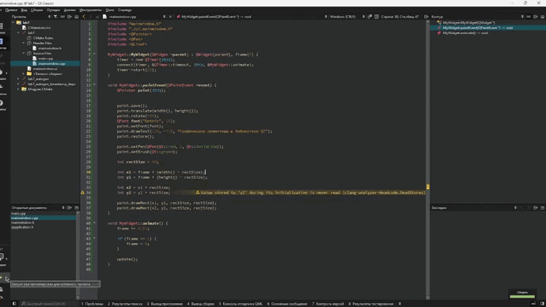

# Отчет по лабораторной работе №7

## Графические примитивы в библиотеке QT

## Вариант №6

Зеленков Константин Игоревич

1. Вывести заданным шрифтом вертикально на экран наименование лабораторной
   работы – 2 балла.
2. Нарисовать цветную фигуру (2 балла) и организовать движение её по заданной траектории
   (6 баллов).

| № варианта |   Шрифт    |                   Фигура                    |                            Траектория движения                             |
| :--------: | :--------: | :-----------------------------------------: | :------------------------------------------------------------------------: |
|     6      | Готический | Два прямоугольника, имеющих один общий угол | Отрезок прямой, проведённой из левого верхнего в правый нижний угол экрана |

## Код программы

- [main.cpp](./src/main.cpp)
- [mainwindow.cpp](./src/mainwindow.cpp)
- [mainwindow.h](./src/mainwindow.h)

## Пример работы программы

