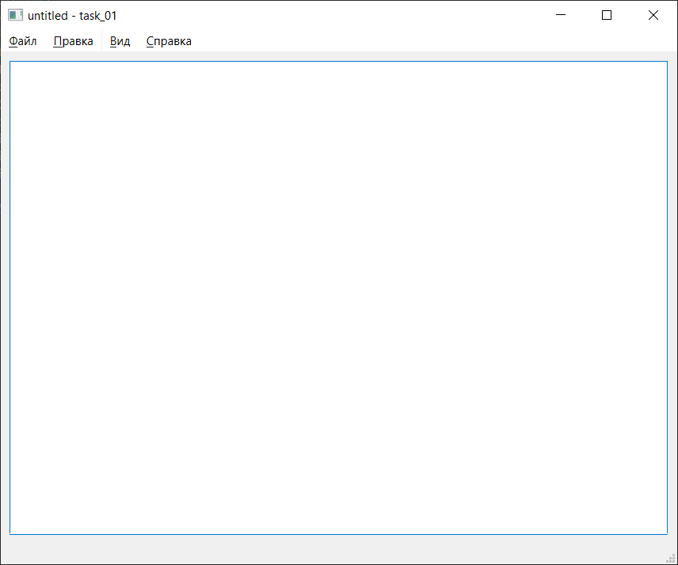
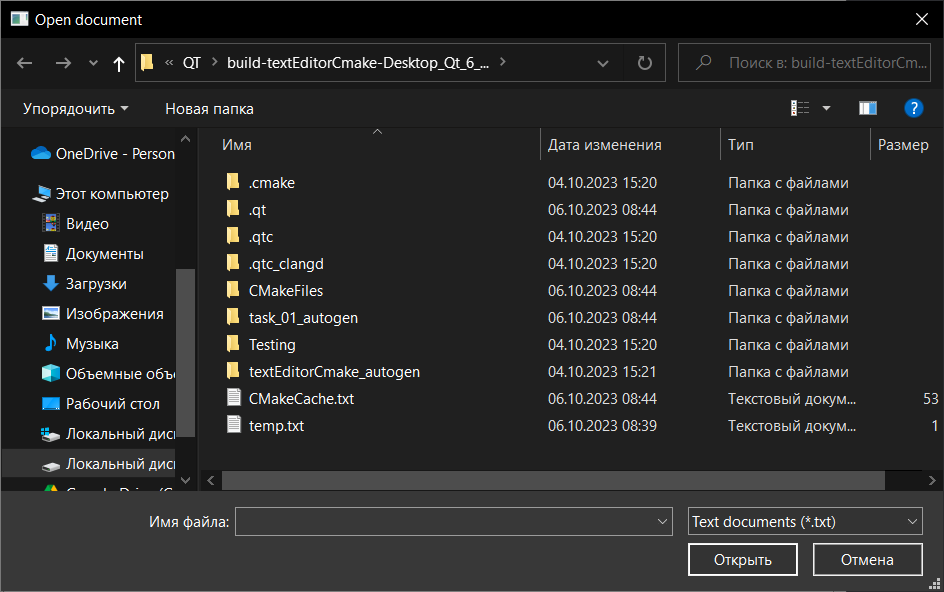
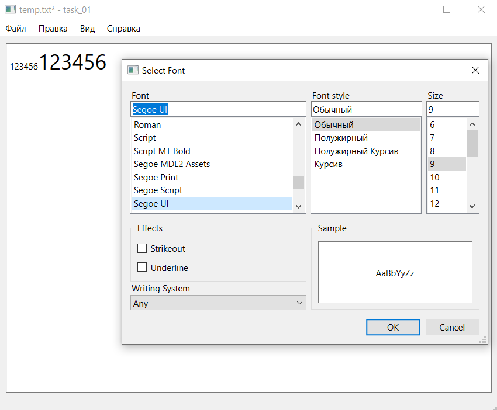
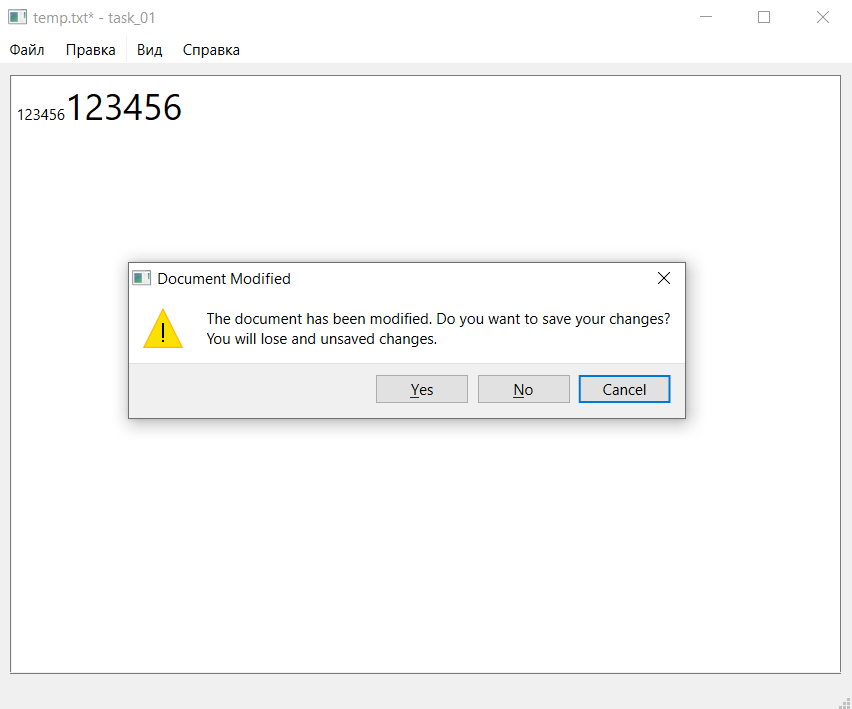

# Отчет по лабораторной работе №2 #

## Основы Qt ##

## Реализация/ход работы ##

При запуске программы видим следующее.

Присутствует возможность открытия файлов:

Существует возможность изменения шрифтов

Поддержка работы нескольких окон

Уведомление о том, что файл не сохранен при выходе из приложения

