# Отчет по лабораторной работе №3

## Контейнеры в Qt5

## Реализация/ход работы

Запуск программы приводит к данному окну, в котором вводим номер задания

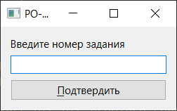

Если же введем некорректный номер, то получим соответствующее сообщение:

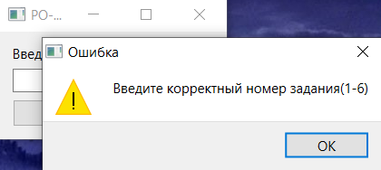

### Задания

#### Задание 1(Вариант 7)

    Из трех данных чисел выбрать наименьшее и наибольшее (числа вводятся в lineedit), и заменить третье число иx разностью (число должно быть изменено в текущем lineedit).

Окно приложения:

Введя три числа (к примеру 12 34 56) и нажав `Подтвердить`  получаем:

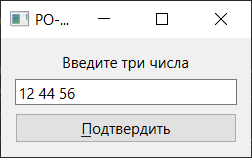

#### Задание 2(Вариант 2)

    Дана матрица размера m x n. Найти суммы элементов всех ее четных и нечетных столбцов (нахождение суммы четных/нечетных столбцов определяется пользователем в виджете comboBox).

Окно приложения:

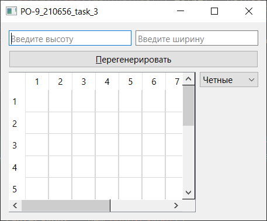

Введем высоту и ширину, нажмем `Перегенерировать` и изменим в выпадающем списке тип суммирующихся столбцов:

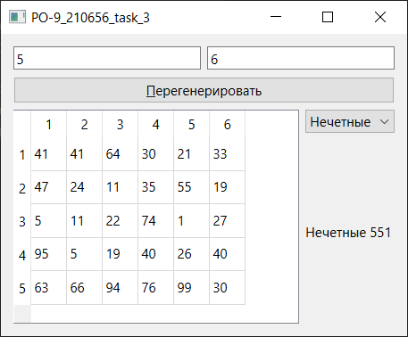

#### Задание 3(Вариант 2)

    - Заполнить список случайными элементами. Реализовать добавление элемента в конец списка и удаления с начала (использовать RadioButton для выбора действия).
    - Создать два связных списка. Реализовать замену одного связного списка на другой.

Окно приложения:

где радиокнопки отвечают за добавление элемента в определенный конец, а выпадающий список - за изменение определенного списка.

Добавим пару элементов:

- 1 в начало
- 2 в начало
- 3 в конец
  
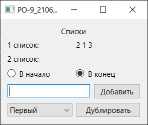

И дублируем его во второй список нажатием кнопки `Дублировать`:

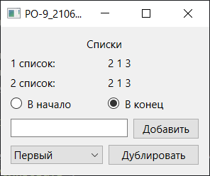

#### Задание 4(Вариант 2)

    - Сформировать стек из 10 случайных целых чисел. Заменить в стеке все положительные значения на 1, а отрицательные - на -1.
    - Сформировать очередь из 10 чисел. Увеличить все значения в очереди на ее максимальный элемент. Результат поместить в очередь.

Окно приложения:

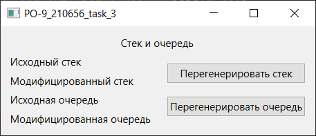

При нажатии на `Перегенерировать стек\очередь` будет заново сгенерирована нужная структура а так же под подписью `Модифицированный\ая стек\очередь` будут выполнены преобразования согласно заданию:

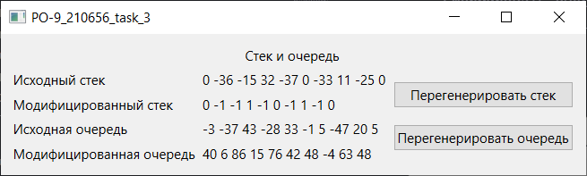

#### Задание 5(Вариант 2)

    Задан некоторый набор товаров. Определить для каждого товара, какие из них имеются в каждом из n магазинов, какие товары есть хотя бы в одном магазине, каких товаров нет ни в одном магазине.

Окно приложения:

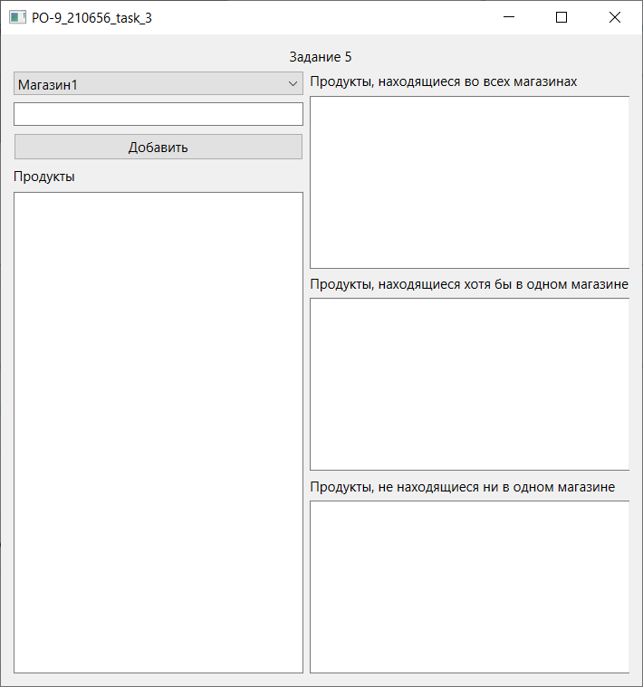

где:

- выпадающий список - либо магазин, либо список всех товаров
- поле и кнопка служат для добавления в спиок магазина или списка всех товаров
- Поле ниже - сами списки товаров выбранного магазина(товаров)

Для примера заполним так:

- Продукты:
  
  - Product1
  - Product2
  - Product3

- Магазин1
  
  - Product1
  - Product2

- Магазин2
  
  - Product1
- Магазин3

  - Product1

Результат:

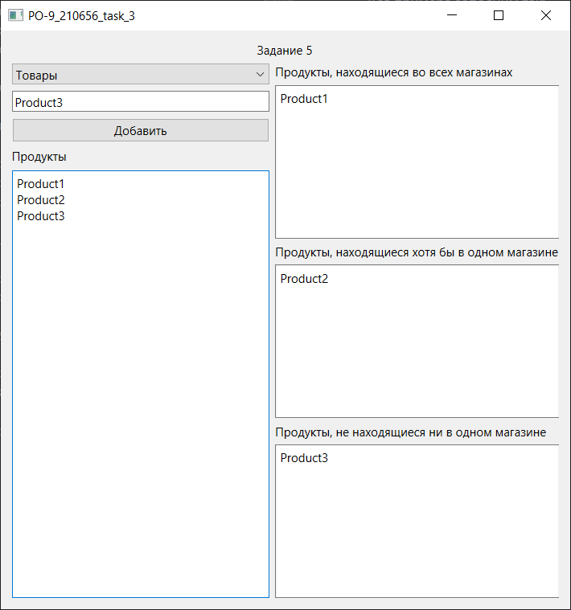

#### Задание 6(Вариант 2)

    Дан файл f, компоненты которого являются целыми числами. Запишите в файл g наибольшее значение первых пяти компонентов файла f, затем - следующих пяти компонентов и т.д. Если в последней группе окажется менее пяти компонентов, то последний компонент файла g должен быть равен наибольшему из компонентов файла f, образующих последнюю (неполную) группу.

Для визуализации файлов сделаем так:

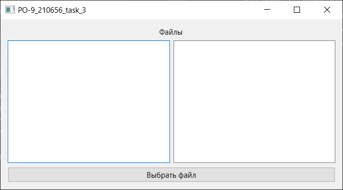

В левом поле будет отображаться содержимое файла, в правом - результат выполнения задания в другом файле.

Выберем какой-нибудь файл:

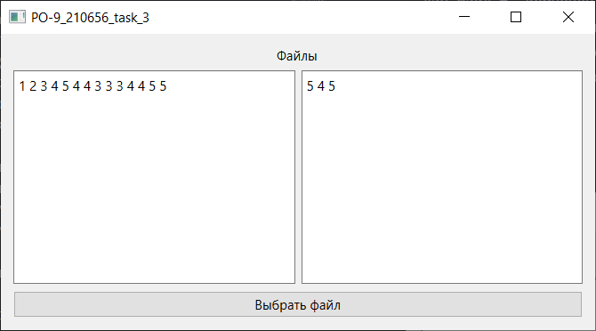
