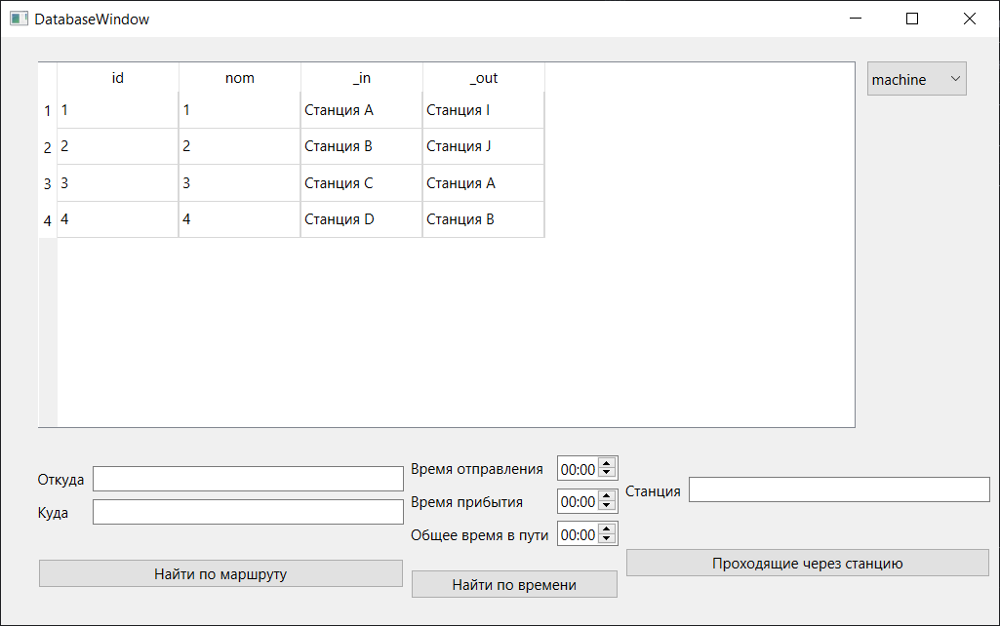
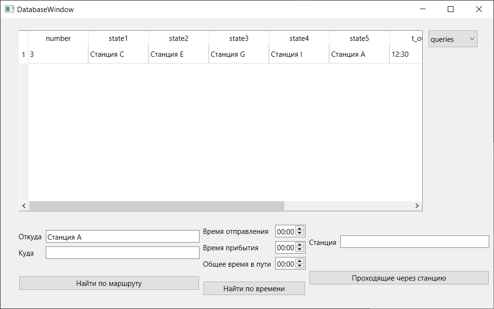
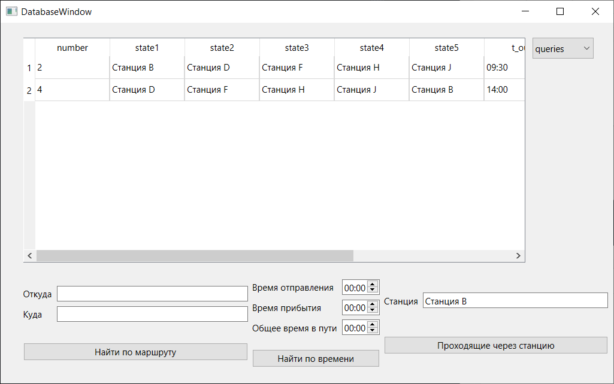

# Отчет по лабораторной работе №5

## Создание приложений баз данных

## Вариант 7

Напишите программу «Расписание движения поездов». В программе использовать три таблицы: machine (поля *id, nom, _in, _out*), reys (поля id, *t_out, t_all, t_in*) и states (поля *id, state1, state2, state3, state4, state5*). Создать запросы: вывод списка поездов по заданному направлению и времени отправления, прибытия и общего времени в пути; вывод списка маршрутов, проходящих через заданную станцию (state).

## Реализация/ход работы

Подготовим таблицы для примера:

- machine:

| id | nom | _in | _out |
|:--:|:--:|:--:|:--:|
|1|1|Станция A|Станция I|
|2|2|Станция B|Станция J|
|3|3|Станция C|Станция A|
|4|4|Станция D|Станция B|

- reys

| id | t_out | t_all | t_in |
|:--:|:--:|:--:|:--:|
|1|08:00|03:00|11:00|
|2|09:30|02:30|12:00|
|3|12:30|02:45|15:15|
|4|14:00|03:15|17:15|

- states

| id | state | state | state | state | state |
|:--:|:--:|:--:|:--:|:--:|:--:|
|1|Станция A|Станция C|Станция E|Станция G|Станция I|
|2|Станция B|Станция D|Станция F|Станция H|Станция J|
|3|Станция C|Станция E|Станция G|Станция I|Станция A|
|4|Станция D|Станция F|Станция H|Станция J|Станция B|

Запустим приложение:

Введем станцию в первое поле `Откуда` и получим нужный маршрут:

Найдем поезд и рейс, который находится в пути к примеру 3:15:

А так же найдем все маршруты которые проходят через станцию `Станция В`:

