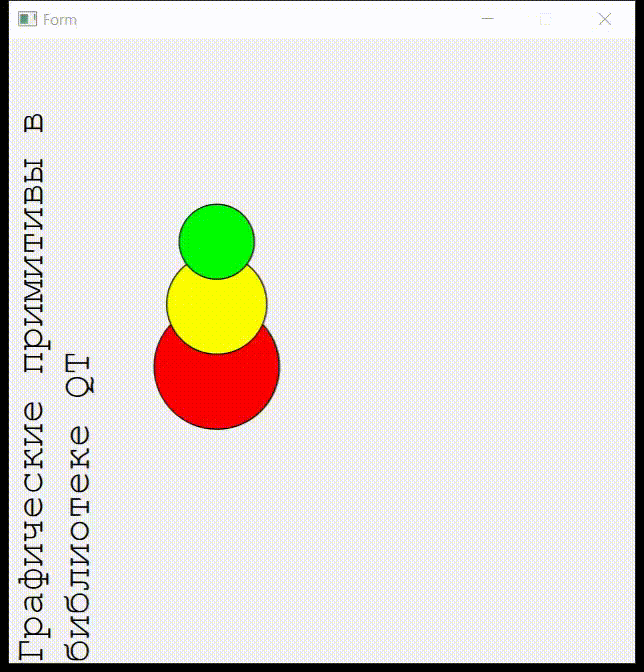

# Отчет по лабораторной работе №5

## Создание приложений баз данных

## Вариант 7

> 1) Вывести матричным шрифтом вертикально на экран наименование лабораторной работы
> 2) Нарисовать цветную фигуру (три окружности, образующих снеговика) и организовать движение её по заданной траектории (косинусоида).

## Реализация/ход работы

Внешний вид запущенного приложения:

