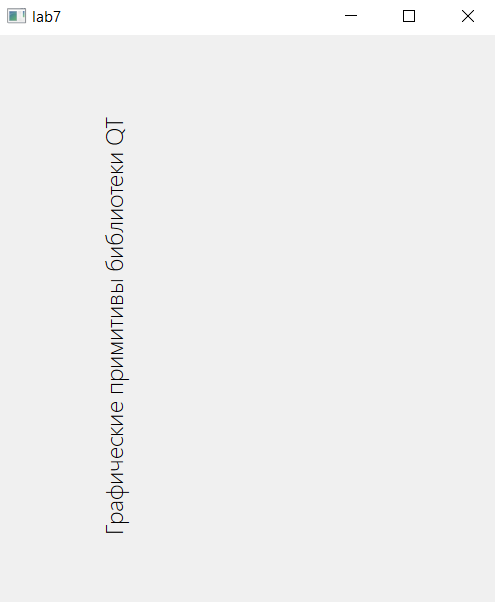
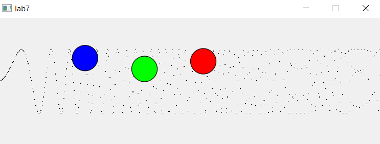

# Отчет по лабораторной работе №7

## Графические примитивы в библиотеке QT

## Вариант №8

1. Вывести заданным шрифтом вертикально на экран наименование лабораторной
работы – 2 балла.  
2. Нарисовать цветную фигуру (2 балла) и организовать движение её по заданной траектории
(6 баллов).

|№ варианта|Шрифт|Фигура|Траектория движения|
| :-: | :-: | :-: | :-: |
|8|Светлый|Три окружности по горизонтали|Синусоида y(x) = asin(x^2 + b)|

При запуске программы появляется два окна, для первого задания и для второго.

Первое окно:

Отображает вертикально название лабораторной работы светлым шрифтом.

Второе окно:

Запускает анимацию трех кругов, движущихся по синусоиде y(x) = asin(x^2 + b).

