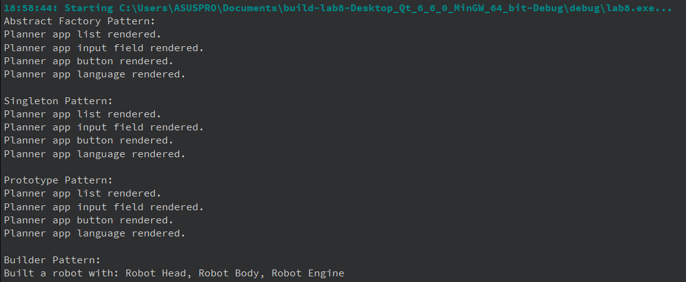

# Отчет по лабораторной работе №8

## Паттерны проектирования

## Реализация/ход работы

### Вариант 8 (2)

    Варианты:
        Применить паттерн абстрактная фабрика при построении интерфейса пользователя Продукты фабрики: список, поле ввода, кнопка, язык отображения.

    Применить паттерн проектирования “Prototype” совместно с абстрактной фабрикой, то есть внести изменения в проект “Порождающие паттерны. Абстрактная фабрика”. То есть теперь в проекте абстрактная фабрика должна параметризоваться прототипами.

    Применить паттерн проектирования “Singleton” совместно с абстрактной фабрикой, то есть внести изменения в проект, разработанный на лабораторной работе “Порождающие паттерны. Абстрактная фабрика”.

    Применить паттерн “Строитель” для построения
        Представления робота в игровой программе
            Части: Head, Body, Engine
            ConcreteBuilder выбрать самостоятельно

    Применить паттерн “Фабричный метод” при создании конкретного строителя и передачи его клиенту. Самостоятельно продумать контекст в каркасе для вызова шаблонного метода.

Было разработано консольное приложение, которое реализует паттерн абстрактной фабрики, абстрактную фабрику, параметризированную синглтонами, абстрактную фабрику, использующую прототипы, а также паттерн строителя (с директором). Вот демонстрация работы программы:

